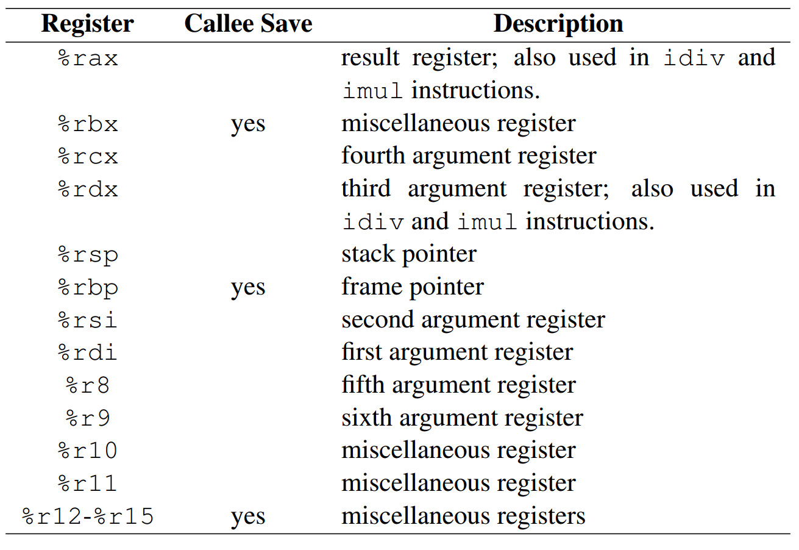
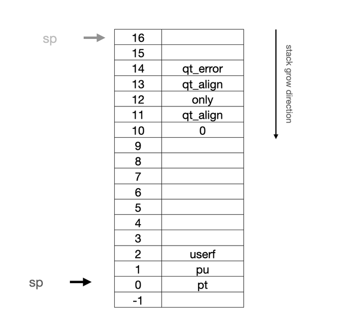
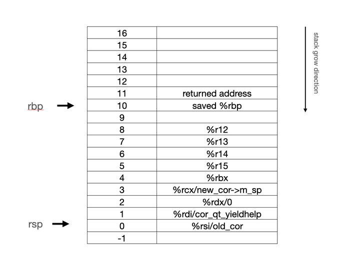

:source-highlighter: coderay

:toc: left

Systemc中的QuickThread，协程原理与实现

== 引言

在硬件设计中，systemc作为一个高层次的仿真，甚至综合的语言，一直有着广泛的应用。
与verilog/vhdl/systemverilog不同，systemc并不是一门新的语言，而是依托于{CPP}语言的一个{CPP}库。
这也意味着，对于硬件设计工程师而言，使用systemc建模做仿真并不需要专业的EDA工具支持，
只需要有一个编译器即可。当然，如果需要用到systemc更多的功能，诸如可综合部分来设计硬件，
或者查看波形debug，诸如此类，可能就需要EDA工具的支持了。

SystemC作为一个CPP的库，内置了一个仿真器。我一直对systemc如何支持并行仿真非常感兴趣，
近期有空，也看了一些systemc的代码。systemc的设计非常复杂和精妙，这里我们只关注其中的一部分，
即quickthread部分，systemc中管这个叫qt。这个qt可不是诺基亚那个QT啊。

SystemC的仿真器使用quickthread，来支持协程(coroutine)。所以，这个名字里带thread的库，
实际上更准确的说法是一个协程库。通过quickthread，systemc具备了协程的能力，这样就可以在一个
SC_CTHREAD中使用wait()函数挂起当前线程，转而执行下一个线程。这也是为何systemc中的
SC_CTHREAD普遍采用while(true)死循环的设计，却可以有多个线程同时执行的奥妙所在了。

实际上，SystemC可选的协程实现不止quickthread一种。版本2.3.3提供了三种协程的支持方法：

* 对于windows平台，只能选择 `fiber`
* `pthread` ，用于非windows平台，使用pthread库支持协程
* `quickthread` ，用于非windows平台

我们这里主要关注和探索一下quickthread库的实现。为了支持协程，quickthread需要
为不同的平台实现不同的协程切换代码，这部分是高度平台相关的，需要用汇编语言编写。
为方便起见，我们将讨论的平台限定为x86_64平台(以下简称为x64平台)。

== QuickThread的设计

QuickThread是一种有栈协程设计，每一个协程都有自己的调用堆栈，这样设计使得协程
之间的切换相对比较简单，不涉及到调用栈之间的保存，付出的代价则是占用的内存空间比较大，
而且所分配的堆栈可能有栈溢出的问题。对于SystemC而言，绝大多数情况下 `SC_THREAD` 的
调用链不会很长，所以可以忍受这种代价。这里我们不去讨论有栈协程和无栈协程的优劣，
或者有栈协程的效率问题等，而仅仅关注于quickthreads的具体实现细节。

QuickThread采用了C语言加上平台相关的汇编语言的设计，大量使用了宏等来精简代码。
对于不同的平台，主要实现一个叫做 `qt_block` 的函数。这个 `qt_block` 的函数功能如下：

1. 保存调用者（等待挂起线程）的寄存器信息，以及调用堆栈信息
2. 切换调用堆栈 ，将CPU的堆栈信息切换为下一个待执行线程的堆栈
3. 移交控制权给待执行线程

这里有比较多的操作无法在C语言层面完成，需要操作寄存器，并且 `qt_block`
不是通常意义上的函数，所以，所有的 `qt_block` 都是用平台相关的代码设计的。
我们这里主要关注x64平台。

以下是x64平台的 `qt_block` 汇编代码实现：

.src/sysc/packages/qt/md/ix86_64.S
[source,asm]
----
_qt_abort:
qt_abort:
_qt_block:
qt_block:
_qt_blocki:
qt_blocki:
	                 /* 11 (return address.) */
        pushq %rbp       /* 10 (push stack frame top.) */
	movq  %rsp, %rbp /* set new stack frame top. */
	                 /* save registers. */
	subq $8, %rsp    /*  9 (Stack alignment) */
	pushq %r12       /*  8 ... */
	pushq %r13       /*  7 ... */
	pushq %r14       /*  6 ... */
	pushq %r15       /*  5 ... */
	pushq %rbx       /*  4 ... */
	pushq %rcx       /*  3 ... (new stack address) */
	pushq %rdx       /*  2 ... (arg) */
	pushq %rdi       /*  1 ... (address of save function.) */
	pushq %rsi       /*  0 ... (cor) */

    movq %rdi, %rax  /* get address of save function. */
    movq %rsp, %rdi  /* set current stack as save argument. */
	movq %rcx, %rsp  /* swap stacks. */
	movq %rcx, %rbp  /* adjust stack frame pointer. */
	addq $10*8, %rbp /* ... */
    call *%rax      /* call function to save stack pointer. */

	                /* restore registers. */
	popq %rsi       /* ... */
	popq %rdi       /* ... */
	popq %rdx       /* ... */
	popq %rcx       /* ... */
	popq %rbx       /* ... */
	popq %r15       /* restore registers from new stack. */
	popq %r14       /* ... */
	popq %r13       /* ... */
	popq %r12       /* ... */
	leave           /* unwind stack. */
_qt_align:
qt_align:
	ret             /* return. */ 
----

代码主要分成三大部分，分别实现了我们之前提到的 `qt_block` 的三大功能。
接下来我们结合具体的场景，分析每一部分代码的实现细节。在开始之前，
我们需要一些背景知识的补充，特别是x64平台函数调用惯例。

=== x64平台调用惯例

开始探索quickthread的功能之前，我们先简单回顾一下x64平台的调用惯例。

x64平台的函数调用一般用寄存器传参，通过寄存器最多可以传6个参数，分别是rdi, rsi, 
rdx, rcx, r8和r9。函数参数的返回值保存在rax中。rbp指向栈帧的起始位置，
rbp指向的内容则是调用者的rbp。rsp指向栈帧的顶端，并且调用栈往低地址方向增长。
函数返回后的下一条指令地址保存在rbp之前的8byte中。

下图展示了x86-64下函数调用及栈帧中，各通用寄存器，其中rbx，
rbp和r12-r15是callee 保存，其他都是caller负责保存。 

.x64通用寄存器使用情况

quickthread中不考虑浮点寄存器的保存和恢复。

有了这些背景知识，就足够我们去探索quickthread中如何在x64平台上实现协程创建和切换了。

=== 创建协程context

创建协程运行的context代码大致如下
(在GitHub - lanphon/quickthread: This is systemc's quickthread learning 中的samples/first/first.cpp里)：

[source,cpp]
----
cort_info_t *create_thread(std::size_t stack_size, cor_fn *fn, void *args)
{
    cort_info_t* cor = new cort_info_t;
    cor->m_stack_size = stack_size;

    // allocate a stack for the thread
    cor->m_stack = new char[stack_size];
    std::memset(cor->m_stack, 0xdb, stack_size);

    // align the stack, also set the stack size after alignment
    void *sto = stack_align(cor->m_stack, QUICKTHREADS_STKALIGN, &cor->m_stack_size);

    // for x86_64, the QUICKTHREADS_STKALIGN is 16byte
    cor->m_sp = QUICKTHREADS_SP(sto, cor->m_stack_size - QUICKTHREADS_STKALIGN);
    cor->m_sp = QUICKTHREADS_ARGS( cor->m_sp
            , args // pu
            , cor // pt
            , (qt_userf_t*) fn // userf
            , cor_qt_wrapper ); //  only
    /*
     * QUICKTHREADS_ARGS would adjust the sp with QUICKTHREADS_STKBASE, for x86_64, it's 0x80 byte
     */
    return cor;
}
----

就像我们之前说的，quickthread是个有栈协程，所以，每个协程都有自己单独的运行栈。
为协程创建运行环境的第一步，就是从堆上分配运行栈。对于x64平台而言，
分配出来的内存块不能直接拿来当运行栈使用，需要对齐，并且由于x64的栈是向下增长的，
实际的栈顶需要调整为分配出来的内存块的尾巴部分。

计算好了运行栈的顶端之后，接下来就是用 `QUICKTHREADS_ARGS` 来为运行栈准备环境了。
这部分是 quickthread比较trick的地方，要配合其他部分才能完成工作。我们这里只探讨
固定参数的情况，可变参数对应的 `QUICKTHREADS_VARGS` 思想一样，就不讨论了。

这里我们先看 `QUICKTHREAD_ARGS` 宏的定义：

.src/sysc/packages/qt/qt.h
[source,cpp]
----
#define QUICKTHREADS_ARGS(sp, pu, pt, userf, only) \
    (QUICKTHREADS_ARGS_MD (QUICKTHREADS_ADJ(sp)), \
     QUICKTHREADS_SPUT (QUICKTHREADS_ADJ(sp), QUICKTHREADS_ONLY_INDEX, only), \
     QUICKTHREADS_SPUT (QUICKTHREADS_ADJ(sp), QUICKTHREADS_USER_INDEX, userf), \
     QUICKTHREADS_SPUT (QUICKTHREADS_ADJ(sp), QUICKTHREADS_ARGT_INDEX, pt), \
     QUICKTHREADS_SPUT (QUICKTHREADS_ADJ(sp), QUICKTHREADS_ARGU_INDEX, pu), \
     ((qt_t *)QUICKTHREADS_ADJ(sp)))
----

这个宏是一个逗号运算符，所以其返回值就是最后的 `"( (qt_t*) QUICKTHREADS_ADJ (sp) )"` ，
而 `QUICKTHREADS_ADJ` 定义的则是下一个对齐的栈帧的位置。对于x64平台而言，
下一个栈帧对齐的位置是当前栈帧减去0x80字节(16个64bit）。这里还有一个 
`QUICKTHREADS_ARGS_MD` 的宏定义，对于x64平台而言，则是：

.src/sysc/packages/qt/md/iX86_64.h
[source,cpp]
----
/* Push on the error return address, force Frame Pointer to 0 and
   push stack alignment trampoline function.  */
#define QUICKTHREADS_ARGS_MD(sto) \
  (QUICKTHREADS_SPUT (sto, QUICKTHREADS_RBP, 0), \
   QUICKTHREADS_SPUT (sto, QUICKTHREADS_POP0, qt_align), \
   QUICKTHREADS_SPUT (sto, QUICKTHREADS_POP1, qt_align), \
   QUICKTHREADS_SPUT (sto, QUICKTHREADS_RPC, qt_error))
----

结合其他宏的定义，我们可以大致画出 `QUICKTHREADS_ARGS` 的效果：

.新建协程的协程运行栈

=== 新建协程的协程运行栈

对于 `QUICKTHREADS_ARGS(sp, pu, pt, userf, only)` 而言，调用的效果就相当于在栈空间内设置这些值，
并且将sp的值减少了0x80字节。图中每一行是一个64bit，左边列是相对于rsp的偏移，以64bit为单位。
其中的 `qt_align` 和 `qt_abort` 
是quickthread库自定义函数的函数指针（准确地说不一定是函数，
可能只是一个位置的指针）。图中各项参数的含义如下：

* `pt` ，point to thread，指向协程管理的数据结构的指针
* `pu` ，协程的参数
* `userf` ，用户自定义的协程函数
* `only` ，一个wrapper的函数，用来调用userf函数 

到这一步，协程的运行栈初始状态就已经准备完毕了。 接下来，我们看一下如何启动一个新的协程。

=== 启动新协程

协程切换的示例代码如下：

[source,cpp]
----
extern "C"
void*
cor_qt_yieldhelp( qt_t* sp, void* old_cor, void* )
{
    reinterpret_cast<cort_info_t*>( old_cor )->m_sp = sp;
    return 0;
}

void
yield( cort_info_t* next_cor )
{
    cort_info_t* new_cor = next_cor;
    cort_info_t* old_cor = s_curr_cor;
    s_curr_cor = new_cor;
    QUICKTHREADS_BLOCK( cor_qt_yieldhelp, old_cor, 0, new_cor->m_sp );
    /*
     * first, call cor_qt_yieldhelp("old cor's stack pointer $rsp", old_cor, 0); via qt_block
     * on the new coroutine's stack
     * the old cor's stack is fetched by ASM language
     */
}
----

这里定义的 `yield` 函数可以挂起调用者，并将cpu控制权转交给 `next_cor` 代表的下一个协程。
其核心部分实现在于对 `QUICKTHREADS_BLOCK` 的引用，而这个宏的定义则是：

.src/sysc/packages/qt/qt.h
[source,cpp]
----
extern void *qt_block (qt_helper_t *h, void *a0, void *a1,
		       qt_t *newthread);
#define QUICKTHREADS_BLOCK(h, a0, a1, newthread) \
    (qt_block (h, a0, a1, newthread)) 
----

调用了 `qt_block` 函数。接下来，我们就需要深入 `qt_block` 函数了。在深入之前，
根据x64的调用惯例，我们先把各个关键的寄存器值罗列一下：

* rdi保存 `cor_qt_yieldhelp` 的函数指针
* rsi保存 `old_cor` 的指针值
* rdx保存0
* rcx保存 `new_cor->m_sp` ，即等待切入的协程的栈指针值

我们先看qt_block的x64版本第一部分，现场保存部分：

[source,asm]
----
	                 /* 11 (return address.) */
        pushq %rbp       /* 10 (push stack frame top.) */
	movq  %rsp, %rbp /* set new stack frame top. */
	                 /* save registers. */
	subq $8, %rsp    /*  9 (Stack alignment) */
	pushq %r12       /*  8 ... */
	pushq %r13       /*  7 ... */
	pushq %r14       /*  6 ... */
	pushq %r15       /*  5 ... */
	pushq %rbx       /*  4 ... */
	pushq %rcx       /*  3 ... (new stack address) */
	pushq %rdx       /*  2 ... (arg) */
	pushq %rdi       /*  1 ... (address of save function.) */
	pushq %rsi       /*  0 ... (cor) */
----
 
首先用 `pushq %rbp` 将当前栈的栈基本地址入栈，接下来将rsp的值赋给rbp，
这样相当于开启了一个新的栈帧结构。接下来的一系列入栈操作，最后的栈结构如下图所示： 

.待挂起协程的运行栈（未切换运行栈之前）

接下来是切换运行栈部分：

[source,asm]
----
    movq %rdi, %rax  /* get address of save function. */
    movq %rsp, %rdi  /* set current stack as save argument. */
	movq %rcx, %rsp  /* swap stacks. */
	movq %rcx, %rbp  /* adjust stack frame pointer. */
	addq $10*8, %rbp /* ... */
    call *%rax      /* call function to save stack pointer. */
----

首先将 `cor_qt_yieldhelp` 的函数指针从rdi拷贝到rax里，因为rdi之后会作为第一个函数参数寄存器，
是需要使用的。接下来把当前栈的栈指针rsp放入rdi中，这样一来，调用 `cor_qt_yield` 函数的
第一个值就是当前栈的栈指针了。之后分别将栈帧指针rbp和栈指针rsp赋值为 
`new_cor->m_sp` 的值，这样一来运行栈就切换为需要调度执行的协程自己的运行栈了。

**之后指令的运行时基于这个马上要调度执行协程的运行栈，而不是准备挂起的协程运行栈了**。
所以，我们这个时候需要参考的图变成了（这里我们讨论启动一个新协程，已经执行过的情况，
即协程的resume我们后续分析）

.执行call指令之前的运行栈（已经切换为新的运行栈）
image:003.png[]

这里展示的是调整完栈帧指针rbp之后的结果。最后，一个 `call` 指令，
调用了函数 `cor_qt_yieldhelp` 函数，此时函数的第一个参数rdi里保存的是未切换栈前，
待挂起函数运行栈的栈指针rsp，第二个参数rsi里保存的则是 `old_cor` 的指针值，
第三个参数rdx则保存着0，实际上传入参数的指针。 `cor_qt_yieldhelp` 的作用很简单，
就是将汇编中拿来的待挂起协程的栈指针保存到相关的数据结构里，
以方便未来唤醒此协程（即resume协程）。

切换完运行栈之后，就是调度新协程部分的代码了：

[source,asm]
----
	                /* restore registers. */
	popq %rsi       /* ... */
	popq %rdi       /* ... */
	popq %rdx       /* ... */
	popq %rcx       /* ... */
	popq %rbx       /* ... */
	popq %r15       /* restore registers from new stack. */
	popq %r14       /* ... */
	popq %r13       /* ... */
	popq %r12       /* ... */
	leave           /* unwind stack. */
_qt_align:
qt_align:
	ret             /* return. */ 
----

一开始是一系列出栈操作，注意这里的栈已经切换为新的协程的栈了。出栈操作的结果为：

* rsi保存pt
* rdi保存pu
* rdx保存userf
* 其他的都是garbage

之后的 `leave` 指令，相当于 `movq %rbp, %rsp` 和 `popq %rbp` 两条指令。
首先将栈指针置为rbp的值，接着将栈弹出，弹出的值赋给rbp。总体的效果相当于用之前
rbp指针指向的值恢复rbp本身，这也是函数调用结束之前，恢复栈帧结构的重要一步。
这里需要注意，新的协程初始的时候，栈帧指针指向的值为0，所以这里 `leave` 指令
执行完毕之后，rbp的值就变成了0. 此时运行栈的结构如下：

.执行完 `leave` 指令之后的运行栈
image:004.png[]

接下来的 `ret` 指令将当前栈数据（即rsp指向的数据）出栈，放入rip中，以实现控制流的跳转。
注意这里的rsp指向的不是我们需要运行的函数 `only`，而是一个 `qt_align` ，
所以ret会跳转到 `qt_align` 地方，
这是哪里呢？哦， `qt_align` 定义的位置就是这条ret指令。这样运行的结果相当于栈指针rsp往上挪动了
一格（64bit）。之所以这么设计，是为了当函数 `only` 运行时候，保持栈帧指针对齐到16字节。
接下来再一次运行 `ret` ，就会跳转到 `only` 函数定义的地方了，这里的 `only` 函数就是我们为协程
准备运行环境时候，使用 `QUICKTHREADS_ARGS` 所传入的 `cor_qt_wrapper` 函数，一般实现为：

[source,cpp]
----
extern "C"
void
cor_qt_wrapper( void* arg, void* cor, qt_userf_t* fn )
{
    (*(cor_fn*) fn)( arg );
    // not reached
}
----

此函数的第一个参数来自rdi，实际上就是之前的 `pu` 也就是我们使用 `QUICKTHREADS_ARGS` 
时传入的args参数。
第二个参数来自rsi，也就是 `pt` ，是我们在 `QUICKTHREADS_ARGS` 时传入的 `cor` 参数。
第三个参数来自rdx，
也就是 `userf` ，是我们在 `QUICKTHREADS_ARGS` 时传入的 `fn` 函数指针。而 `cor_qt_wrapper` 
函数只是简单地调用函数 `fn` 而已。这样一来，就能够切换执行我们在此协程创建时候给予的参数了。 

=== 协程resume

resume一个协程，其实就是再次切换回到一个协程。唯一的区别是，此时的运行栈结构是之前
协程挂起时候保存的，而不是协程初始化时候创建的。所以，此时的协程运行栈的状态如下：

.协程resume时，qt_block执行call指令前的运行栈状态
image:005.png[]

其实这个协程运行栈状态就相当于协程挂起时，切换到新的协程运行栈之前的运行栈状态。
在这个运行栈上执行 `qt_block` 第三部分的一系列出栈操作和 `leave` 以及 `ret` ，可以看到是
能够正确恢复挂起时候的运行状态的。并且，我们可以看到， 对于caller需要保存的值，
除了rbp在 `leave` 指令执行的时候被正确恢复以外，rbx和r12-r15都在 `leave` 之前的出栈操作中恢复了。

== SystemC内部的封装

SystemC封装了三种不同类型的携程实现方案。对于Windows平台，只能使用 `fiber` 。对于非Windows
平台，则根据宏 `SC_USE_PTHREADS` 来决定是否使用 `pthread` 还是 `quickthread`

.src/sysc/kernel/sc_cor_qt.h
[source,cpp]
----
#if !defined(_WIN32) && !defined(WIN32) && !defined(WIN64)  && !defined(SC_USE_PTHREADS)
----

例如，在 `sc_cor_qt.h` 中，只有在非windows平台，且没有定义 `SC_USE_PTHREADS` 的情况下，
才会有相关代码参与编译。

.src/sysc/kernel/sc_cor_pthread.h
[source,cpp]
----
#if defined(SC_USE_PTHREADS)
----

而在 `sc_cor_pthread.h` 中，则只有定义了宏 `SC_USE_PTHREADS` 时候，才会编译相关的代码。

.src/sysc/kernel/sc_cor_fiber.h
[source,cpp]
----
#if defined(_WIN32) || defined(WIN32) || defined(WIN64)
----

在 `sc_cor_fiber.h` 中，则只有定义windows平台相关的宏，才会编译相关代码。

三种不同的实现都定义了 `sc_cor_pkg_t` 类型，而 `simc` 则只使用 `sc_cor_pkg_t`
作为协程管理器的类型。

协程管理器 `sc_cor_pkg` 是一个虚基类，定义了相关的接口。实现 `sc_cor_pkg` 的
类应当实现如下接口：

* `create` ，创建一个协程
* `yield` ，阻塞一个协程，同时转而执行另一个协程
* `abort` ，结束当前协程，同时转而执行另一个协程
* `get_main` ，返回代码主线程的协程参数（主线程也是一特特殊的协程）

在 `sc_cor_qt.cpp` 中，SystemC使用了quickthread实现了这些接口。

== 总结 

本片文章主要分析了SystemC所使用的一种协程库quickthread的设计，基于x86_64平台分析了具体的实现，
包括协程的切换与恢复等。quickthread是一个比较简洁且高效的设计，在忽略浮点寄存器等前提下，
给出了一个简单的协程切换方案。

对于SystemC而言，从语言上而言一个发展的方向是加快仿真的速度。目前在非windows平台上，
协程的实现要么是pthread，要么是quickthread。实际上两者从原理上来讲是不冲突的：
pthread是真正的thread，而quickthread则是coroutine。不知道systemc能否提供一种选项，
既可以利用pthread的线程并行特性（操作系统调度的线程），同时利用quickthread的高效性
（用户态调度的线程/协程），来加速systemc的仿真速度。

而另一个SystemC可能的发展方向是systemc使用{CPP}20/23中所提出的标准协程，
来支持并行的调度。 不过这个支持要等到各大编译器真正支持了{CPP}20/23的标准协程之后
才能够考虑进行，可能有的等了。