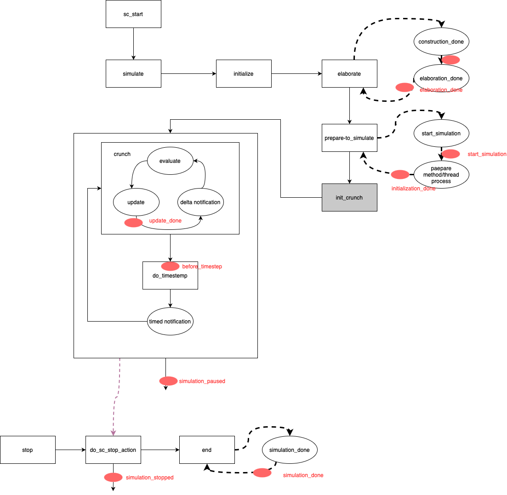

:source-highlighter: coderay

= SystemC调度模型
[[chap::schedule_model]]
:toc: left

== 引言

SystemC作为 {CPP} 语言写成的库，可以像其他HDL语言一样，描述数字电路的并行性。这其中，其独特的线程模型起到了非常重要的作用。本部分我们将尝试梳理清楚：

1. SystemC中有哪些类型的线程
2. 线程是如何创建和初始化的
3. 线程如何阻塞/非阻塞调度

我们这里以SystemC 2.3.3为例，尝试探索SystemC的内部细节。这应当可以覆盖之前SystemC版本的内容，并且原理和未来版本应该是相通的。

=== terminology

对于SystemC而言， `sc_simcontext`
数据结构实现了仿真器，我们一般提到simcontext的时候，指的都是实例化simcontext的唯一的一个全局仿真器实例，有时候我们也会用
`simc` 来指代这个仿真器内核，或者直接使用 `simcontext` 。

在之后讨论中，我们会用到交替使用 `sc_method_process` 和 `sc_method_handle` 来表示Method线程对象，使用 `sc_thread_procss` 和 `sc_thread_handle` 来表示Thread线程对象，实际上
这两组数据类型是对象和指针的关系：

.src/sysc/kernel/sc_process.h
[source,cpp]
----

typedef class sc_cthread_process* sc_cthread_handle;
typedef class sc_method_process*  sc_method_handle;
typedef class sc_thread_process*  sc_thread_handle;

----

sc_method_process和sc_thread_process统称为SystemC中的线程。如果需要区分，sc_method_process是method类型的线程，而
sc_thread_process则是thread类型的线程。如果没有特殊说明，其他场合下所说的线程指的是操作系统级别的线程。sc_cthread_process
属于sc_thread_process的派生类，不做单独区分。

== 线程的类型

SystemC中的线程概念，并不同于操作系统中的进程/线程概念。对于SystemC而言，所谓的线程，更多的类似于HDL语言中的一个`always@`模块。从概念上来讲，所有的线程都是并行运行的。而SystemC仿真器则使用了一系列包括deltay cycle在内的技术，使用串行执行的{CPP}语言，来模拟这种并行行为。SystemC的线程之于SystemC的内核，恰恰等同于操作系统概念上的线程之于操作系统，这也是为何我们在SystemC中将这些并行运行的调度模块称之为线程的一个非常重要的原因。

SystemC中一般分为三种线程（有时候也翻译为三种进程/process）：

* Method，也叫method线程，一般用于建模组合逻辑
* Thread，叫做thread线程
* CThread，即clock驱动的Thread，可以认为是Thread的一种特殊形式，一般和Thread放在一起

=== Method线程
[[concept::method]]

Method线程在SystemC中一般用于建模组合逻辑。相比于其他两种类型的线程，Method线程的特定是**非阻塞**。这意味着每一次调度
Method线程的运行，都会将Method从头到尾执行完毕到函数退出为止。所以在Method中，不允许使用任何<<api::wait, wait>>
或者间接调用wait的函数API。如果simcontext发现Method线程中直接或者间接调用了wait，则视为致命错误，终止仿真过程。

Method可以使用<<api::next_trigger, next_trigger>> 来动态设置下一次的调度时机。 `next_trigger` 是非阻塞的，设置好了
调度时机之后会立即返回。Method只能同时保持一个调度条件，要么是<<api::SC_METHOD, SC_METHOD>>创建之后，使用敏感沿
`sensitive/sensitive_pos/sensitive_neg` 设置的__静态__调度条件，要么是 `next_trigger` 设置的__动态__调度条件。这也意味着
如果在Method内部多次使用 `next_trigger` 设置动态调度条件，那么只有最后一次有效的 `next_trigger` 设置上，之前的
`next_trigger` 都会被忽略掉。

所谓的调度条件，指的是何时Method线程会被再次执行。所以在仿真器运行过程中，一个Method线程可以被多次执行。

=== ( C )Thread线程
[[concept::c_thread]]

Thread线程在SystemC中一般用来建模时序逻辑。相比于Method线程，Thread线程的特点是**阻塞式**的，在仿真器运行过程中，每个Thread
线程**只会执行一次**。一个设计良好的Thread线程应当内部包括一个 `while(true) {}` 的循环体，以保证函数体永远不会返回。

仿真器使用一种协作式线程，即协程的方式，来调度所有注册的Thread线程（包括CThread线程）。在Thread线程实现内部，可以直接或者间接
调用<<api::wait, wait>> 来让出执行权footnote:[实际上调用了<<api::suspend_me, suspend_me>>函数]，以使得其他Thread线程获得执行权。
如果一个Thread线程没有让渡出执行权，而是始终执行自己本身的 `while(true){}` 循环，则仿真器卡死。

CThread是Thread的一种特殊形式。在之后讨论中，如非必要，我们不会特意区分Thread或者Thread。当提及Thread的时候，除非特殊强调，否则这些讨论同样适用于CThread.

== 线程的创建

在一个继承自 <<data::sc_module, sc_module>> 的class实现中，我们需要在构造函数中使用 `SC_METHOD` 创建method
线程，使用 `SC_THREAD` 创建thread线程，使用 `SC_CTHREAD` 创建cthread线程。这三个类似于
函数的东西，其实是SystemC定义的宏。

=== 创建METHOD线程
[[api::SC_METHOD]]

(((SC_METHOD)))
我们首先看一下 `SC_METHOD` 是怎么实现的：

.src/sysc/kernel/sc_module.h
[source,cpp]
----
#define declare_method_process(handle, name, host_tag, func)        \
    {		                                                    \
        ::sc_core::sc_process_handle handle =                      \
	    sc_core::sc_get_curr_simcontext()->create_method_process( \
		name,  false, SC_MAKE_FUNC_PTR( host_tag, func ), \
		this, 0 ); \
        this->sensitive << handle;                                        \
        this->sensitive_pos << handle;                                    \
        this->sensitive_neg << handle;                                    \
    }

#define SC_METHOD(func)                                                       \
    declare_method_process( func ## _handle,                                  \
                            #func,                                            \
                            SC_CURRENT_USER_MODULE,                           \
                            func )
----

`SC_METHOD` 会接受一个成员函数作为参数，构建四个参数，传递给另一个 `declare_method_process` 的宏。这
四个参数分别是：

1. `func ## _handle` 扩展开来的一个token，例如，成员函数名称为 `AMethodTest` ，那么第一个参数就是
`AMethodTest_handle`
2. `#func` 扩展开来的一个字符串，例如 `AMethodTest` 生成一个 `"AMethodTest"` 的字符串
3. `SC_CURRENT_USER_MODULE`  是在 `SC_HAS_PROCESS` 或者 `SC_CTOR`  中的一个 `typedef` ，为当前类的名字
取的一个别名
4. `func` 则是成员函数指针

在 `declare_method_process` 里，首先调用 `simcontext` 的成员函数 `create_method_process` ，将参数都传递进去。注意这里有一个
新的宏 `SC_MAKE_FUNC_PTR`  来包装成员函数到成员函数指针的cast过程。以下是成员函数形式的 `SC_MAKE_FUNC_PTR` 的定义：

.src/sysc/kernel/sc_process.h
[source,cpp]
----
    typedef void (sc_process_host::*SC_ENTRY_FUNC)(); <1>
#   define SC_DECL_HELPER_STRUCT(callback_tag, func) /*EMPTY*/
#   define SC_MAKE_FUNC_PTR(callback_tag, func) \
        static_cast<sc_core::SC_ENTRY_FUNC>(&callback_tag::func)
----
<1> 这里cast能成功，是因为所有的sc_module都是<<data::sc_process_host, sc_process_host>>的派生类

如果编译器不支持成员函数形式，或者有其他理由无法使用，SystemC在 `sc_process.h` 里还提供了非成员函数形式的包装，这里我们就不再介绍了。

从这里可以看出，所有的成员函数都会cast成一个 `(sc_process_host::*)()` 类型的指针。 `sc_process_host` 是SystemC内部的一个类， `sc_module` 继承
自 `sc_process_host`, 因此这个cast是安全的。

`create_method_process` 创建好了method的process handle，同时将创建的handle压入simcontext自己内部的保存process handle的Quque里。
所以实际上所有SystemC内的线程，都会在simcontext里保存着一份 handle。

`create_method_process` 将创建的process handle返回之后，这里我们在使用重载的 `operator << (sc_process_handle)` 的函数，将process handle
设置到 `sensitive`, `sensitive_pos`, `sensitive_neg` 内。以 `sensitive` 为例：
[[function::sensitive_set_handle]]

.src/sysc/kernel/sc_sensitive.cpp
[source,cpp]
----
sc_sensitive&
sc_sensitive::operator << ( sc_process_handle handle_ )
{
    switch ( handle_.proc_kind() )
	{
      case SC_CTHREAD_PROC_:
      case SC_THREAD_PROC_:
        m_mode = SC_THREAD_;
	break;
      case SC_METHOD_PROC_:
	m_mode = SC_METHOD_;
	break;
      default:
	sc_assert(0);
    }
    m_handle = (sc_process_b*)handle_;
    return *this;
}
----

从这段代码我们可以看出，调用 `sensitive` 的 `operator <<(sc_process_handle)` 只是简单将传入的handle cast成 `sc_process_b` 指针，赋给
`sensitive` 内的一个 `m_handle` 成员变量，同时设置了 `sensitive` 的模式，方便后续校验。从这种意义上来讲， `sensitive/sensitive_pos/sensitive_neg` 
三个类似于一种语法糖设计。这也是为何一定要在 `SC_METHOD/SC_THREAD/SC_CTHREAD` 之后，立马就调用 `sensitive/sensitive_pos/sensitive_neg` 设置
敏感信号的原因：如果这个时候不设置，之后的 `SC_METHOD/SC_THREAD/SC_CTHREAD` 会重置 `m_handle` ，而这里却没有返回 `process handle` 的地方可以
重新设置回去（虽然的确可以用 
<<api::sc_get_current_process_handle, `sc_get_current_process_handle`>> 保存下来刚刚创建的process handle后续使用）。

那么，什么是 `sc_process_handle` 呢？这里我们摘录了 `sc_process_handle` 的部分代码：
[[datatype::sc_process_handle]]

.src/sysc/kernel/sc_process_handle.h
[source,cpp]
----
class SC_API sc_process_handle {

  // blabla

  public:
    operator sc_process_b* ()
        { return m_target_p; }
    operator sc_cthread_handle ();
    operator sc_method_handle ();
    operator sc_thread_handle ();

  protected:
    sc_process_b* m_target_p;   // Target for this object instance.

  // blabla

};
----

因此可以看出， `sc_process_handle` 实际上就是保存一个 `sc_process_b` 指针的包装类，只不过这个包装类提供了4个到其他类型转换的
成员函数，可以转为 `sc_process_b*` ，或者 `sc_cthread_handle`, `sc_thread_handle`, `sc_method_handle` :

.src/sysc/kernel/sc_process_handle.h
[source,cpp]
----
    operator sc_process_b* ()
        { return m_target_p; }
    operator sc_cthread_handle ();
    operator sc_method_handle ();
    operator sc_thread_handle ();
----

==== 控制METHOD线程是否初始化
[[api::dont_initialize]]

(((dont_initialize)))
默认情况下， `SC_METHOD`  所创建的METHOD线程会执行初始化，即在仿真器开始的零时刻，METHOD会被调度执行一次。为了控制是否执行
初始化， <<data::sc_module, sc_module>> 提供了成员函数 `dont_initialize()` 函数。

.src/sysc/kernel/sc_module.cpp
[source,cpp]
----
// to prevent initialization for SC_METHODs and SC_THREADs

void
sc_module::dont_initialize()
{
    sc_process_handle last_proc = sc_get_last_created_process_handle();
    last_proc.dont_initialize( true );
}
----

这里通过 `sc_get_last_created_process_handle` ，调用了刚刚创建的线程（无论是METHOD还是THREAD)的 `dont_initialize` 函数:

而process handle的 `dont_initialize` 则直接调用了所保存的 `sc_process_b` 的成员函数 `dont_initialize`:

.src/sysc/kernel/sc_process_handle.h
[source,cpp]
----
inline void sc_process_handle::dont_initialize( bool dont )
{
    if ( m_target_p )
        m_target_p->dont_initialize( dont );
    else
        SC_REPORT_WARNING( SC_ID_EMPTY_PROCESS_HANDLE_, "dont_initialize()");
}

----

对于`sc_process_b`, 这里的 `dont_initialize` 只是简单地将状态保存下来而已。

.src/sysc/kernel/sc_process.cpp
[source,cpp]
----
//------------------------------------------------------------------------------
//"sc_process_b::dont_initialize"
//
// This virtual method sets the initialization switch for this object instance.
//------------------------------------------------------------------------------
void sc_process_b::dont_initialize( bool dont )
{
    m_dont_init = dont;
}
----

注意对于`sc_process_b`, `dont_initialize` 是一个虚函数。实际上无论是METHOD还是正常的THREAD线程而言，这个虚函数都没有被override。
对于CTHREAD，这个虚函数被重写为一个WARNING了，这也就意味着， `dont_initialize` 只能应用于METHOD和正常的THREAD线程，而不能应用于
CTHREAD线程上，这也是这个 `dont_initialize` 函数被设计成为一个虚函数的原因所在了。

默认情况下， `SC_THREAD`  所创建的THREAD线程也会在仿真器开始的零时刻被调度（因此开始执行，从不返回）。我们这里同样可以使用
`dont_initialize` 来控制是否执行初始化。

对于 `SC_CTHREAD`  所创建的CTHREAD线程而言，永远执行初始化。我们无法通过 `dont_initialize` 来阻止一个CTHREAD的初始化过程。

=== 创建THREAD线程
[[api::SC_THREAD]]

(((SC_THREAD)))
构造函数里使用 `SC_THREAD` 宏创建一个THREAD线程，代码如下：

.src/sysc/kernel/sc_module.h
[source,cpp]
----
#define SC_THREAD(func)                                                       \
    declare_thread_process( func ## _handle,                                  \
                            #func,                                            \
                            SC_CURRENT_USER_MODULE,                           \
                            func )
#define declare_thread_process(handle, name, host_tag, func)        \
    {                                                               \
        ::sc_core::sc_process_handle handle =                      \
	     sc_core::sc_get_curr_simcontext()->create_thread_process( \
                 name,  false,           \
                 SC_MAKE_FUNC_PTR( host_tag, func ), this, 0 ); \
        this->sensitive << handle;                                        \
        this->sensitive_pos << handle;                                    \
        this->sensitive_neg << handle;                                    \
    }
----

从代码可以看出，这里的代码和 `SC_METHOD` 基本一致，除了调用的是simcontext的 `create_thread_process` 之外，其他部分一样。所以这里我们 就不多介绍了。

THREAD线程同样使用<<api::dont_initialize, dont_initialize>>来控制是否在零时刻执行一次以进行初始化。

=== 创建CTHREAD线程
[[api::SC_CTHREAD]]

当使用 `SC_CTHREAD`  创建一个CTHREAD时候，宏的实现就有所不同：

.src/sysc/kernel/sc_module.h
[source,cpp]
----
#define declare_cthread_process(handle, name, host_tag, func, edge) \
    {                                                               \
        ::sc_core::sc_process_handle handle =                     \
	     sc_core::sc_get_curr_simcontext()->create_cthread_process( \
            name,  false,          \
                     SC_MAKE_FUNC_PTR( host_tag, func ), this, 0 ); \
        this->sensitive.operator() ( handle, edge );\
    }

#define SC_CTHREAD(func, edge)                                                \
    declare_cthread_process( func ## _handle,                                 \
                             #func,                                           \
                             SC_CURRENT_USER_MODULE,                          \
                             func,                                            \
                             edge )
----

这里主要增加了一个 `edge` 的参数。 `edge` 并不会实际参与到 `create_cthread_process` 里，但是设置敏感信号的时候，这里不再设置
`sensitive_pos/sensitive_neg` 了，而是将 `edge` 信息传递给 `sensitive` 。

而一般 `sc_clock` 类型的 `pos/neg` 定义则是：

.src/sysc/communication/sc_signal_ports.h
[source,cpp]
----
    // use for positive edge sensitivity

    sc_event_finder& pos() const
    {
        return sc_event_finder::cached_create
                ( m_pos_finder_p, *this, &in_if_type::posedge_event );
    }

    // use for negative edge sensitivity

    sc_event_finder& neg() const
    {
        return sc_event_finder::cached_create
                ( m_neg_finder_p, *this, &in_if_type::negedge_event );
    }
----

所以调用的函数重载形式是 `operator() (sc_cthread_handle, sc_event_finder&)`  :

.src/sysc/kernel/sc_sensitive.cpp
[source,cpp]
----
sc_sensitive&
sc_sensitive::operator () ( sc_cthread_handle handle_,
			    sc_event_finder& event_finder_ )
{
    event_finder_.port().make_sensitive( handle_, &event_finder_ );
    return *this;
}
----

这部分内容我们后续再展开来讲。

== 线程的调度

=== simcontext中的调度器
[[concept::simcontext::intro]]

`simc` 中，成员函数 `crunch`
是实现Delta模型的非常重要的一部分。某种程度上，我们可以认为一次 `crunch`
成员函数的启动，就是一次Delta
Cycle。而我们探索线程的调度，也将着重放在一个Delta
Cycle内部，观察线程是如何调度的。在实际的代码中，也只有 `crunch`
函数内部才会调度所创建的各种类型的线程。

(((sc_start)))
我们这里简单介绍一下SystemC的仿真器启动流程：

----
main() -> sc_core::sc_elab_and_sim() // sc_main.cpp
-> sc_core::sc_main() // sc_main_main.cpp
-> // User Code
-> sc_start() // User Code
-> sc_simcontext::simulate() // sc_simcontext.cpp
-> sc_simcontext::crunch() // sc_simcontext.cpp
----

简单来说，{CPP} 语言的入口是main函数，在SystemC中，main函数间接(通过
`sc_elab_and_sim` )调用了 `sc_main` 函数。用户代码需要实现 `sc_main`
函数，并且需要使用 `sc_start()` 显式开启simulation过程。 `sc_start`
函数调用了simcontext的 `simulate` 函数，而这个函数则主要调用 `crunch`
，实现了基于Delta模型的硬件仿真模型。

==== Crunch函数

[[concept::crunch]]
((Crunch))函数执行多次Delta Cycle，直到没有事件发生，没有可执行的列表。

[[phase::evaluate]]
Crunch函数的执行分为三个阶段：
[[phase::update]]

1. ((EVALUATE PHASE))，本阶段将调度执行所有处于调度列表中<<concept::pop_queue, Pop Queue>>的线程
2. ((UPDATE PHASE))，调用primitive channel registry的 `perform_update` 函数，更新primitive channel
3. ((NOTIFICATION PHASE))，对于上述两个阶段过程中更新了的delta event列表，执行这些
delta事件列表的trigger函数，尝试将依赖这些delta event的线程放入<<concept::push_queue, Push Queue>>中，未下一此循环做准备

[[phase::notification]]
三个阶段完成后，仿真器会检查是否还有可执行的线程。如果有，则重复上述循环，直到满足退出条件为止。
crunch函数的退出条件包括：delta event列表为空，并且可运行的调度单元也为空。这类比于仿真过程
进入starvation模式，没有新的激励可以执行了。

==== 两个调度列表
[[concept::runnable]]

`simc` 中用 `sc_runnable` 建模了两个调度列表，分别为thread的调度列表，和method的调度列表，数据成员如下：

.src/sysc/kernel/sc_runnable.h
[source,cpp]
----
    sc_method_handle m_methods_push_head;
    sc_method_handle m_methods_push_tail;
    sc_method_handle m_methods_pop;
    sc_thread_handle m_threads_push_head;
    sc_thread_handle m_threads_push_tail;
    sc_thread_handle m_threads_pop;
----

其中，每种类型的调度链表由三个成员组成，分别是 `push_head`, `push_tail` 和 `pop` 。
这三个成员又分为两组，
`push_head` 和 `push_tail` 组成了对应调度列表的[[concept::push_queue]] Push Queue，而
`pop` 则单独组成对应调度列表的[[concept::pop_queue]] Pop Queue。

`sc_runnable` 提供了 `toggle_method()` 和 `toggle_thread()` 成员函数，将对应调度
列表的Push Queue转为Pop Queue(只有Pop为空的时候才能转)：

.src/sysc/kernel/sc_runnable_int.h
[source,cpp]
----

//------------------------------------------------------------------------------
//"sc_runnable::toggle_methods"
//
// This method moves the methods push queue to the pop queue and zeros the push
// queue. This will only be done if the pop queue is presently empty.
//------------------------------------------------------------------------------
inline void sc_runnable::toggle_methods()
{
    if ( m_methods_pop == SC_NO_METHODS )
    {
	m_methods_pop = m_methods_push_head->next_runnable();
	m_methods_push_head->set_next_runnable(SC_NO_METHODS);
	m_methods_push_tail = m_methods_push_head;
    }
}
----

从 `toggle_methods()` 的实现可以看出，只是简单地将 `push_head` 所指向的链表头结点
移动到 `pop` 结点，并且重置 `push_head` 和 `push_tail` 结点的值即可达成目的。

这样一来，在执行的<<phase::evaluate, EVALUATE>>阶段，仿真器只调度执行Pop Queue里的线程。如果这些线程中更新了
某些事件，或者某些条件达成，需要调度新的线程，这些新加入的线程会被压入Push Queue中去，而不会
影响本次delta cycle的执行。 这些新加入的线程会在下一个delta cycle开始的时候，被toggle_methods/toggle_threads函数从Push Queue挪到Pop Queue.

=== Method的静态敏感
[[concept::method::static]]

==== 设置Method线程的静态敏感事件

使用 <<api::SC_METHOD, `SC_METHOD`>> 创建Method线程时，所创建线程的process handle会被<<function::sensitive_set_handle, 注册>>到sensitive中。之后
我们可以使用 sensitive/sensitive_pos/sensitive_neg 来为Method线程设置敏感事件。使用这种方式设置敏感事件，称之为Method线程
的**静态**敏感事件。

`sensitive::operator <<()` 函数可以接受四种重载形式：

.src/sysc/kernel/sc_sensitive.h
[source,cpp]
----
    sc_sensitive& operator << ( const sc_event& );
    sc_sensitive& operator << ( const sc_interface& );
    sc_sensitive& operator << ( const sc_port_base& );
    sc_sensitive& operator << ( sc_event_finder& );
----

关于sc_sensitive更多的介绍参考<<data::sc_sensitive, sc_sensitive>>部分。
我们这里主要关注第一种重载形式，即使用一个 `sc_event` 来作为Method的静态调度事件:

.src/sysc/kernel/sc_sensitive.cpp
[source,cpp]
----
sc_sensitive&
sc_sensitive::operator << ( const sc_event& event_ )
{
    // check
    if( sc_is_running() ) {
	SC_REPORT_ERROR( SC_ID_MAKE_SENSITIVE_, "simulation running" );
    }

    // make sensitive
    switch( m_mode ) {
    case SC_METHOD_:
    case SC_THREAD_: {
	m_handle->add_static_event( event_ );
	break;
    }
    case SC_NONE_:
        /* do nothing */
        break;
    }

    return *this;
}
----

从这个函数的实现我们可以看出，对于METHOD/THREAD类型的process handle，这里只是简单地调用了 `sc_process_b` 的
`add_static_event` 成员函数。CTHREAD无法使用这种方式注册静态调度事件。

.src/sysc/kernel/sc_process.cpp
[source,cpp]
----
void sc_process_b::add_static_event( const sc_event& e )
{
    sc_method_handle method_h; // This process as a method.
    sc_thread_handle thread_h; // This process as a thread.

    // CHECK TO SEE IF WE ARE ALREADY REGISTERED WITH THE EVENT:

    for( int i = m_static_events.size() - 1; i >= 0; -- i ) {
        if( &e == m_static_events[i] ) {
            return;
        }
    }

    // REMEMBER THE EVENT AND THEN REGISTER OUR OBJECT INSTANCE WITH IT:

    m_static_events.push_back( &e );

    switch ( m_process_kind )
    {
      case SC_THREAD_PROC_:
      case SC_CTHREAD_PROC_:
        thread_h = static_cast<sc_thread_handle>( this );
        e.add_static( thread_h );
        break;
      case SC_METHOD_PROC_:
        method_h = static_cast<sc_method_handle>( this );
        e.add_static( method_h );
        break;
      default:
        sc_assert( false );
        break;
    }
}
----

而在 `sc_process_b::add_static_event()` 函数的实现里，主要做了两件事情：

1. 将event的指针保存到成员变量 `m_static_events` 内，一个event只会保存一次，避免多次调度
2. 同时将自己本身cast成为合适的handle，调用event的 `add_static` 成员函数，注册到event中

对于event而言:

.src/sysc/kernel/sc_process.cpp
[source,cpp]
----
inline
void
sc_event::add_static( sc_method_handle method_h ) const
{
    m_methods_static.push_back( method_h );
}

inline
void
sc_event::add_static( sc_thread_handle thread_h ) const
{
    m_threads_static.push_back( thread_h );
}
----

无论注册的是Thread类型，还是Method类型的handle，都只是将他们保存在对应的成员变量
`m_threads_static` 和 `m_methods_static` 中。

至此，达到了两个效果：

* process handle的 `m_static_events` 中保存了线程静态敏感事件对象event的指针
* event中分别用 `m_methods_static` 和 `m_threads_static` 保存了此事件需要触发的线程handle

==== 事件引发调度
[[api::event::trigger::static_method]]

在仿真器的<<phase::notification, NOTIFICATON>> Phase, event的 `trigger()`
函数里，实现了对所关联的Method线程的调度。调度静态Method线程的代码片段如下：

.src/sysc/kernel/sc_event.cpp
[source,cpp]
----
    // trigger the static sensitive methods

    if( ( size = m_methods_static.size() ) != 0 )
    {
        sc_method_handle* l_methods_static = &m_methods_static[0];
        int i = size - 1;
        do {
            sc_method_handle method_h = l_methods_static[i];
            method_h->trigger_static();
        } while( -- i >= 0 );
    }

----

这里逆序调用了每个注册的Method线程对象的 `trigger_static()` 函数：

[[api::sc_method_process::trigger_static]]
.src/sysc/kernel/sc_method_process.h
[source,cpp]
----
//------------------------------------------------------------------------------
//"sc_method_process::trigger_static"
//
// This inline method adds the current method to the queue of runnable
// processes, if required.  This is the case if the following criteria
// are met:
//   (1) The process is in a runnable state.
//   (2) The process is not already on the run queue.
//   (3) The process is expecting a static trigger, 
//       dynamic event waits take priority.
//
//
// If the triggering process is the same process, the trigger is
// ignored as well, unless SC_ENABLE_IMMEDIATE_SELF_NOTIFICATIONS
// is defined.
//------------------------------------------------------------------------------
inline
void
sc_method_process::trigger_static()
{
    if ( (m_state & ps_bit_disabled) || is_runnable() ||
          m_trigger_type != STATIC )
        return;

#if ! defined( SC_ENABLE_IMMEDIATE_SELF_NOTIFICATIONS )
    if( SC_UNLIKELY_( sc_get_current_process_b() == this ) )
    {
        report_immediate_self_notification();
        return;
    }
#endif // SC_ENABLE_IMMEDIATE_SELF_NOTIFICATIONS

    // If we get here then the method is has satisfied its wait, if its 
    // suspended mark its state as ready to run. If its not suspended then 
    // push it onto the runnable queue.

    if ( m_state & ps_bit_suspended )
    {
        m_state = m_state | ps_bit_ready_to_run;
    }
    else
    {
        simcontext()->push_runnable_method(this);
    }
}
----

满足以下三个条件的情况下， `sc_method_process::trigger_static()` 将会
使用 `simc` 的成员函数 `push_runnable_method()` ，
将自己加入到 `simc` 的可执行method <<concept::push_queue, push列表>>中去：

1. 线程处于可执行状态，没有被disable掉
2. 线程没有正在执行，即不在 `simc` 的<<concept::push_queue, Push Queue>>或者<<concept::pop_queue, Pop Queue>> 中
3. 线程是静态触发的，动态触发比静态触发拥有更高的优先级

==== 多个EVENT
[[method::static::multi_event]]

在使用 `sensitive` 等注册敏感事件时，我们可以注册多个事件对象。这样一来，对于所创建的
Method线程，其成员变量 `m_static_events` 内可以保存多个静态事件对象的指针。同时，
每个静态对象的 `m_methods_static` 成员变量都保存着Method线程的句柄。

如果多个事件同时发生，这些事件都会调用 `trigger()` 成员函数，从而多次调用同一个
Method线程的 `trigger_static()` 成员函数。当某一个事件调用了 Method线程的 `trigger_static()` 成功
将Method线程加入到<<concept::push_queue>> 中，这也会同时设置Method线程的 `m_runnable_p` 指针，指向
Runnable Push Queue中的下一个节点。当其他事件满足条件，从而调用Method线程的时候， 
<<api::sc_method_process::trigger_static, `trigger_static()`>> 函数
入口的 `is_runnable()` 则返回true，以防止同一个Method线程被多次加入到Runnable Push Queue中。

从这里的分析可以看出，如果使用 `sensitive` 等注册多个事件，那么着多个事件彼此之间是**或**的关系：只要
有一个事件发生，都会导致与之关联的Method线程被调度执行。

=== Method的动态调度
[[api::next_trigger]]

(((next_trigger)))
在Method内部，可以使用 `next_trigger` 注册下一次这个Method线程的调度时机。这种调度方式即为Method线程
的**动态**调度。

`next_trigger` 有多重重载形式。不带参数的 `next_trigger` 只是简单调用了Method线程的 `clear_trigger`
成员函数：

.src/sysc/kernel/sc_wait.cpp
[source,cpp]
----
// static sensitivity for SC_METHODs

SC_API void
next_trigger( sc_simcontext* simc )
{
    sc_curr_proc_handle cpi = simc->get_curr_proc_info();
    if( cpi->kind == SC_METHOD_PROC_ ) {
	reinterpret_cast<sc_method_handle>( cpi->process_handle )->clear_trigger();
    } else {
	SC_REPORT_ERROR( SC_ID_NEXT_TRIGGER_NOT_ALLOWED_, "\n        "
			 "in SC_THREADs and SC_CTHREADs use wait() instead" );
    }
}
----

而 `sc_method_process::clear_trigger` 只是简单清理不使用的资源，然后将本线程的调度模式更改为静态调度而已。
[[api::sc_method_process::clear_trigger]]

.src/sysc/kernel/sc_method_process.cpp
[source,cpp]
----
void sc_method_process::clear_trigger()
{
    // blabla <1>
    m_trigger_type = STATIC;
}
----
<1> 主要是一些资源释放的问题，以及可能已经设置好的timed event被cancel和reset，或者已经加入到dynamic list中的事件被移除

这也就意味着我们可以使用不带任何参数的 `next_trigger()` 调用，将一个Method线程从动态调度改回静态调度模式。

如果 `next_trigger` 函数调用提供了一个event对象，那么：

.src/sysc/kernel/sc_wait.cpp
[source,cpp]
----
// dynamic sensitivity for SC_METHODs

SC_API void
next_trigger( const sc_event& e, sc_simcontext* simc )
{
    sc_curr_proc_handle cpi = simc->get_curr_proc_info();
    if( cpi->kind == SC_METHOD_PROC_ ) {
	reinterpret_cast<sc_method_handle>( cpi->process_handle )->next_trigger( e );
    } else {
	SC_REPORT_ERROR( SC_ID_NEXT_TRIGGER_NOT_ALLOWED_, "\n        "
			 "in SC_THREADs and SC_CTHREADs use wait() instead" );
    }
}
----

这里实际上间接调用了 `sc_method_process::next_trigger(const sc_event&)` 函数，而这个method线程的成员函数实现了：

.src/sysc/kernel/sc_method_process.cpp
[source,cpp]
----
inline
void
sc_method_process::next_trigger( const sc_event& e )
{
    clear_trigger();
    e.add_dynamic( this );
    m_event_p = &e;
    m_trigger_type = EVENT;
}
----

首先，清除所有之前设置的trigger条件，然后将本method线程通过 `sc_event::add_dynamic` 的函数，注册到事件内部。
最后保存下事件的指针，更改触发类型为事件类型(EVENT)。

.src/sysc/kernel/sc_event.h
[source,cpp]
----
inline
void
sc_event::add_dynamic( sc_method_handle method_h ) const
{
    m_methods_dynamic.push_back( method_h );
}
----

对于 `sc_event::add_dynamic()` 而言，这里只是将method线程handle存入成员变量 `m_methods_dynamic` 中，然后在
`sc_event::trigger()` 函数调用的时候，满足条件的method线程就被动态调度起来。Method线程在 event里动态调度的
代码片段如下：

.src/sysc/kernel/sc_event.cpp
[source,cpp]
----
    // trigger the dynamic sensitive methods

    if( ( size = m_methods_dynamic.size() ) != 0 )
    {
	last_i = size - 1;
	sc_method_handle* l_methods_dynamic = &m_methods_dynamic[0];
	for ( int i = 0; i <= last_i; i++ )
	{
	    sc_method_handle method_h = l_methods_dynamic[i];
	    if ( method_h->trigger_dynamic( this ) )
	    {
		l_methods_dynamic[i] = l_methods_dynamic[last_i];
		last_i--;
		i--;
	    }
	}
        m_methods_dynamic.resize(last_i+1);
    }
----

注意这里调用了 `sc_method_process::trigger_dynamic` 函数，同时根据返回值判断是否成功调度。
一个Method可能由于多种原因无法成功调度，例如， `next_trigger` 设置了多个event，但只有
为数不多的event发生，或者其他原因。如果Method线程没有成功调度，event对象需要保持对这个
Method线程的引用。反之，如果线程调度成功，则event删除对Method线程的引用。

注意在这里SystemC采用了一种巧妙的方法删除 `trigger_dynamic` 成功的method process handle。
对于已经成功的process handle，将之与最后一个还没有处理的process handle交换。这样处理了一遍
之后，`last_i` 指向的就是最后一个没有 trigger_dynamic成功的method，并且这个之前都是
没有成功的，之后都是已经成功的。最后调用resize，即可将这些trigger_dynamic成功的
method process handle删掉。

这里也可以对比下那些静态trigger的method process。无论trigger_static method process
是否成功，method process handle都不会被删除的。

[[sc_process_b::trigger_dynamic]]

.src/sysc/kernel/sc_method_process.cpp
[source,cpp]
----
bool sc_method_process::trigger_dynamic( sc_event* e )
{
    // No time outs yet, and keep gcc happy.

    m_timed_out = false;

    // Escape cases:
    //   (a) If this method issued the notify() don't schedule it for
    //       execution, but leave the sensitivity in place.
    //   (b) If this method is already runnable can't trigger an event.

#if ! defined( SC_ENABLE_IMMEDIATE_SELF_NOTIFICATIONS )
    if( SC_UNLIKELY_( sc_get_current_process_b() == this ) )
    {
        report_immediate_self_notification();
        return false;
    }
#endif // SC_ENABLE_IMMEDIATE_SELF_NOTIFICATIONS

    if( is_runnable() ) <1>
        return true;

    // If a process is disabled then we ignore any events, leaving them enabled:
    //
    // But if this is a time out event we need to remove both it and the
    // event that was being waited for.

    if ( m_state & ps_bit_disabled )
    {
        if ( e == m_timeout_event_p )
	{
	    remove_dynamic_events( true );
	    return true;
	}
	else
	{
	    return false;
	}
    }

    // Process based on the event type and current process state:
    //
    // Every case needs to set 'rc' and continue on to the end of
    // this method to allow suspend processing to work correctly.

    switch( m_trigger_type )
    {
      case EVENT: <2>
	m_event_p = 0;
	m_trigger_type = STATIC;
	break;

      case AND_LIST:
        -- m_event_count;
	if ( m_event_count == 0 )
	{
	    m_event_list_p->auto_delete();
	    m_event_list_p = 0;
	    m_trigger_type = STATIC;
	}
	else
	{
	    return true;
	}
	break;

      case OR_LIST:
	m_event_list_p->remove_dynamic( this, e );
	m_event_list_p->auto_delete();
	m_event_list_p = 0;
	m_trigger_type = STATIC;
	break;

      case TIMEOUT:
	m_trigger_type = STATIC;
	break;

      case EVENT_TIMEOUT:
        if ( e == m_timeout_event_p )
	{
	    m_timed_out = true;
	    m_event_p->remove_dynamic( this );
	    m_event_p = 0;
	    m_trigger_type = STATIC;
	}
	else
	{
	    m_timeout_event_p->cancel();
	    m_timeout_event_p->reset();
	    m_event_p = 0;
	    m_trigger_type = STATIC;
	}
	break;

      case OR_LIST_TIMEOUT:
        if ( e == m_timeout_event_p )
	{
            m_timed_out = true;
            m_event_list_p->remove_dynamic( this, e );
            m_event_list_p->auto_delete();
            m_event_list_p = 0;
            m_trigger_type = STATIC;
	}

	else
	{
            m_timeout_event_p->cancel();
            m_timeout_event_p->reset();
	    m_event_list_p->remove_dynamic( this, e );
	    m_event_list_p->auto_delete();
	    m_event_list_p = 0;
	    m_trigger_type = STATIC;
	}
	break;

      case AND_LIST_TIMEOUT:
        if ( e == m_timeout_event_p )
	{
            m_timed_out = true;
            m_event_list_p->remove_dynamic( this, e );
            m_event_list_p->auto_delete();
            m_event_list_p = 0;
            m_trigger_type = STATIC;
	}

	else
	{
	    -- m_event_count;
	    if ( m_event_count == 0 )
	    {
		m_timeout_event_p->cancel();
		m_timeout_event_p->reset();
		// no need to remove_dynamic
		m_event_list_p->auto_delete();
		m_event_list_p = 0;
		m_trigger_type = STATIC;
	    }
	    else
	    {
	        return true;
	    }
	}
	break;

      case STATIC: {
        // we should never get here, but throw_it() can make it happen.
	SC_REPORT_WARNING(SC_ID_NOT_EXPECTING_DYNAMIC_EVENT_NOTIFY_, name());
        return true;
      }
    }

    // If we get here then the method has satisfied its next_trigger, if its
    // suspended mark its state as ready to run. If its not suspended then push
    // it onto the runnable queue.

    if ( (m_state & ps_bit_suspended) ) <3>
    {
	m_state = m_state | ps_bit_ready_to_run;
    }
    else
    {
        simcontext()->push_runnable_method(this); <4>
    }

    return true;
}
----
<1> 如果method线程正在运行，则无需调度
<2> 对于EVENT的trigger类型而言，只要事件发生，那么就可以调度，这里调度完之后会清除
保留的信息，重置method线程的trigger类型为静态调度
<3> 如果线程被suspend，简单标记下线程是ready to run，就返回
<4> 最后部分将本method线程加入到 `simc` 的push queue中，在下一个delta cycle的EVALUATE
PHASE执行调度任务

==== 动态触发类型
[[concept::trigger_type]]

对于Method线程而言，我们介绍了一种使用单一事件动态触发的触发类型。除此之外，可能的触发类型
还有：

* `AND_LIST`  多个事件同时满足才能够触发的触发类型
* `OR_LIST` 多个事件只要满足一个就可以触发的触发类型
* `TIMEOUT` 定时功能，超时时候触发的触发类型
* `EVENT_TIMEOUT` 单一事件带超时的触发类型，当事件发生，或者设置的超时时间达到时即触发
* `AND_LIST_TIMEOUT` 多个事件同时满足，或者超时才能触发的触发类型
* `OR_LIST_TIMEOUT` 多个事件只要有一个满足，或者超时，即可触发的触发类型

从<<sc_process_b::trigger_dynamic, `trigger_dynamic`>>中我们也能够看到对于不同的触发类型的处理方式。
例如：

. 对于 `AND_LIST` ，实际上只统计抵达的事件个数，而不会区分具体是否全部事件都发生。所以用户应当保证
每个事件只发生一次
. 对于 `AND_LIST_TIMEOUT`  ，需要检查事件类型，超时导致的触发即可发生，普通事件则需要检查是否满足所有
的触发条件
. 对于 `EVENT/OR_LIST/OR_LIST_TIMEOUT/TIMEOUT/EVENT_TIMEOUT`  ，只有有事件达到就可以触发
. 带超时功能的触发类型，会多出一个定时事件，这个定时事件是每个method线程自带的一个定时事件。

动态触发条件满足之后，无论是何种触发类型，都会重置为静态触发类型。在动态触发过程中分配的资源也会在触发成功
的时候释放完毕。

=== Thread的静态调度
[[concept::thread::static]]

使用 <<api::SC_THREAD, `SC_THREAD`>> 创建Thread线程时，所创建线程的process handle会被<<function::sensitive_set_handle, 注册>>到sensitive中。之后
我们可以使用 sensitive/sensitive_pos/sensitive_neg 来为Thread线程设置调度事件。使用这种方式设置调度事件，称之为Thread线程
的**静态**调度。

Thread的静态调度基本和<<concept::method::static, Method的静态调度>>一样，所不同的是调用的是Thread的 `trigger_static` 函数：
[[api::sc_thread_process::trigger_static]]

.src/sysc/kernel/sc_thread_process.h
[source,cpp]
----
inline
void
sc_thread_process::trigger_static()
{
    // No need to try queueing this thread if one of the following is true:
    //    (a) it is disabled
    //    (b) it is already queued for execution
    //    (c) it is waiting on a dynamic event
    //    (d) its wait count is not satisfied and it is not currently in reset

    if ( (m_state & ps_bit_disabled) || is_runnable() ||
          m_trigger_type != STATIC )
        return;

#if ! defined( SC_ENABLE_IMMEDIATE_SELF_NOTIFICATIONS )
    if( SC_UNLIKELY_( sc_get_current_process_b() == this ) )
    {
        report_immediate_self_notification();
        return;
    }
#endif // SC_ENABLE_IMMEDIATE_SELF_NOTIFICATIONS

    if ( m_wait_cycle_n > 0 && THROW_NONE == m_throw_status ) <1>
    {
        --m_wait_cycle_n;
        return;
    }

    // If we get here, then the thread has satisfied its wait criteria. If it is
    // suspended, then mark its state as ready to run. If it is not suspended,
    // then push it onto the runnable queue.

    if ( m_state & ps_bit_suspended )
    {
        m_state = m_state | ps_bit_ready_to_run;
        return;
    }

    simcontext()->push_runnable_thread(this); <2>
}
----
<1> 为仿真时钟精确模型，这里在静态触发时，加入了时钟周期的判断
<2> 如果触发条件满足，那么将本Thread线程加入到 `simc` 的push queue中，等待下一个delta cycle调度执行

这里的结构基本等同于<<api::sc_method_process::trigger_static, Method线程的 `trigger_static`>>函数，除了
多了个 `m_wait_cycle_n` 的判断，这个是为了建模时钟精确模型而添加的。

==== 多个EVENT

与<<method::static::multi_event, Method线程多个EVENT静态调度>> 一样，如果一个Thread线程
敏感列表中有多个EVENT，那么这些EVENT彼此之间是**或**的关系：只要有一个事件触发，都会将与之关联的
Thread线程加入到runnable <<concept::push_queue, Push Queue>>，而之后其他的时间调用到
Thread线程的 `trigger_static()` 函数时候，由于Thread已经是runnable的了，只会简单返回。

=== Thread的动态调度
[[api::wait]]
[[concept::thread::dynamic]]

不同于Method中使用 `next_trigger` 注册下一次调度条件，在Thread线程中，一般使用 `wait()` 函数以及各种
重载形式来完成动态调度。 `wait` 函数是**阻塞**式调用，这意味着如果一个Thread线程执行到 `wait` 处，则会
阻塞当前正在执行的线程，让渡出执行权，让 `simc` 转而执行其他可调度的线程。当本Thread线程满足调度
条件，再一次被 `simc` 调度的时候，将会从 `wait` 处返回，继续执行接下来的代码。

`wait` 有多重重载形式，不带任何参数的 `wait()` 将阻塞当前线程，等待静态调度事件发生，然后将线程加入调度列表：

.src/sysc/kernel/sc_wait.cpp
[source,cpp]
----
SC_API void
wait( sc_simcontext* simc )
{
    sc_curr_proc_handle cpi = simc->get_curr_proc_info();
    switch( cpi->kind ) {
    case SC_THREAD_PROC_:
    case SC_CTHREAD_PROC_: {
        reinterpret_cast<sc_thread_handle>( cpi->process_handle )->wait_cycles(); <1>
        break;
    }
    default:
	SC_REPORT_ERROR( SC_ID_WAIT_NOT_ALLOWED_, "\n        "
			 "in SC_METHODs use next_trigger() instead" );
        break;
    }
}
----
<1> 这里是等待多个周期，周期由静态调度事件定义，不一定就是精确的clock cycle

所以这里无论是Thread线程，还是CThread线程，都简单调用了 `sc_thread_process::wait_cycles()` 函数：

.src/sysc/kernel/sc_thread_process.h
[source,cpp]
----
//------------------------------------------------------------------------------
//"sc_thread_process::wait_cycles"
//
// This method suspends this object instance for the specified number of cycles.
// A cycle is defined as the event the thread is set up to staticly wait on.
// The field m_wait_cycle_n is set to one less than the number of cycles to
// be waited for, since the value is tested before being decremented in
// the simulation kernel.
//------------------------------------------------------------------------------
inline
void
sc_thread_process::wait_cycles( int n )
{
    if( m_unwinding )
        SC_REPORT_ERROR( SC_ID_WAIT_DURING_UNWINDING_, name() );

    if( n <= 0 )
        SC_REPORT_ERROR( SC_ID_WAIT_NEGATIVE_CYCLES_, name() );

    m_wait_cycle_n = n-1;
    suspend_me();
}
----

如这里的注释所说，所谓的一个时钟周期，指的是这个线程被一次静态调度的周期。如果一个THREAD线程的敏感信号没有设置为 `sc_clock` ，而是其他
时间，在这个THREAD线程中使用 `wait()` 调用的结果等同于等待下一次敏感信号发生。

[NOTE]
=====

[[api::suspend_me]]
在 `sc_thread_process::wait_cycles( int n )` 函数里，我们发现有一个非常有趣的函数， `suspend_me` ，这是实现协程的一部分，这个函数会：

1. 调用 `suspend_me` 时候，调用方被调度出去，让渡出CPU执行权
2. 当调用方被再次调度时候，执行会从 `suspend_me` 返回

`suspend_me` 是实现阻塞式调用的核心所在，我们在后续部分会具体分析这个函数的实现机制。

=====

如果 `wait` 调用给予一个事件对象，那么:

.src/sysc/kernel/sc_wait.cpp
[source,cpp]
----
// dynamic sensitivity for SC_THREADs and SC_CTHREADs

SC_API void
wait( const sc_event& e, sc_simcontext* simc )
{
    sc_curr_proc_handle cpi = simc->get_curr_proc_info();
    switch( cpi->kind ) {
    case SC_THREAD_PROC_: {
	reinterpret_cast<sc_thread_handle>( cpi->process_handle )->wait( e );
	break;
    }
    case SC_CTHREAD_PROC_: {
        warn_cthread_wait(); <1>
	sc_cthread_handle cthread_h =
            reinterpret_cast<sc_cthread_handle>( cpi->process_handle );
	cthread_h->wait( e );
	cthread_h->wait_cycles();
	break;
    }
    default:
	SC_REPORT_ERROR( SC_ID_WAIT_NOT_ALLOWED_, "\n        "
			 "in SC_METHODs use next_trigger() instead" );
        break;
    }
}
----
<1> 对于CTHREAD而言，不应当使用事件触发

对于Thread线程，这转而执行了 `sc_thread_process::wait(const sc_event&)` 了:
[[api::sc_thread_process::wait::sc_event]]

.src/sysc/kernel/sc_thread_process.h
[source,cpp]
----
//------------------------------------------------------------------------------
//"sc_thread_process::wait"
//
//------------------------------------------------------------------------------
inline
void
sc_thread_process::wait( const sc_event& e )
{
    if( m_unwinding )
        SC_REPORT_ERROR( SC_ID_WAIT_DURING_UNWINDING_, name() );

    m_event_p = &e; // for cleanup.
    e.add_dynamic( this );
    m_trigger_type = EVENT;
    suspend_me();
}
----

这里将事件指针保存下来，本thread线程通过event的 `add_dynamic` 注册到事件里，然后设置trigger类型为EVENT类型。不同于
Method线程里的处理，这里多了一个 `suspend_me` ，阻塞了当前线程的执行。

当事件调用 `sc_event::trigger()` 时候，最终调用到 `sc_thread_process::trigger_dynamic()` 部分，将此线程对象加入到
`simc` 的Push Queue，在下一个delta cycle得到调度执行。

Thread线程的动态调度过程和<<sc_process_b::trigger_dynamic, Method线程的 `trigger_dynamic`>> 函数实现一模一样。
由于在其他一些函数里需要区分是thread的 `trigger_dynamic` ，还是method的 `trigger_dynamic` ，所以这两个不能
合并成为基类 `sc_process_b` 的 `trigger_dynamic` 。两边代码实际上是一致的，如果修改了其中一个，另一个也需要
同步得到修改。

=== 初始化
[[concept::simulate::initialize]]

到现在我们已经可以理解在运行过程中，各个method/thread线程是如何通过event来交互的，然而要让整个
系统正确运行起来，一个非常重要的前提是这些method/thread已经开始执行。想象一下我们有很多
method/thread线程，这些线程都没有设置静态调度条件，并且都是 <<api::dont_initialize, dont initialize>> 的，那么这些method/thread就会变成所谓的孤儿线程，即从来不会被调度到的线程。即使
设置了静态调度条件，如果静态调度条件的事件是在一个孤儿线程中被notification的，那么这个线程
也会陷入从来不会被调度的困境。因此，对于method/thread线程，一定要仔细评估其触发条件，防止
出现显式或者隐式的孤儿线程。

在仿真最开始的时候， `sc_simcontext::prepare_to_simulate()` 函数中，会将所有

* 需要初始化的method线程
* 需要初始化的thread线程 

放入runnable的<<concept::push_queue, Push Queue>>中footnote:[实际上是只有那些
没有被disable/suspend的线程才会被放入runnable中]。此时仿真器处于0时刻，在 
`sc_simcontext::simulate()` 函数内，则在仿真开始的0时刻执行一次 `crunch` 函数，并且限定
只执行一次delta cycle:

.src/sysc/kernel/sc_simcontext.cpp
[source,cpp]
----
    // IF DURATION WAS ZERO WE ONLY CRUNCH ONCE:
    //
    // We duplicate the code so that we don't add the overhead of the
    // check to each loop in the do below.
    if ( duration == SC_ZERO_TIME )
    {
	m_in_simulator_control = true;
  	crunch( true ); <1>
	if( m_error ) {
	    m_in_simulator_control = false;
	    return;
	}
        if( m_forced_stop ) {
            do_sc_stop_action();
            return;
        }
        // return via implicit pause
        goto exit_pause;
    }
----
<1> 这里给crunch参数传递一个true的参数，指明只执行一次delta cycle

这里的 `crunch` 调用就完成了仿真的零时刻初始化工作：
* 所有未指明dont_initialize的Method线程都会被完整执行一遍
* 所有未指明dont_initialize的Thread线程都会执行直到阻塞

=== 小结

Method和Thread线程都可以用 `sensitive` `sensitive_pos` `sensitive_neg` 来设置静态调度事件列表。
当这些静态事件发生的时候，对应的Method线程会被完整执行一遍，对应的Thread线程则会被调度，从上次 `suspend_me`
返回（或者初始化时从最开始就执行）。

在Method线程中，我们可以使用 `next_trigger` API，非阻塞式地设置这个Method线程下一次调度的条件，
这会覆盖静态调度的条件。当动态设置的调度条件满足时，此Method线程会加入 `simc` 的可执行列表，
重置为静态调度，被完整执行一遍（完整执行过程可能在此设置为动态调度）。

在Thread线程中，我们则使用 `wait` API，阻塞式地设置这个Thread线程调度（恢复）的条件。这些
动态设置的条件会覆盖静态调度条件。当动态设置的调度条件满足时，此Thread线程会加入 `simc` 的可执行
列表，重置为静态调度，从上次休眠的地方恢复出来继续执行，直到再次被阻塞（或者极端情况下，执行结束返回）。

== Event

在之前的介绍中，我们已经可以看到event是如何与Method/Thread线程交互，静态或者动态地设置
这些线程的调度条件的。在这些描述中，我们用了一个模糊的词，“满足条件” 时候被调度，而现在
则是时候来解释所谓的条件应当如何被满足了。

在一次delta cycle中，EVALUATE PHASE和UPDATE PHASE会注册那些已经ready状态的delta event到
`simc` 的 `m_delta_events` 列表中，而<<phase::notification, NOTIFICATION PHASE>>
则只索引这个 `m_delta_events` 列表中的events，将与之关联，可以达到运行条件的Method/Thread
线程放入runnable <<concept::push_queue, Push Queue>>，为下一个delta cycle做准备。

对于已经位于 `m_delta_events` 列表中的events，并非所有与之关联的Method/Thread线程都
达到了运行条件。例如，一个Method依赖多个event的AND组合，那么仅一个事件达到ready状态，放入
`m_delta_events` 是不足以让这个Method进入runnable状态的。

这里存在如下几个问题：

1. event的ready状态是如何判断的？
2. ready的event是如何注册到 `m_delta_events` 中的
3. 对于我们正常使用的event，例如一个event通知延迟3个clock，3个clock后，这个event是如何进入
`m_delta_events` 中，并调度与之相关联的线程的？

而在这里，我们就会尝试探索并理解SystemC的event机制。

=== EVENT的类型

EVENT可选的类型有3种：

* NONE, 初始状态，并且event调用 `trigger()` 或者 `cancel()` 之后都会进入NONE状态
* DELTA，在一个crunch内部通信用的event，用以在多个delta cycle中通信，也可以是用户提供的 `SC_ZERO_TIME` 时延的event
* TIMED，定时事件，用以在多个仿真clock cycle中通信

一个特定EVENT并不会固定在一个状态中，而是在这三种状态之间不断跳转的。

=== TIMED EVENT的创建和销毁

对于timed event对象，是由SystemC内部创建并维护的。一个timed event并不是真正意义上的event，而是包含了一个与之关联的, trigger类型为TIMED的event的指针，和一个时间信息的数据组合体。
有时候我么提到TIMED event，指代的是由SystemC内部创建并销毁的组合体对象，有时候则指代都是
这个组合体对象内部持有的trigger类型为TIMED的event本身，具体的含义根据上下文来理解。

(((sc_event, notify)))
对于用户而言，当调用 `sc_event::notify()` 并提供一个不是 `SC_ZERO_TIME` 的延时时间参数时，SystemC
就会创建一个timed event，将此event的指针赋给timed event，并标记好这个事件发生的时间信息（当前的时间加上提供的延时时间）。

[[api::event::notify]]
.src/sysc/kernel/sc_event.cpp
[source,cpp]
----
void
sc_event::notify( const sc_time& t )
{
    if( m_notify_type == DELTA ) {
        return;
    }
    if( t == SC_ZERO_TIME ) {
        // blabla <1>
        return;
    }
    if( m_notify_type == TIMED ) {
        sc_assert( m_timed != 0 );
        if( m_timed->m_notify_time <= m_simc->time_stamp() + t ) { <2>
            return;
        }
        // remove this event from the timed events set
        m_timed->m_event = 0;
        m_timed = 0; <3>
    }
    // add this event to the timed events set
    sc_event_timed* et = new sc_event_timed( this, m_simc->time_stamp() + t );
    m_simc->add_timed_event( et ); <4>
    m_timed = et;
    m_notify_type = TIMED;
}
----
<1> 这部分是处理延时参数为 `SC_ZERO_TIME` 的，实际上生成一个DELTA类型的event
<2> 如果event已经是一个TIMED的event，并且之前设置的时间小于即将设置的时间，这里会取消即将设置的时间，而保留之前设置的较近的时间
<3> 直接将 `m_timed` 指针赋值为空，不会造成内存泄漏，这里new出来的timed event都会在 `simc` 的simulate中，当抵达时间点时delete掉
<4> 新建的timed event都会被加入 `simc` 中的 `m_timed_events` 中

除了用户调用 `sc_event::notify()` 并给与一个非 `SC_ZERO_TIME` 的延时参数以外，SystemC内部
还会在 `sc_event::notify_internal()` 中创建timed event。 `sc_event::notify_internal()` 
并不会无条件创建timed event，而是和 `sc_event::notify()` 一样，当延时参数为 `SC_ZERO_TIME` 时，设定为DELTA的event，非 `SC_ZERO_TIME` 时才会创建timed event:

.src/sysc/kernel/sc_event.h
[source,cpp]
----
inline
void
sc_event::notify_internal( const sc_time& t )
{
    if( t == SC_ZERO_TIME ) { <1>
        // add this event to the delta events set
        m_delta_event_index = m_simc->add_delta_event( this );
        m_notify_type = DELTA;
    } else {
        sc_event_timed* et =
		new sc_event_timed( this, m_simc->time_stamp() + t );
        m_simc->add_timed_event( et );
        m_timed = et;
        m_notify_type = TIMED; <2>
    }
}
----
<1> 延时参数为 `SC_ZERO_TIME` 时，创建DELTA类型的event
<2> 延时参数不是 `SC_ZERO_TIME` 时，创建TIMED类型的event

`sc_event::notify_internal()` 是一个private的成员函数，这表明这个函数只用于SystemC内部（其他sc_event friend class也可能调用这个private的成员函数）。 带超时时间设置的<<api::wait, wait>>和
<<api::next_trigger, next_trigger>> 都使用了 `notify_internal` 来设置超时事件。

例如：

.src/sysc/kernel/sc_method_process.h
[source,cpp]
----
inline
void
sc_method_process::next_trigger( const sc_time& t, const sc_event& e )
{
    clear_trigger();
    m_timeout_event_p->notify_internal( t );
    m_timeout_event_p->add_dynamic( this );
    e.add_dynamic( this );
    m_event_p = &e;
    m_trigger_type = EVENT_TIMEOUT;
}
----

这里就使用了 `notify_internal` 来设置超时事件，并且将本Method线程加入到超时事件的动态调度列表里。

'''

[[concept::timed_event]]
所有创建的TIMED类型的EVENT都会被 `simc` 的 `m_timed_events` 管理，这个数据结构实际上是一个
有序的Queue，所有的EVENT按照内部的时间设置，由近到远放置。这个Queue的顶部则是里当前仿真时刻最近的
一个timed event。当 `sc_simcontext::simulate()` 处理完一个 `crunch` 之后，会执行如下
代码片段：

.src/sysc/kernel/sc_simcontext.cpp
[source,cpp]
----
	do {
	    // See note 1 above:

            if ( !next_time(t) || (t > until_t) ) { <1>
                if ( (t > until_t) || m_prim_channel_registry->async_suspend() ) {
                    // requested simulation time completed or no external updates
                    goto exit_time; <2>
                }
                // received external updates, continue simulation
                break;
            }

            if ( t > m_curr_time )
                do_timestep(t); <3>

	    // PROCESS TIMED NOTIFICATIONS AT THE CURRENT TIME

	    do { <4>
		sc_event_timed* et = m_timed_events->extract_top();
		sc_event* e = et->event();
		delete et;
		if( e != 0 ) {
		    e->trigger();
		}
	    } while( m_timed_events->size() &&
		     m_timed_events->top()->notify_time() == t ); <5>

	} while( m_runnable->is_empty() ); <6>
----
<1> next_time 会尝试获取最近一个到达超时时间的timed event的时刻，如果没有可用的timed event，则返回false
<2> 如果设定的仿真时间达到，或者没有可用的timed event，则退出仿真，async_suspend部分的功能参考<<concept::primitive::async, primitive channel的异步框架>>部分的解释
<3> 这里根据next_time获取的下一个超时时刻，进行了仿真时间的增加
<4> 在这个循环里， `simc` 会将顶部所有当前仿真时间超时（到达设定的延时时间）的timed event弹出并销毁，如果这个仿真时间关联的event非空，就调用event的trigger参数，event的trigger可以调度Method或者Thread线程
<5> 退出的条件是timed event为空，或者Quque顶部的时间不等于当前仿真时刻
<6> 这里保证runnable <<concept::push_queue, Push Queue>>和<<concept::pop_queue, Pop Queue>>有需要运行的线程，如果没有，那当前clock cycle不需要做任何事情，仿真时间可以继续往前走

关于<<api::sc_prim_channel_registry::async_suspend, async_suspend>>在这个地方的作用，请参考
<<concept::primitive::async, primitive channel的异步框架>>部分的解释。

在处理 `m_timed_events` 时使用了一个 `do {} while ();` 循环，这是因为仿真时间已经来到了
最近一个timed event超时的时间，所以 `m_timed_events` 顶部的timed event一定已经达到了超时
时间。

所有的TIMED event都只会在 `crunch` 结束之后，下一个 `crunch` 开始之前，进行状态判断：如果
超时时间到达，则调用内部event的trigger函数（重置这个event为NONE类型），调度与之关联的Method/Thread线程进入runnable列表，如果没有到达超时
时间，则继续pending。只有一种情况下，TIMED event会转成DELTA event状态：当同一个EVENT先
调用notify，给予一个非 `SC_ZERO_TIME` 的时延，之后又调用notify，给予 `SC_ZERO_TIME` 的时延，
由于 `SC_ZERO_TIME` 比任何一个时间都要短，因此这个TIMED event会被转成DELTA event状态。
除了这个例外情况之外，所有的TIMED event都是在crunch开始之前（而不是crunch运行的过程中）
激发并trigger，并重置为NONE状态的。

同样，所有的DELTA event都只会在 `crunch` 的<<phase::notification, NOTIFICATION PHASE>>
激发并trigger。一个DELTA event只可能在trigger或者cancel之后变为NONE状态，而绝不会从DELTA
状态专为TIMED状态。

从这层意义上来讲，TIMED event用于clock之间的通信，而DELTA event用于一个clock内部多个delta cycle
之间的通信。

=== DELTA EVENT

DELTA EVENT就是将 `m_notify_type` 设置为DELTA类型的event。所有的DELTA event都会
加入 `simc` 的 `m_delta_events` 成员中，在crunch的<<phase::notification, NOTIFICATION PHASE>> 激发并trigger.
不同于TIMED EVENT, DELTA EVENT在 `crunch` 中的激发和trigger是**无条件**的。对于DELTA EVENT而言，
它的产生就意味着所代表的事件已经处于ready状态。

DELTA EVENT的trigger效果等同于将所有阻塞在本DELTA EVENT上的线程放入runnable列表，为
下一个delta cycle的evaluate phase阶段准备可运行的线程。

所有的DELTA EVENT会在<<phase::evaluate, EVALUATE>>和<<phase::update, UPDATE>> 阶段产生，
然后在<<phase::notification, NOTIFICATION>> 阶段消费掉。

<<phase::evaluate, EVALUATE>>阶段可能产生DELTA EVENT的有：

* 用户显式地用 `sc_event::notify(SC_ZERO_TIME)`
* 用户通过Method/Thread的 `next_trigger/wait`, 隐式地调用了 `sc_event::notify_internal(SC_ZERO_TIME)`

<<phase::update, UPDATE>>阶段可能产生DELTA EVENT的有：

* 调用 `sc_fifo::update()` 函数，将EVALUATE阶段阻塞在本事件上的线程放入runnable列表，
例如，通过 `sc_signal` update，调用do_update,最终调用了 `sc_event::notify_next_delta()`

<<phase::notification, NOTIFICATION>>阶段不会产生DELTA EVENT（存疑）。

=== 不带时间参数的notify

现在我们可以得出结论，一个event的发生，是调用成员函数<<api::event::notify, `notify()`>> 的结果。

`sc_event::notify()` 有三种重载形式，两种接受一个指定的时间参数。第三种重载形式，不接受任何参数：

.src/sysc/kernel/sc_event.cpp
[source,cpp]
----
void
sc_event::notify()
{
    // immediate notification
    if( !m_simc->evaluation_phase() )
        // coming from
        //  * elaboration
        //  * sc_prim_channel::update
        //  * phase callbacks
    {
        SC_REPORT_ERROR( SC_ID_IMMEDIATE_NOTIFICATION_, "" );
        return;
    }
    cancel();
    trigger();
}
----

这种叫做**立即notification**，在用户写的仿真代码中用的很少。不带参数的 `notify()` 会立即调用
`trigger` 函数，这就潜在地带来了竞争：如果本应该 `next_trigger/wait` 在这个event上的Method/Thread线程
还没来得及执行，那么这个notification等同于丢失，因为 `notify()` 之后立马调用了本应当在
<<phase::notification, NOTIFICATION>>阶段调用的 `trigger` 函数，将pending在此event
身上的线程加入 `simc` runnable列表。由于这些 `next_trigger/wait` 还没来得及执行，因此
这个event也就没有与之关联的线程。

另一种情况，如果 `next_trigger/wait` 在这个event上的Method/Thread线程在 `notify()` 之前
执行了，那么就会得到想要的结果。

这样一来， `notify()` 的效果依赖于 `simc` 调度线程的顺序。然而根据SystemC规定， `simc` 会以
一种 **unspecified but could reproduce** 的顺序调度所有的线程，我们是无从假设线程调度的先后
顺序的。所以在用户代码中，请务必避免使用不带参数的 `notify()` 。

[NOTE]
=====
不带参数的 `sc_event::notify()` 一般用于如下场合：

1. SystemC内部的elaboration
2. SystemC内部的prim_channel的update
3. SystemC内部的phase callback

除了SystemC内部以外，不建议在用户代码中使用不带参数的notify。

=====

对于用户代码而言，替代不带参数的 `notify()` 功能的形式是 `notify(SC_ZERO_TIME)` ，这在<<phase::evaluate, EVALUATE>>阶段会设定事件为一个DELTA类型的
event，注册到 `simc` 的 `m_delta_events` 成员变量中。等全部的线程都完成一轮调度之后，再
执行此event对应的 `trigger()` ，这就天然保证了顺序。

== 仿真调度

在<<concept::simcontext::intro, simcontext中的调度器>>部分，我们简单介绍了SystemC的
仿真器启动流程，以及核心的<<concept::crunch, `crunch`>>函数，以及在 `crunch` 函数中使用
的<<concept::runnable, 两个调度列表>>。这里我们会再次研究一下 `sc_simcontext::simulate()`
函数的实现，代码片段如下footnote:[已经去掉了错误处理等与整体无关的代码，只保留足以说明流程的代码]

.src/sysc/kernel/sc_simcontext.cpp
[source,cpp]
----
void
sc_simcontext::simulate( const sc_time& duration )
{
    initialize( true );

    sc_time non_overflow_time = max_time() - m_curr_time;

    sc_time until_t = m_curr_time + duration;
    sc_time t;            // current simulaton time.

    // NON-ZERO DURATION: EXECUTE UP TO THAT TIME, OR UNTIL EVENT STARVATION:
    do {
	crunch();
	t = m_curr_time;
	do {
	    // See note 1 above:
        if ( !next_time(t) || (t > until_t) ) {
            if ( (t > until_t) || m_prim_channel_registry->async_suspend() ) {
                // requested simulation time completed or no external updates
                goto exit_time;
            }
            // received external updates, continue simulation
            break;
        }

        if ( t > m_curr_time )
            do_timestep(t);

	    // PROCESS TIMED NOTIFICATIONS AT THE CURRENT TIME
	    do {
    		sc_event_timed* et = m_timed_events->extract_top();
    		sc_event* e = et->event();
    		delete et;
    		if( e != 0 ) {
    		    e->trigger();
    		}
	    } while( m_timed_events->size() &&
		     m_timed_events->top()->notify_time() == t );

	} while( m_runnable->is_empty() );

    } while ( t < until_t ); // hold off on the delta for the until_t time.

exit_time:  // final simulation time update, if needed
    if ( t > m_curr_time && t <= until_t )
        do_timestep(t);
exit_pause: // call pause callback upon implicit or explicit pause
}
----

在执行 `initialize` 之后，仿真过程开始，一次 `crunch` 会反复执行所有的runnable的调度单元（Method线程和Thread线程），直到
delta event事件列表为空，不会再产生新的runnable调度单元为止。

`crunch` 执行完之后， `simulate` 会前进仿真时间，处理所有当前仿真时刻已经超时的<<concept::timed_event, TIMED EVENT>>，并将与这些TIMED EVENT关联的调度单元放入
<<concept::runnable, runnable>>中，为下次 `crunch` 准备初始化的调度单元。

仿真器仿真结束的条件有多种，主要有：

* 发生了错误
* 用户显式要求退出（调用 `sc_stop` )
* 仿真时间达到
* 没有多余的事件，仿真器进入STARVATION状态

== SystemC内核API函数

本部分我们汇总下，SystemC的内核提供的API接口函数有哪些，并且是如何
实现的。注意，这些API函数都是自由函数，而不是sc_simcontext的成员函数。
这些API接口函数都可以直接使用。

=== sc_set_stop_mode and sc_get_stop_mode
[[api::sc_set_stop_mode]]

((sc_set_stop_mode)) 和 ((sc_get_stop_mode))是用来设置
和获取停止模式的：

.src/sysc/kernel/sc_simcontext.cpp
[source,cpp]
----
sc_stop_mode stop_mode = SC_STOP_FINISH_DELTA;

//------------------------------------------------------------------------------
//"sc_set_stop_mode"
//
// This function sets the mode of operation when sc_stop() is called.
//     mode = SC_STOP_IMMEDIATE or SC_STOP_FINISH_DELTA.
//------------------------------------------------------------------------------
SC_API void sc_set_stop_mode(sc_stop_mode mode)
{
    if ( sc_is_running() )
    {
        SC_REPORT_ERROR(SC_ID_STOP_MODE_AFTER_START_,"");
        return;
    }

    switch( mode )
    {
      case SC_STOP_IMMEDIATE:
      case SC_STOP_FINISH_DELTA:
          stop_mode = mode;
          break;
      default:
          break;
    }
}

SC_API sc_stop_mode
sc_get_stop_mode()
{
    return stop_mode;
}
----

所设置的stop_mode决定了当<<api::sc_stop, sc_stop>>调用的时候，何时停止。如果设置为
`SC_STOP_IMMEDIATE`，则会立即终止当前的执行。如果设置为 `SC_STOP_FINISH_DELTA` ，则会等待
当前的delta cycle都处理完毕，才终止仿真器的执行，这也默认的行为。

=== sc_start
[[api::sc_start]]

((sc_start))可以开始仿真阶段，根据需求不同，sc_start有不同的重载形式：

.src/sysc/kernel/sc_simcontext.h
[source,cpp]
----
enum sc_starvation_policy 
{
    SC_EXIT_ON_STARVATION,
    SC_RUN_TO_TIME
};
extern SC_API void sc_start();
extern SC_API void sc_start( const sc_time& duration, 
                      sc_starvation_policy p=SC_RUN_TO_TIME );
inline void sc_start( int duration, sc_time_unit unit, 
                      sc_starvation_policy p=SC_RUN_TO_TIME )
{
    sc_start( sc_time((double)duration,unit), p );
}

inline void sc_start( double duration, sc_time_unit unit, 
                      sc_starvation_policy p=SC_RUN_TO_TIME )
{
    sc_start( sc_time(duration,unit), p );
}
----

=== sc_stop
[[api::sc_stop]]

((sc_stop))用以显式终止仿真器的运行：

.src/sysc/kernel/sc_simcontext.cpp
[source,cpp]
----
SC_API void
sc_stop()
{
    sc_get_curr_simcontext()->stop();
}
----

sc_stop其实调用的是sc_simcontext的stop成员函数，来终止仿真器的。

=== sc_delta_count
[[api::sc_delta_count]]

((sc_delta_count))用来返回当前的delta count时间戳：

.src/sysc/kernel/sc_simcontext.h
[source,cpp]
----
inline
sc_dt::uint64 sc_delta_count()
{
    return sc_get_curr_simcontext()->m_delta_count;
}
----

注意，这里返回的delta count时间戳是从仿真开始不断累加的。

=== sc_delta_count_at_current_time
[[api::sc_delta_count_at_current_time]]

((sc_delta_count_at_current_time))作用和sc_delta_count类似，也是返回一个
delta count的时间戳，所不同的是，这个返回的delta count是以本时钟周期起点计算的：

.src/sysc/kernel/sc_simcontext.h
[source,cpp]
----
inline
sc_dt::uint64 sc_delta_count_at_current_time()
{
    return sc_get_curr_simcontext()->delta_count_at_current_time();
}

inline sc_dt::uint64
sc_simcontext::delta_count_at_current_time() const
{
    return m_delta_count - m_initial_delta_count_at_current_time;
}
----

SystemC的内核为每个时钟周期的开始都记录一个delta count起始值 `m_initial_delta_count_at_current_time`，需要
获取相对当前时间的delta count时，就用m_delta_count减去这个值。

=== sc_get_top_level_events
[[api::sc_get_top_level_events]]

((sc_get_top_level_events))返回当前由仿真器内核所拥有的的所有event:

.src/sysc/kernel/sc_simcontext.h
[source,cpp]
----
inline
const std::vector<sc_event*>& sc_get_top_level_events(
    const sc_simcontext* simc_p = sc_get_curr_simcontext() )
{
    return simc_p->m_child_events;
}
----

如果一个event由所属的对象，那么在event创建的时候，调用
<<api::sc_event::register_event, register_event>>的最后，会将这个event插入作为
父对象的child event，而不是内核的event。

=== sc_get_top_level_objects
[[api::sc_get_top_level_objects]]

((sc_get_top_level_objects)) 返回当前由仿真器内核所拥有的所有objects:

.src/sysc/kernel/sc_simcontext.h
[source,cpp]
----
inline
const std::vector<sc_object*>& sc_get_top_level_objects(
    const sc_simcontext* simc_p = sc_get_curr_simcontext() )
{
    return simc_p->m_child_objects;
}
----

=== sc_is_running
[[api::sc_is_running]]

((sc_is_running))用来返回当前是否正在运行仿真阶段：

.src/sysc/kernel/sc_simcontext.h
[source,cpp]
----
inline 
bool sc_is_running( const sc_simcontext* simc_p = sc_get_curr_simcontext() )
{
    return simc_p->m_ready_to_simulate;
}
----

=== sc_pause
[[api::sc_pause]]

((sc_pause))可以用来暂停仿真器的运行：

.src/sysc/kernel/sc_simcontext.h
[source,cpp]
----
inline void sc_pause()
{
    sc_get_curr_simcontext()->m_paused = true;
}
----

仿真器被暂停之后，可以通过调用sc_start，调用到sc_simcontext的simulate函数，重置
m_paused为false。

=== sc_end_of_simulation_invoked
[[api::sc_end_of_simulation_invoked]]

((sc_end_of_simulation_invoked))返回仿真是否结束：

.src/sysc/kernel/sc_simcontext.h
[source,cpp]
----
inline
bool
sc_end_of_simulation_invoked()
{
    return sc_get_curr_simcontext()->m_end_of_simulation_called;
}
----

=== sc_start_of_simulation_invoked
[[api::sc_start_of_simulation_invoked]]

((sc_start_of_simulation_invoked))返回仿真是否开始：

.src/sysc/kernel/sc_simcontext.h
[source,cpp]
----
inline
bool
sc_start_of_simulation_invoked()
{
    return sc_get_curr_simcontext()->m_start_of_simulation_called;
}
----

sc_simcontext的 `m_start_of_simulation_called` 在prepare_to_simulate的时候
被设置为true。

=== sc_set_time_resolution
[[api::sc_set_time_resolution]]

((sc_set_time_resolution))用来设置仿真的时间分辨率：

.src/sysc/kernel/sc_simcontext.h
[source,cpp]
----
SC_API void    sc_set_time_resolution( double, sc_time_unit );
----

sc_set_time_resolution的具体实现后续在介绍。

=== sc_get_time_resolution
[[api::sc_get_time_resolution]]

((sc_get_time_resolution))是用来获取所设置的时间分辨率的：

.src/sysc/kernel/sc_time.cpp
[source,cpp]
----
sc_time
sc_get_time_resolution()
{
    return sc_time::from_value( sc_dt::UINT64_ONE );
}
----

=== sc_set_default_time_unit
[[api::sc_set_default_time_unit]]

((sc_set_default_time_unit))已经被废弃了，需要用sc_set_time_resolution代替：

.src/sysc/kernel/sc_simcontext.h
[source,cpp]
----
SC_API void    sc_set_default_time_unit( double, sc_time_unit );
----

=== sc_get_default_time_unit
[[api::sc_get_default_time_unit]]

((sc_get_default_time_unit))也已经被废弃了，需要用sc_get_time_resolution代替：

.src/sysc/kernel/sc_simcontext.h
[source,cpp]
----
SC_API sc_time sc_get_default_time_unit();
----

=== sc_pending_activity_at_current_time
[[api::sc_pending_activity_at_current_time]]

((sc_pending_activity_at_current_time))可以用来返回在本delta cycle内，是否
还有process需要处理：

.src/sysc/kernel/sc_simcontext.h
[source,cpp]
----
// Return indication if there are more processes to execute in this delta phase

inline bool sc_pending_activity_at_current_time
  ( const sc_simcontext* simc_p = sc_get_curr_simcontext() )
{
  return simc_p->pending_activity_at_current_time();
}
----

sc_simcontext的 `pending_activity_at_current_time` 则实现如下：

.src/sysc/kernel/sc_simcontext.cpp
[source,cpp]
----
// Return indication if there are more processes to execute in this delta phase

bool
sc_simcontext::pending_activity_at_current_time() const
{
    return ( m_delta_events.size() != 0) ||
           ( m_runnable->is_initialized() && !m_runnable->is_empty() ) ||
           m_prim_channel_registry->pending_updates();
}
----

从代码中可以看出，在以下几种情况下的时候，这个会返回true:

* delta event不为空
* 正在运行的process列表不为空
* primitive channel registry返回还有需要等待更新的primitive channel

=== sc_pending_activity_at_future_time
[[api::sc_pending_activity_at_future_time]]

((sc_pending_activity_at_future_time))返回是否还有下一个定时的事件：

.src/sysc/kernel/sc_simcontext.h
[source,cpp]
----
// Return indication if there are timed notifications in the future

inline bool sc_pending_activity_at_future_time
  ( const sc_simcontext* simc_p = sc_get_curr_simcontext() )
{
  sc_time ignored;
  return simc_p->next_time( ignored );
}
----

实现中，主要借助了sc_simcontext的next_time，获取下一个定时事件信息。如果没有定时事件，就
返回false。

=== sc_gen_unique_name
[[api::sc_gen_unique_name]]

((sc_gen_unique_name))可以用来产生唯一的名字：

.src/sysc/kernel/sc_simcontext.cpp
[source,cpp]
----
SC_API const char*
sc_gen_unique_name( const char* basename_, bool preserve_first )
{
    sc_simcontext* simc = sc_get_curr_simcontext();
    sc_module* curr_module = simc->hierarchy_curr();
    if( curr_module != 0 ) {
	return curr_module->gen_unique_name( basename_, preserve_first );
    } else {
        sc_process_b* curr_proc_p = sc_get_current_process_b();
	if ( curr_proc_p )
	{
	    return curr_proc_p->gen_unique_name( basename_, preserve_first );
	}
	else
	{
	    return simc->gen_unique_name( basename_, preserve_first );
	}
    }
}
----

其中参数 `preserve_first` 默认值为 false。

首先获取当前模块的指针，如果对象位于模块内，那么这个指针应该有效。
如果当前模块指针为空，那么尝试获取当前process的指针，如果对象位于process下，那么这个process指针应该有效。
如果所创建的对象既不在module下，也不再process下，那么就直接在
仿真器内核下调用simc的gen_unique_name。

=== sc_get_current_process_handle
[[api::sc_get_current_process_handle]]

((sc_get_current_process_handle))可以用来返回一个process的handle，具体实现如下：

.src/sysc/kernel/sc_simcontext.cpp
[source,cpp]
----
// Get a handle for the current process
//
// Note that this method should not be called if the current process is
// in the act of being deleted, it will mess up the reference count management
// of sc_process_b instance the handle represents. Instead, use the a
// pointer to the raw sc_process_b instance, which may be acquired via
// sc_get_current_process_b().

SC_API sc_process_handle
sc_get_current_process_handle()
{
    return ( sc_is_running() ) ?
	sc_process_handle(sc_get_current_process_b()) :
	sc_get_last_created_process_handle();
}
----

从代码实现可以看出，调用sc_get_current_process_handle区分为两种情况。如果是SystemC仿真器
已经开始仿真阶段，那么这个API函数返回的是当前所在位置所属的process handle。如果仿真器
还没有开始仿真，还处于elaboration阶段，那么就返回最后一个创建的process handle。

=== sc_get_curr_process_handle
[[api::sc_get_curr_process_handle]]

((sc_get_curr_process_handle))已经被标记为废弃了：

.src/sysc/kernel/sc_simcontext.cpp
[source,cpp]
----
// THE FOLLOWING FUNCTION IS DEPRECATED IN 2.1
SC_API sc_process_b*
sc_get_curr_process_handle()
{
    static bool warn=true;
    if ( warn )
    {
        warn = false;
        SC_REPORT_INFO(SC_ID_IEEE_1666_DEPRECATION_,
       "sc_get_curr_process_handle deprecated use sc_get_current_process_handle"
       );
    }

    return sc_get_curr_simcontext()->get_curr_proc_info()->process_handle;
}
----

=== sc_set_random_seed
[[api::sc_set_random_seed]]

((sc_set_random_seed))是用来设置随机种子的，目前的SystemC版本并未实现这个特性，应当是
为后续版本准备的:

.src/sysc/kernel/sc_simcontext.cpp
[source,cpp]
----
// Set the random seed for controlled randomization -- not yet implemented

SC_API void
sc_set_random_seed( unsigned int )
{
    SC_REPORT_WARNING( SC_ID_NOT_IMPLEMENTED_,
		       "void sc_set_random_seed( unsigned int )" );
}
----

=== sc_initialize
[[api::sc_initialize]]

((sc_initialize))已经被标记为废弃的API，使用 `sc_start(SC_ZERO_TIME)`
可以实现相同的功能：

.src/sysc/kernel/sc_simcontext.cpp
[source,cpp]
----
// The following function is deprecated in favor of sc_start(SC_ZERO_TIME):

SC_API void
sc_initialize()
{
    static bool warning_initialize = true;

    if ( warning_initialize )
    {
        warning_initialize = false;
        SC_REPORT_INFO(SC_ID_IEEE_1666_DEPRECATION_,
	    "sc_initialize() is deprecated: use sc_start(SC_ZERO_TIME)" );
    }
    sc_get_curr_simcontext()->initialize();
}
----

=== sc_max_time
[[api::sc_max_time]]

((sc_max_time))用来返回SystemC内核的最大仿真时间：

.src/sysc/kernel/sc_simcontext.cpp
[source,cpp]
----
SC_API const sc_time&
sc_max_time()
{
    return sc_get_curr_simcontext()->max_time();
}
----

这个其实返回的是一个固定值，即当前SystemC仿真器内核能够支持的最大的仿真时间。sc_simcontext
的max_time实现如下：

.src/sysc/kernel/sc_simcontext.h
[source,cpp]
----
inline
const sc_time&
sc_simcontext::max_time() const
{
    if ( m_max_time == SC_ZERO_TIME )
    {
        m_max_time = sc_time::from_value( ~sc_dt::UINT64_ZERO );
    }
    return m_max_time;
}
----

=== sc_time_stamp
[[api::sc_time_stamp]]

((sc_time_stamp))返回当前的仿真时间：

.src/sysc/kernel/sc_simcontext.cpp
[source,cpp]
----
SC_API const sc_time&
sc_time_stamp()
{
    return sc_get_curr_simcontext()->time_stamp();
}
----

=== sc_simulation_time
[[api::sc_simulation_time]]

((sc_simulation_time))是一个废弃的API函数，应当使用 `sc_time_stamp`
来代替：

.src/sysc/kernel/sc_simcontext.cpp
[source,cpp]
----
SC_API double
sc_simulation_time()
{
    static bool warn_simulation_time=true;
    if ( warn_simulation_time )
    {
        warn_simulation_time=false;
        SC_REPORT_INFO(SC_ID_IEEE_1666_DEPRECATION_,
	    "sc_simulation_time() is deprecated use sc_time_stamp()" );
    }
    return sc_get_curr_simcontext()->time_stamp().to_default_time_units();
}
----

=== sc_defunct_process_function
[[api::sc_defunct_process_function]]

sc_defunct_process_function是一个占位函数，主要是为了防止被错误调用，所以实现里直接
就是断言错误：

.src/sysc/kernel/sc_simcontext.cpp
[source,cpp]
----
SC_API void
sc_defunct_process_function( sc_module* )
{
    // This function is pointed to by defunct sc_thread_process'es and
    // sc_cthread_process'es. In a correctly constructed world, this
    // function should never be called; hence the assert.
    assert( false );
    sc_assert( false );
}
----

=== sc_find_event
[[api::sc_find_event]]

((sc_find_event))可以用来根据一个event的名字，从SystemC内核托管的所有event中找到
这个event，并返回一个 `sc_object` 指针：

.src/sysc/kernel/sc_simcontext.cpp
[source,cpp]
----
SC_API sc_event* sc_find_event( const char* name )
{
    return sc_get_curr_simcontext()->get_object_manager()->find_event( name );
}
----

SystemC中所有的event对象都由内核进行托管的，所以只要名字正确，必然能找到event对象。

=== sc_find_object
[[api::sc_find_object]]

((sc_find_object)) 用来根据名字，从SystemC托管的对象列表中找到这个对象，并返回
一个 `sc_object` 的指针：

.src/sysc/kernel/sc_simcontext.cpp
[source,cpp]
----
SC_API sc_object* sc_find_object( const char* name )
{
    return sc_get_curr_simcontext()->get_object_manager()->find_object( name );
}
----

=== sc_is_unwinding
[[api::sc_is_unwinding]]

((sc_is_unwinding))用来表明当前的线程是否正在解调用栈过程中：

.src/sysc/kernel/sc_simcontext.cpp
[source,cpp]
----
SC_API bool sc_is_unwinding()
{
    return sc_get_current_process_handle().is_unwinding();
}
----

=== sc_time_to_pending_activity
[[api::sc_time_to_pending_activity]]

((sc_time_to_pending_activity)) API函数实现有问题，目前的代码中没有返回
任何时间信息：

.src/sysc/kernel/sc_simcontext.h
[source,cpp]
----
C_API sc_time
sc_time_to_pending_activity
  ( const sc_simcontext* simc_p = sc_get_curr_simcontext() );

----

=== sc_allow_process_control_corners
[[api::sc_allow_process_control_corners]]

((sc_allow_process_control_corners))是一个可以被设置的布尔值：

.src/sysc/kernel/sc_simcontext.h
[source,cpp]
----
// The following variable controls whether process control corners should
// be considered errors or not. See sc_simcontext.cpp for details on what
// happens if this value is set to true.

extern SC_API bool sc_allow_process_control_corners;
----

根据代码里的注释，这个变量主要用来控制未定义行为时的sysc仿真器内核的行为：

.src/sysc/kernel/sc_simcontext.cpp
[source,cpp]
----
// The IEEE 1666 Standard for 2011 designates that the treatment of
// certain process control interactions as being "implementation dependent".
// These interactions are:
//   (1) What happens when a resume() call is performed on a disabled,
//       suspended process.
//   (2) What happens when sync_reset_on() or sync_reset_off() is called
//       on a suspended process.
//   (3) What happens when the value specified in a reset_signal_is()
//       call changes value while a process is suspended.
//
// By default this Proof of Concept implementation reports an error
// for these interactions. However, the implementation also provides
// a non-error treatment. The non-error treatment for the interactions is:
//   (1) A resume() call performed on a disabled, suspended process will
//       mark the process as no longer suspended, and if it is capable
//       of execution (not waiting on any events) it will be placed on
//       the queue of runnable processes. See the state diagram below.
//   (2) A call to sync_reset_on() or sync_reset_off() will set or clear
//       the synchronous reset flag. Whether the process is in reset or
//       not will be determined when the process actually executes by
//       looking at the flag's value at that time.
//   (3) If a suspended process has a reset_signal_is() specification
//       the value of the reset variable at the time of its next execution
//       will determine whether it is in reset or not.
//
// TO GET THE NON-ERROR BEHAVIOR SET THE VARIABLE BELOW TO TRUE.
//
// This can be done in this source before you build the library, or you
// can use an assignment as the first statement in your sc_main() function:
//    sc_core::sc_allow_process_control_corners = true;

bool sc_allow_process_control_corners = false;

// The state transition diagram for the interaction of disable and suspend
// when sc_allow_process_control_corners is true is shown below:
//
// ......................................................................
// .         ENABLED                    .           DISABLED            .
// .                                    .                               .
// .                 +----------+    disable      +----------+          .
// .   +------------>|          |-------.-------->|          |          .
// .   |             | runnable |       .         | runnable |          .
// .   |     +-------|          |<------.---------|          |------+   .
// .   |     |       +----------+     enable      +----------+      |   .
// .   |     |          |    ^          .            |    ^         |   .
// .   |     |  suspend |    | resume   .    suspend |    | resume  |   .
// .   |     |          V    |          .            V    |         |   .
// .   |     |       +----------+    disable      +----------+      |   .
// .   |     |       | suspend  |-------.-------->| suspend  |      |   .
// . t |   r |       |          |       .         |          |      | r .
// . r |   u |       |  ready   |<------.---------|  ready   |      | u .
// . i |   n |       +----------+     enable      +----------+      | n .
// . g |   / |         ^                .                           | / .
// . g |   w |  trigger|                .                           | w .
// . e |   a |         |                .                           | a .
// . r |   i |       +----------+    disable      +----------+      | i .
// .   |   t |       | suspend  |-------.-------->| suspend  |      | t .
// .   |     |       |          |       .         |          |      |   .
// .   |     |       | waiting  |<------.---------| waiting  |      |   .
// .   |     |       +----------+     enable      +----------+      |   .
// .   |     |          |    ^          .            |    ^         |   .
// .   |     |  suspend |    | resume   .    suspend |    | resume  |   .
// .   |     |          V    |          .            V    |         |   .
// .   |     |       +----------+    disable      +----------+      |   .
// .   |     +------>|          |-------.-------->|          |      |   .
// .   |             | waiting  |       .         | waiting  |      |   .
// .   +-------------|          |<------.---------|          |<-----+   .
// .                 +----------+     enable      +----------+          .
// .                                    .                               .
// ......................................................................
----

== SystemC仿真流程
[[concept::systemc_flow]]

在<<data::sc_phase_callback_registry, sc_phase_callback_registry>>
部分，我们介绍各种用于注册回调的地方，而在本部分，我们将梳理下SystemC仿真器的
流程，并且在流程中显示各个回调函数所指代的位置。

SystemC的仿真流程如下图所示：

.SystemC仿真流程

仿真过程以sc_start的调用开始，仿真器内核将接管整个流程。sc_start主要调用了
simulate函数，而在simulate函数中，则首先调用了initialize函数，初始化
整个仿真器。在initialize函数中，主要分为三部分：

* 调用elaborate函数
** elaborate内部，首先调用所有registry footnote:[其实就是port, export, module和prim channel，一共4个registry]的 _constrution_done_ ，结束之后，就是 *construction_done phase*
** 然后调用所有registry的 _elaboration_done_ ，结束之后，就是 *elaboration_done phase*
* 调用prepare_to_simulate函数
** prepare_to_simulate首先调用4个registry的 _start_simulation_ ，这之后就是 *start_simulation phase*
** 然后调用所有thread线程的<<use::process::control::prepare_to_simulate, prepare_to_simulate>>，准备协程栈
** 执行prim channel registry的perform_update函数
** 将所有normal状态，且没有标记dont_initialize的method线程放入runnable列表
** 将所有normal状态，且没有标记dont_initialize的thread线程放入runnable列表
** 执行delta event的notificaton
** 完成之后，即 *initialization_done phase*
* 调用一个init_crunch函数，这个函数在这里什么也不做

initialize结束之后，返回simulate函数，继续执行。simulate函数后续主要执行基于crunch的delta cycle
更新，以及基于timed event的timed notification。在一个crunch内，
<<phase::update, UPDATE PHASE>>结束之后，就是 *update_done phase*。当所有的delta event处理完毕，crunch
退出之后，需要执行timed event更新，在调用do_timestep后，进入do_timestep就是 *before_timestep phase*。

如果在simulate函数调用过程中，某些SystemC线程显式调用sc_stop，那么就进入stop流程。do_stop_action调用
end函数，在end内部，会调用4个registry的 _simulation_done_ ，这之后就是 *simulation_done phase* 。end返回给do_stop_action
之后，do_stop_action处理完毕，最后就是 *simulation_stopped phase* 了。

如果simulate函数调用没有收到sc_stop请求，而是等到设定的仿真时间到达，或者没有可用的事件后，则simulate执行结束，最后
就是 *simulation_paused phase* 。

== 总结

本部分我们探索了SystemC的调度原理和具体的实现框架。总的来说, SystemC以Method线程和Thread线程
为调度单元，以EVENT对象为通道，实现了clock内部（delta event）和clock之间（timed event），
各种类型的线程的调度和执行。

对于Method线程，每一次调度执行都会执行完整的函数体。对于Thread线程，每一次调度执行都从上次
suspend的地方resume，直到再次被suspend。关于Thread线程的suspend和resume，我们会在SystemC
的协程实现部分做详细的探索。

EVENT对象是SystemC调度器的核心。EVENT对象本身，就关联了现在的线程执行（用户代码调用了 `sc_event::notify()`
)和未来的线程执行（ `simc` 调用 `sc_event::trigger()` ). DELTA EVENT关联的是本clock内部
的线程调度，而TIMED EVENT关联的则是clock之间的线程调度。