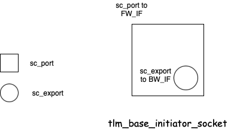
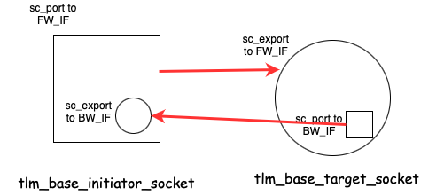
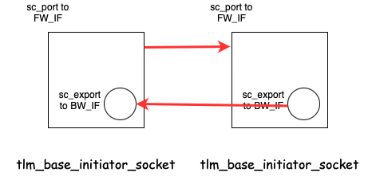
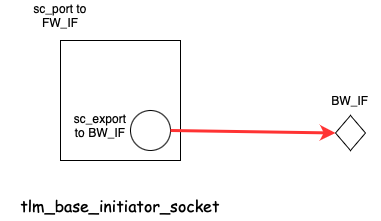
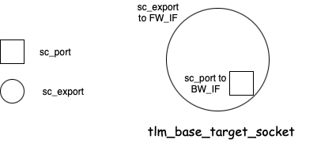

:source-highlighter: coderay

:toc: left

SystemC中的TLM 2.0介绍
[[chap::tlm_intro]]

=== 引言

TLM，全称是Transaction Level Medel，即事务级传输模型。SystemC的TLM实现有两个版本，1.0的版本和后续的
2.0.6版本。1.0的版本在<<chap::tlm_1_0, tlm1.0>>部分已经介绍过了，本部分着重介绍TLM 2.0部分的内容。

TLM的组织框图如下所示：

.TLM结构，来源自TLM LRM文档
image::tlm_framework.png[]

首先我们主要介绍TLM 2.0.6版本中的interoperability layer（互操作层）部分。
在本部分的末尾，我们从tlm中的socket概念入手，逐渐探索TLM 2.0的实现机制，并在下一部分内容中，单独讨论TLM 2.0关于
socket实现的更多的细节和功能。

本章主要包括如下内容：

* tlm_generic_payload
* tlm_fw_transport_if
* tlm_bw_transport_if
* tlm_initiator_socket
* tlm_target_socket
* <<api::tlm_global_quantum, tlm_global_quantum>>

=== TLM 2.0 基础数据结构

==== tlm_mm_interface
[[api::tlm_mm_interface]]

tlm_mm_interface是一个接口基类，只要求实现接口函数 `free` 即可：

.src/tlm_core/tlm_2/tlm_generic_payload/tlm_gp.h
[source,cpp]
----
class tlm_mm_interface {
public:
  virtual void free(tlm_generic_payload*) = 0; <1>
  virtual ~tlm_mm_interface() {}
};
----
<1> 纯虚类的成员函数free，是tlm_mm_interface唯一要求的接口函数，接受一个指向tlm_generic_payload
的指针，返回void类型

tlm_mm_interface设计的主要目的是为了提供内存管理。对于一些特殊的数据结果，可能需要实现自己的内存分配和释放功能，如果有这种需要的话，就可以
继承tlm_mm_interface，定义自己的内存释放部分。

==== tlm_extension
[[data::tlm_extension]]

tlm_extension，包括一个基类tlm_extension_base，和一个模板基类tlm_extension，其主要作用是为能够被
tlm_generic_payload持有的extension对象提供基本的接口信息。换言之，只有继承自tlm_extension的派生类
才可以被tlm_generic_payload作为extension所持有。

tlm_extension_base的定义非常简单：

.src/tlm_core/tlm_2/tlm_generic_payload/tlm_gp.h
[source,cpp]
----
class SC_API tlm_extension_base
{
public:
    virtual tlm_extension_base* clone() const = 0; <1>
    virtual void free() { delete this; } <2>
    virtual void copy_from(tlm_extension_base const &) = 0; <3>
protected:
    virtual ~tlm_extension_base() {} <4>
    static unsigned int register_extension(const std::type_info&); <5>
};
----
<1> 接口函数clone，用来实现clone功能
<2> 虚函数free，默认实现是释放自己
<3> 接口函数copy_from，实现需要的拷贝功能
<4> 析构函数是虚函数，注意析构函数是protected，这意味着析构函数只能被派生类调用
<5> 这里有一个静态成员函数，register_extension，接受一个 `std::type_info` 作为参数，返回一个
`unsigned int` 类型的数据，这是tlm_generic_payload自己实现类型管理一套机制

之所以将tlm_extension_base定义出来（或者说，定义一个非模板类作为基类），其思想和systemc中其他部分的设计
是一样的：如果需要使用一个未知类型的tlm_extension_base的派生类，只需要将指针类型设置为tlm_extension_base
即可，不需要加任何模板类型参数。

按照一贯的设计，接下来的tlm_extension继承自tlm_extension_base，还增加了模板参数的选项：
[[api::tlm_extension]]

.src/tlm_core/tlm_2/tlm_generic_payload/tlm_gp.h
[source,cpp]
----
template <typename T>
class tlm_extension : public tlm_extension_base
{
public:
    virtual tlm_extension_base* clone() const = 0;
    virtual void copy_from(tlm_extension_base const &ext) = 0;
    virtual ~tlm_extension() {}
    const static unsigned int ID;
};

template <typename T>
const unsigned int tlm_extension<T>::ID
  = tlm_extension_base::register_extension(typeid(T));
----

这里继续保持clone和copy_from作为接口函数不变，同时额外增加了一个静态成员变量ID。注意，这个静态成员
变量ID是根据模板参数T而决定的，如果T发生变化，那么对应的静态成员变量ID也就不同。这个ID的赋值非常有
技巧，调用了基类tlm_extension_base的 `register_extension` 函数。注意，这并不意味着 `register_extension`
需要是一个编译期就能执行的函数。这主要是因为模板类的静态成员变量初始化并不像普通类的静态成员变量初始化
一样，这个问题我们后续讨论。

这样一来对于类型T, `tlm_extension<T>::ID` 就是一个 `unsigned int` 类型，可以用来标识类型的标识符。
tlm_generic_payload借助这个功能，实现了不同类型的extension数据保存到同一个数组的能力，即实现了
类型擦除的功能。

对于编译系统中，所有继承自tlm_extension的模板参数T，都在 `tlm_extension_base::register_extension`
函数中，被注册进来：

.src/tlm_core/tlm_2/tlm_generic_payload/tlm_gp.cpp
[source,cpp]
----
unsigned int
tlm_extension_base::register_extension(const std::type_info& type)
{
    return tlm_extension_registry::instance().register_extension(type);
}
----

其中 `tlm_extension_registry::instance()` 是一个单件实现。本部分的实现后续补充。

==== tlm_generic_payload
[[api::tlm_generic_payload]]

在TLM 2.0部分，TLM为所需要传输的数据结构设计了一个通用的类型，即这里要介绍的tlm_generic_payload。tlm_generic_payload
可以满足基本的TLM数据传输要求，可以携带包括地址，读写信息，状态，数组等各种常用的数据。TLM 2.0中其他部分组件基本默认使用
tlm_generic_payload作为需要传输的数据类型。

tlm_generic_payload是一个没有继承自其它类的基类：

.src/tlm_core/tlm_2/tlm_generic_payload/tlm_gp.h
[source,cpp]
----
class SC_API tlm_generic_payload {

public:
    //---------------
    // Constructors
    //---------------

    // Default constructor
    tlm_generic_payload();
    explicit tlm_generic_payload(tlm_mm_interface* mm);
----

tlm_generic_payload的构造函数有两种，一种是空的构造，另一种则是接受一个
tlm_mm_interface的指针。空构造的tlm_generic_payload也需要后续使用
set_mm成员函数来设置mm，因为在tlm_generic_payload的很多成员函数中
都会显式检查这个成员变量是否为空:

.src/tlm_core/tlm_2/tlm_generic_payload/tlm_gp.h
[source,cpp]
----
   void set_mm(tlm_mm_interface* mm) { m_mm = mm; }
   bool has_mm() const { return m_mm != 0; }
----

tlm_generic_payload不允许拷贝或者赋值，因此拷贝构造函数和赋值函数均为空。

tlm_generic_payload可以作为虚基类使用，因此析构函数是虚函数。

===== 成员变量

tlm_generic_payload中的成员变量可以分为两大类，基本成员变量，以及控制成员变量。

基本成员变量包括如下:

.src/tlm_core/tlm_2/tlm_generic_payload/tlm_gp.h
[source,cpp]
----
    sc_dt::uint64        m_address;
    tlm_command          m_command;
    unsigned char*       m_data;
    unsigned int         m_length;
    tlm_response_status  m_response_status;
    bool                 m_dmi;
    unsigned char*       m_byte_enable;
    unsigned int         m_byte_enable_length;
    unsigned int         m_streaming_width;
    tlm_gp_option        m_gp_option;
----

其中的tlm_gp_option为枚举类型，包括：
[[data::tlm_gp_option]]

.src/tlm_core/tlm_2/tlm_generic_payload/tlm_gp.h
[source,cpp]
----
enum tlm_gp_option {
    TLM_MIN_PAYLOAD,
    TLM_FULL_PAYLOAD,
    TLM_FULL_PAYLOAD_ACCEPTED
};
----

tlm_command同样是枚举类型：
[[data::tlm_command]]

.src/tlm_core/tlm_2/tlm_generic_payload/tlm_gp.h
[source,cpp]
----
enum tlm_command {
    TLM_READ_COMMAND,
    TLM_WRITE_COMMAND,
    TLM_IGNORE_COMMAND
};
----

基本成员变量可以用一系列类似getter/setter的API成员函数进行访问和控制：

.src/tlm_core/tlm_2/tlm_generic_payload/tlm_gp.h
[source,cpp]
----
    //----------------
    // API (including setters & getters)
    //---------------

    // Command related method
    bool                 is_read() const {return (m_command == TLM_READ_COMMAND);}
    void                 set_read() {m_command = TLM_READ_COMMAND;}
    bool                 is_write() const {return (m_command == TLM_WRITE_COMMAND);}
    void                 set_write() {m_command = TLM_WRITE_COMMAND;}
    tlm_command          get_command() const {return m_command;}
    void                 set_command(const tlm_command command) {m_command = command;}

    // Address related methods
    sc_dt::uint64        get_address() const {return m_address;}
    void                 set_address(const sc_dt::uint64 address) {m_address = address;}

    // Data related methods
    unsigned char*       get_data_ptr() const {return m_data;}
    void                 set_data_ptr(unsigned char* data) {m_data = data;}

    // Transaction length (in bytes) related methods
    unsigned int         get_data_length() const {return m_length;}
    void                 set_data_length(const unsigned int length) {m_length = length;}

    // Response status related methods
    bool                 is_response_ok() const {return (m_response_status > 0);}
    bool                 is_response_error() const {return (m_response_status <= 0);}
    tlm_response_status  get_response_status() const {return m_response_status;}
    void                 set_response_status(const tlm_response_status response_status)
        {m_response_status = response_status;}
    std::string          get_response_string() const;

    // Streaming related methods
    unsigned int         get_streaming_width() const {return m_streaming_width;}
    void                 set_streaming_width(const unsigned int streaming_width) {m_streaming_width = streaming_width; }

    // Byte enable related methods
    unsigned char*       get_byte_enable_ptr() const {return m_byte_enable;}
    void                 set_byte_enable_ptr(unsigned char* byte_enable){m_byte_enable = byte_enable;}
    unsigned int         get_byte_enable_length() const {return m_byte_enable_length;}
    void                 set_byte_enable_length(const unsigned int byte_enable_length){m_byte_enable_length = byte_enable_length;}

    // This is the "DMI-hint" a slave can set this to true if it
    // wants to indicate that a DMI request would be supported:
    void                 set_dmi_allowed(bool dmi_allowed) { m_dmi = dmi_allowed; }
    bool                 is_dmi_allowed() const { return m_dmi; }

    // Use full set of attributes in DMI/debug?
    tlm_gp_option get_gp_option() const { return m_gp_option; }
    void          set_gp_option( const tlm_gp_option gp_opt ) { m_gp_option = gp_opt; }
----

控制成员变量则有如下三个：

.src/tlm_core/tlm_2/tlm_generic_payload/tlm_gp.h
[source,cpp]
----
    tlm_array<tlm_extension_base*> m_extensions;
    tlm_mm_interface*              m_mm;
    unsigned int                   m_ref_count;
----

m_ref_count是一个引用计数器，和memory manager类接口变量m_mm一起配合使用：

.src/tlm_core/tlm_2/tlm_generic_payload/tlm_gp.h
[source,cpp]
----
    void acquire() { sc_assert(m_mm != 0); m_ref_count++; }

    void release() {
        sc_assert(m_mm != 0 && m_ref_count > 0);
        if (--m_ref_count==0)
            m_mm->free(this);
    }

    int get_ref_count() const { return m_ref_count; }
----

成员函数acquire用来增加引用计数，而成员函数release则用来减少引用计数。当引用计数器值
到0的时候，调用注册的m_mm的free接口函数，传入 `this` 指针，释放相关资源。

m_extensions是tlm_generic_payload用来放置extensions的数组。所有放置到m_extensions
的数据类型必须是tlm_extension_base的子类。注意，m_extensions的大小在tlm_generic_payload
构建的时候，是初始化好的：

.src/tlm_core/tlm_2/tlm_generic_payload/tlm_gp.cpp
[source,cpp]
----
// Default constructor
tlm_generic_payload::tlm_generic_payload()
  : m_address(0)
  , m_command(TLM_IGNORE_COMMAND)
  , m_data(0)
  , m_length(0)
  , m_response_status(TLM_INCOMPLETE_RESPONSE)
  , m_dmi(false)
  , m_byte_enable(0)
  , m_byte_enable_length(0)
  , m_streaming_width(0)
  , m_gp_option(TLM_MIN_PAYLOAD)
  , m_extensions(max_num_extensions()) <1>
  , m_mm(0)
  , m_ref_count(0)
{}
----
<1> m_extensions的大小由max_num_extensions决定，这个函数返回的是所有注册类型的
总的个数

我们来看一下extension的使用，比如用来设置extension的API：

.src/tlm_core/tlm_2/tlm_generic_payload/tlm_gp.h
[source,cpp]
----
    // Stick the pointer to an extension into the vector, return the
    // previous value:
    template <typename T> T* set_extension(T* ext)
    {
        return static_cast<T*>(set_extension(T::ID, ext));
    }

    // non-templatized version with manual index:
    tlm_extension_base* set_extension(unsigned int index,
                                      tlm_extension_base* ext);
----

模板成员函数 `template<typename T> T* set_extension(T* ext)` 接受一个类型
T的指针，然后调用另一个非模板的成员函数 set_extension，将 `T::ID` 作为第一个参数，
指针作为第二个参数传递进去，这意味着T必须是tlm_extensions的子类，否则 `T::ID`
无法通过编译。
[[api::tlm_generic_payload::set_extension]]

.src/tlm_core/tlm_2/tlm_generic_payload/tlm_gp.cpp
[source,cpp]
----
tlm_extension_base*
tlm_generic_payload::set_extension(unsigned int index,
                                   tlm_extension_base* ext)
{
    sc_assert(index < m_extensions.size());
    tlm_extension_base* tmp = m_extensions[index];
    m_extensions[index] = ext;
    return tmp;
}
----

从这里可以看出，`m_extensions` 对于一种extension（tlm_extension<T>），只能保存一个
数据。对于 `set_extension`，将数据设置到 m_extensions后，将原来保存的同类型数据返回。

除了一个 `set_extension` 外，还有一对类似的 `set_auto_extension` 函数，主要实现如下：
[[api::tlm_generic_payload::set_auto_extension]]

.src/tlm_core/tlm_2/tlm_generic_payload/tlm_gp.cpp
[source,cpp]
----
tlm_extension_base*
tlm_generic_payload::set_auto_extension(unsigned int index,
                                        tlm_extension_base* ext)
{
    sc_assert(index < m_extensions.size());
    tlm_extension_base* tmp = m_extensions[index];
    m_extensions[index] = ext;
    if (!tmp) m_extensions.insert_in_cache(&m_extensions[index]);
    sc_assert(m_mm != 0);
    return tmp;
}
----

相比于 `set_extension` 而言，主要在于，如果原先要被替换的位置非空，那么就将这个位置的指针
传入 `m_extensions` 的insert_in_cache成员函数中：
[[api::tlm_array::insert_in_cache]]
[[api::tlm_array::free_entire_cache]]

.src/tlm_core/tlm_2/tlm_generic_payload/tlm_array.h
[source,cpp]
----

    // this function shall get a pointer to a array slot
    // it stores this slot in a cache of active slots
    void insert_in_cache(T* p)
    {
        //sc_assert( (p-&(*this)[0]) < size() );
        m_entries.push_back( p-&(*this)[0] );
    }

    //this functions clears all active slots of the array
    void free_entire_cache()
    {
        while(m_entries.size())
        {
            if ((*this)[m_entries.back()])      //we make sure no one cleared the slot manually
              (*this)[m_entries.back()]->free();//...and then we call free on the content of the slot
            (*this)[m_entries.back()]=0;        //afterwards we set the slot to NULL
            m_entries.pop_back();
        }
    }
----

`insert_in_cache` 是 `tlm_array` 在vector的基础上增加的成员函数，主要在一个 `m_entries`
内部成员变量中保存了位置信息（这里其实保存的相当于数组下标），并且在 `free_entrie_cache`
成员阿汉湖中使用这个数组下标，调用所有有效指针的 free成员函数，这样一来就自动释放掉了内部的
对象。在tlm_generic_payload的reset成员函数中，调用了 `m_extensions` 的这个成员函数：
[[api::tlm_generic_payload::reset]]

.src/tlm_core/tlm_2/tlm_generic_payload/tlm_gp.cpp
[source,cpp]
----
void tlm_generic_payload::reset() {
    //should the other members be reset too?
    m_gp_option = TLM_MIN_PAYLOAD;
    m_extensions.free_entire_cache(); <1>
}
----
<1> 调用了 tlm_array的free_entire_cache成员函数，自动释放所有的成员变量

此外，在<<api::tlm_generic_payload::free_all_extensions, free_all_extensions>>中，也调用了
free_entire_cache成员函数，来释放那些通过set_auto_extension设置过来的extension对象。

===== 成员函数

tlm_generic_payload除了成员变量以及上述介绍的和成员变量打交道的成员函数外，还存在其他成员函数，
包括

.src/tlm_core/tlm_2/tlm_generic_payload/tlm_gp.h
[source,cpp]
----
   // non-virtual deep-copying of the object
    void deep_copy_from(const tlm_generic_payload & other);

    // To update the state of the original generic payload from a deep copy
    // Assumes that "other" was created from the original by calling deep_copy_from
    // Argument use_byte_enable_on_read determines whether to use or ignores byte enables
    // when copying back the data array on a read command

    void update_original_from(const tlm_generic_payload & other,
                              bool use_byte_enable_on_read = true);

    void update_extensions_from(const tlm_generic_payload & other);

    // Free all extensions. Useful when reusing a cloned transaction that doesn't have memory manager.
    // normal and sticky extensions are freed and extension array cleared.
    void free_all_extensions();
----

其中， `deep_copy_from` 成员函数实现了tlm_generic_payload的深拷贝：
[[api::tlm_generic_payload::deep_copy_from]]

.src/tlm_core/tlm_2/tlm_generic_payload/tlm_gp.cpp
[source,cpp]
----
// non-virtual deep-copying of the object
void
tlm_generic_payload::deep_copy_from(const tlm_generic_payload & other)
{
    m_command =            other.get_command();
    m_address =            other.get_address();
    m_length =             other.get_data_length();
    m_response_status =    other.get_response_status();
    m_byte_enable_length = other.get_byte_enable_length();
    m_streaming_width =    other.get_streaming_width();
    m_gp_option =          other.get_gp_option();
    m_dmi =                other.is_dmi_allowed();

    // deep copy data
    // there must be enough space in the target transaction!
    if(m_data && other.m_data)
    {
        std::memcpy(m_data, other.m_data, m_length); <1>
    }
    // deep copy byte enables
    // there must be enough space in the target transaction!
    if(m_byte_enable && other.m_byte_enable)
    {
        std::memcpy(m_byte_enable, other.m_byte_enable, m_byte_enable_length); <2>
    }
    // deep copy extensions (sticky and non-sticky)
    if(m_extensions.size() < other.m_extensions.size()) {
        m_extensions.expand(other.m_extensions.size());
    }
    for(unsigned int i=0; i<other.m_extensions.size(); i++)
    {
        if(other.m_extensions[i])
        {                       //original has extension i
            if(!m_extensions[i]) <3>
            {                   //We don't: clone.
                tlm_extension_base *ext = other.m_extensions[i]->clone();
                if(ext)     //extension may not be clonable.
                {
                    if(has_mm())
                    {           //mm can take care of removing cloned extensions
                        set_auto_extension(i, ext);
                    }
                    else
                    {           // no mm, user will call free_all_extensions().
                        set_extension(i, ext);
                    }
                }
            }
            else <4>
            {                   //We already have such extension. Copy original over it.
                m_extensions[i]->copy_from(*other.m_extensions[i]);
            }
        }
    }
}
----
<1> 深拷贝，拷贝m_data指针指向的buffer
<2> 深拷贝，拷贝m_byte_enable指针指向的buffer
<3> 对于extension部分，深拷贝策略是，对于某个类型的extension，如果拷贝源有，而拷贝目的对象没有，则直接拷贝
<4> 对于extension部分，深拷贝策略是，对于某个类型的extension，如果拷贝源有，同事拷贝目的对象也有，则调用对象的copy_from

从这个成员函数的实现可以看出，`deep_copy_from` 主要处理的是两个buffer的深拷贝，以及extension的拷贝策略。

tlm_generic_payload的 `update_original_from` 成员函数，主要用来从一个深拷贝获取的对象中，更新源
对象的一些状态。从注释中可以看出，这里假设update_original_from的对象是之前从本对象使用deep_copy_from
创建出来的一个对象。参数use_byte_enable_on_read则决定了在read command的时候，是否拷贝byte enable信息。
这个函数的实现如下：
[[api::tlm_generic_payload::update_original_from]]
[[api::tlm_generic_payload::update_extension_from]]

.src/tlm_core/tlm_2/tlm_generic_payload/tlm_gp.cpp
[source,cpp]
----
// To update the state of the original generic payload from a deep copy
// Assumes that "other" was created from the original by calling deep_copy_from
// Argument use_byte_enable_on_read determines whether to use or ignores byte enables
// when copying back the data array on a read command

void
tlm_generic_payload::update_original_from(const tlm_generic_payload & other,
                                          bool use_byte_enable_on_read)
{
    // Copy back extensions that are present on the original
    update_extensions_from(other); <1>

    // Copy back the response status and DMI hint attributes
    m_response_status = other.get_response_status();
    m_dmi             = other.is_dmi_allowed();

    // Copy back the data array for a read command only
    // deep_copy_from allowed null pointers, and so will we
    // We assume the arrays are the same size
    // We test for equal pointers in case the original and the copy share the same array

    if(is_read() && m_data && other.m_data && m_data != other.m_data) <2>
    {
        if (m_byte_enable && use_byte_enable_on_read) <3>
        {
            if (m_byte_enable_length == 8 && m_length % 8 == 0 ) <4>
            {
                // Optimized implementation copies 64-bit words by masking
                for (unsigned int i = 0; i < m_length; i += 8)
                {
                    typedef sc_dt::uint64* u;
                    *reinterpret_cast<u>(&m_data[i]) &= ~*reinterpret_cast<u>(m_byte_enable);
                    *reinterpret_cast<u>(&m_data[i]) |= *reinterpret_cast<u>(&other.m_data[i]) &
                                                        *reinterpret_cast<u>(m_byte_enable);
                }
            }
            else if (m_byte_enable_length == 4 && m_length % 4 == 0 ) <5>
            {
                // Optimized implementation copies 32-bit words by masking
                for (unsigned int i = 0; i < m_length; i += 4)
                {
                    typedef unsigned int* u;
                    *reinterpret_cast<u>(&m_data[i]) &= ~*reinterpret_cast<u>(m_byte_enable);
                    *reinterpret_cast<u>(&m_data[i]) |= *reinterpret_cast<u>(&other.m_data[i]) &
                                                        *reinterpret_cast<u>(m_byte_enable);
                }
            }
            else <6>
                // Unoptimized implementation
                for (unsigned int i = 0; i < m_length; i++)
                    if ( m_byte_enable[i % m_byte_enable_length] )
                        m_data[i] = other.m_data[i];
        }
        else
          std::memcpy(m_data, other.m_data, m_length); <7>
    }
}

void
tlm_generic_payload::update_extensions_from(const tlm_generic_payload & other)
{
    // deep copy extensions that are already present
    sc_assert(m_extensions.size() <= other.m_extensions.size());
    for(unsigned int i=0; i<m_extensions.size(); i++) <8>
    {
        if(other.m_extensions[i])
        {                       //original has extension i
            if(m_extensions[i])
            {                   //We have it too. copy.
                m_extensions[i]->copy_from(*other.m_extensions[i]);
            }
        }
    }
}
----
<1> 首先使用update_extensions_from，更新本对象的extensions状态
<2> update_original_from主要处理核心是对于read的处理
<3> 如果byte_enable打开，以及传入的参数指定根据byte enable拷贝的时候，才选择进行拷贝
<4> 如果byte_enable是8的倍数，即按照QW来拷贝，那么之后就可以一个QW一个QW拷贝
<5> 如果byte_enable是4的倍数，就按照DW来拷贝，之后可以一个DW一个DW来拷贝
<6> 否则，就只能一个byte一个byte拷贝了
<7> 如果byte_enable没打开，或者入参指定不需要byte enable，直接拷贝data部分即可
<8> update_extensions_from中，只有当拷贝源和拷贝目的对象相同类型的extension都有效，才会将extension从源拷贝到墓地中，调用的是
extension自己的copy_from成员函数

tlm_generic_payload的 `free_all_extensions` 成员函数，主要用来释放所有的extensions。这些extensions
主要分为两类：使用set_auto_extensions插入的extensions，使用<<api::tlm_array::free_entire_cache, tlm_array的free_entire_cache>>
释放；使用set_extensions插入的extension，则调用自带的free函数，进行释放，参考如下：
[[api::tlm_generic_payload::free_all_extensions]]

.src/tlm_core/tlm_2/tlm_generic_payload/tlm_gp.cpp
[source,cpp]
----
// Free all extensions. Useful when reusing a cloned transaction that doesn't have memory manager.
// normal and sticky extensions are freed and extension array cleared.
void tlm_generic_payload::free_all_extensions()
{
    m_extensions.free_entire_cache();
    for(unsigned int i=0; i<m_extensions.size(); i++)
    {
        if(m_extensions[i])
        {
            m_extensions[i]->free();
            m_extensions[i] = 0;
        }
    }
}
----

tlm_generic_payload之所以需要设计deep_copy_from和update_original_from，是由于在TLM 2.0设计中，所传递的数据（默认情况下
是tlm_generic_payload类型的数据）都是通过传非常量引用的方式传递的，这允许被调用函数根据需要修改传递数据的内容，所以tlm_generic_payload
提供了这些拷贝和更新函数，用来管理这些数据的拷贝和更新动作，做到可以根据需要，方便地选择是否更新某些特定的数据。

==== tlm_phase
[[api::tlm_phase]]

tlm_phase是一个类定义（不是模板，也不是虚基类，也不是枚举）：

.src/tlm_core/tlm_2/tlm_generic_payload/tlm_phase.h
[source,cpp]
----
class SC_API tlm_phase
{
public:
  tlm_phase();
  tlm_phase(unsigned int id); // TODO: should be dropped

  tlm_phase(tlm_phase_enum standard);
  tlm_phase& operator=(tlm_phase_enum standard);

  operator unsigned int() const { return m_id; }
  const char* get_name() const;

protected:
  // register extended phase
  tlm_phase( const std::type_info & type, const char* name ); <1>

private:
  unsigned int m_id;
};
----
<1> 这个protected的构造函数可以用来注册新的phase

从这个定义可以看出，tlm_phase的主要功能是实现了一个类似time-stamp的功能。

其中，tlm_phase_enum的枚举值有：
[[api::tlm_phase_enum]]

.src/tlm_core/tlm_2/tlm_generic_payload/tlm_phase.h
[source,cpp]
----
enum SC_API tlm_phase_enum
{
  UNINITIALIZED_PHASE=0,
  BEGIN_REQ=1,
  END_REQ,
  BEGIN_RESP,
  END_RESP
};
----

tlm_phase有一个protected的构造函数，可以用来构造新的phase名称，这个函数的实现如下：

.src/tlm_core/tlm_2/tlm_generic_payload/tlm_phase.h
[source,cpp]
----
tlm_phase::tlm_phase( const std::type_info& type, const char* name )
  : m_id( tlm_phase_registry::instance().register_phase(type, name) )
{}
----

这就允许用户自定义的类继承自tlm_phase，通过这个pretected的构造函数注册新的PHASE，而不用去手动修改
tlm_phase_enum的定义。

这里实际上调用的是<<api::tlm_phase_registry::register_phase, tlm_phase_registry的register_phase>>
成员函数完成注册的，具体细节可以参考register_phase函数的介绍。 `get_name` 成员函数也是使用了tlm_phase_registry
的id-string之间的对应关系获取的：

.src/tlm_core/tlm_2/tlm_generic_payload/tlm_phase.h
[source,cpp]
----
const char*
tlm_phase::get_name() const
{
  return tlm_phase_registry::instance().get_name( m_id );
}
----

tlm_phase的构造比较简单，内部的成员变量 `m_id` 实际上保存的就是tlm_phase_enum对应的
integer值，默认初始化为 `UNINITIALIZED_PHASE` ：

.src/tlm_core/tlm_2/tlm_generic_payload/tlm_phase.h
[source,cpp]
----
inline
tlm_phase::tlm_phase()
  : m_id( UNINITIALIZED_PHASE )
{}

inline
tlm_phase::tlm_phase( tlm_phase_enum standard )
  : m_id( standard )
{}

inline
tlm_phase& tlm_phase::operator=( tlm_phase_enum standard )
{
  m_id = standard;
  return *this;
}
----

===== tlm_phase_registry

tlm_phase_registry是实现在cpp文件中的一个私有类，因此这个类只能在SystemC内部使用。
这个类主要管理了tlm_phase的注册事项，允许继承自<<api::tlm_phase, tlm_phase>>的
继承类通过protected的tlm_phase构造函数注册新的PHASE，新注册的PHASE从5开始（0-4已经被
SC里的<<api::tlm_phase_enum, tlm_phase_enum>>占据了）。tlm_phase_registry
的实现如下所示：
[[data::tlm_phase_registry]]

.src/tlm_core/tlm_2/tlm_generic_payload/tlm_phase.cpp
[source,cpp]
----
private:
  typedef std::map<sc_type_index, key_type> type_map;
  typedef std::vector<std::string> name_table;

  type_map   ids_;
  name_table names_;

  tlm_phase_registry() <1>
    : names_( END_RESP+1 )
  {
#   define BUILTIN_PHASE(phase) \
      names_[phase] = #phase

    BUILTIN_PHASE( UNINITIALIZED_PHASE );
    BUILTIN_PHASE( BEGIN_REQ );
    BUILTIN_PHASE( END_REQ );
    BUILTIN_PHASE( BEGIN_RESP );
    BUILTIN_PHASE( END_RESP );
  }
----
<1> 为一个的构造函数是私有函数，因此这个类不能被其他部分create出来，其实这是为了保护这个类的单件实现

tlm_phase_registry的构造函数往  `names_` 这个string的vector中分别放入了5个tlm_phase_enum的
字符串表达形式。

tlm_phase_registry的主要核心部分实现是一个register_phase函数：

[[api::tlm_phase_registry::register_phase]]

.src/tlm_core/tlm_2/tlm_generic_payload/tlm_phase.cpp
[source,cpp]
----
  unsigned int register_phase(sc_type_index type, sc_string_view name)
  {
    type_map::const_iterator it = ids_.find( type );

    if( name.empty() ) {
      SC_REPORT_FATAL( sc_core::SC_ID_INTERNAL_ERROR_,
                       "unexpected empty tlm_phase name" );
      return UNINITIALIZED_PHASE;
    }

    if( it == ids_.end() ) { // new phase - generate/store ID and name 
      type_map::value_type v( type, static_cast<key_type>(names_.size()) ); <1>
      names_.push_back( name_table::value_type(name.data(), name.size()) );
      ids_.insert( v );
      return v.second; <2>
    }

    if( names_[it->second] != name ) {
      SC_REPORT_FATAL( sc_core::SC_ID_INTERNAL_ERROR_,
                       "tlm_phase registration failed: duplicate type info" );
      sc_core::sc_abort();
    }
    return it->second; <3>
  }
----
<1> 如果map里没有type，那么就构造type，并将值设定为names_的长度，将name放入names_中，并将构造的
type-id对（id值就是名字在names_里的下表）插入到map中
<2> 返回的值实际上对应新插入的type所对应的名字在names_里的下表
<3> 如果map里已经有type，直接返回所记录的下标值即可

由于 `names_` 成员变量在初始化的时候已经插入了5个名字（即<<api::tlm_phase_enum, tlm_phase_enum>>
的5个枚举值对应的字符串，因而后续所有使用register_phase所注册的phase，其ID值将不小于5.

tlm_phase的get_name调用到了tlm_phase_registry的get_name成员函数，这个成员函数的实现是：

.src/tlm_core/tlm_2/tlm_generic_payload/tlm_phase.h
[source,cpp]
----
  const char* get_name( key_type id ) const
  {
    sc_assert( id < names_.size() );
    return names_[id].c_str();
  }
----

这个成员函数不仅可以返回自定义（自己使用register_phase注册的phase）的名称，还可以返回
预定义的5个<<api::tlm_phase_enum, tlm_phase_enum>>的名称，这是因为5个tlm_phase_enum
的枚举名称已经在tlm_phase_registry构造的时候放入进去了。

==== tlm_dmi
[[api::tlm_dmi]]

tlm_dmi是一个直接定义的类，没有继承体系：

.src/tlm_core/tlm_2/tlm_2_interfaces/tlm_dmi.h
[source,cpp]
----
class tlm_dmi
{
  public:
  // blabla
  private:

  // If the forward call is successful, the target returns the dmi_ptr,
  // which must point to the data element corresponding to the
  // dmi_start_address. The data is organized as a byte array with the
  // endianness of the target (endianness member of the tlm_dmi struct).
  
  unsigned char*   m_dmi_ptr;
  
  // The absolute start and end addresses of the DMI region. If the decoder
  // logic in the interconnect changes the address field e.g. by masking, the
  // interconnect is responsible to transform the relative address back to an
  // absolute address again.
  
  sc_dt::uint64    m_dmi_start_address;
  sc_dt::uint64    m_dmi_end_address;

  // Granted access
  
  dmi_access_e     m_dmi_access;

  // These members define the latency of read/write transactions. The
  // initiator must initialize these members to zero before requesting a
  // dmi pointer, because both the interconnect as well as the target can
  // add to the total transaction latency.
  // Depending on the 'type' attribute only one, or both of these attributes
  // will be valid.
  
  sc_core::sc_time m_dmi_read_latency;
  sc_core::sc_time m_dmi_write_latency;
};
----

tlm_dmi中的成员变量包括：

* 一个指针变量m_dmi_ptr，是target用来返回initiator请求结果的部分
* 一组地址，即DMI区域的其实和结束的地址，m_dmi_start_address和m_dmi_end_address
* DMI访问的权限m_dmi_access
* 一组表示访问latency的变量 m_dmi_read_latency和m_dmi_write_latency

DMI访问的权限使用一个枚举类型dmi_access_e标识：

.src/tlm_core/tlm_2/tlm_2_interfaces/tlm_dmi.h
[source,cpp]
----
  // Enum for indicating the access granted to the initiator. 
  // The initiator uses gp.m_command to indicate it intention (read/write)
  //  The target is allowed to promote DMI_ACCESS_READ or DMI_ACCESS_WRITE
  //  requests to dmi_access_read_write.

  enum dmi_access_e
  { DMI_ACCESS_NONE       = 0x00                               // no access
  , DMI_ACCESS_READ       = 0x01                               // read access
  , DMI_ACCESS_WRITE      = 0x02                               // write access
  , DMI_ACCESS_READ_WRITE = DMI_ACCESS_READ | DMI_ACCESS_WRITE // read/write access
  };
----

而一个tlm_dmi的构造则非常简单：

.src/tlm_core/tlm_2/tlm_2_interfaces/tlm_dmi.h
[source,cpp]
----
 tlm_dmi (void)
  {
    init();
  }
  
  void init (void)
  {
    m_dmi_ptr           = 0x0;
    m_dmi_start_address = 0x0;
    m_dmi_end_address   = (sc_dt::uint64)(-1);
    m_dmi_access        = DMI_ACCESS_NONE;
    m_dmi_read_latency  = sc_core::SC_ZERO_TIME;
    m_dmi_write_latency = sc_core::SC_ZERO_TIME;
  }
----

空构造调用init成员函数，而init成员函数基本将tlm_dmi的成员变量重置为0（除了m_dmi_end_address，重置为-1）。

tlm_dmi的成员变量都是private的，所以tlm_dmi还为每个成员变量提供了相应的getter/setter函数：

.src/tlm_core/tlm_2/tlm_2_interfaces/tlm_dmi.h
[source,cpp]
----
  unsigned char*    get_dmi_ptr           (void) const {return m_dmi_ptr;}
  sc_dt::uint64     get_start_address     (void) const {return m_dmi_start_address;}
  sc_dt::uint64     get_end_address       (void) const {return m_dmi_end_address;}
  sc_core::sc_time  get_read_latency      (void) const {return m_dmi_read_latency;}
  sc_core::sc_time  get_write_latency     (void) const {return m_dmi_write_latency;}
  dmi_access_e      get_granted_access    (void) const {return m_dmi_access;}
  bool              is_none_allowed       (void) const {return m_dmi_access == DMI_ACCESS_NONE;}
  bool              is_read_allowed       (void) const {return (m_dmi_access & DMI_ACCESS_READ) == DMI_ACCESS_READ;}
  bool              is_write_allowed      (void) const {return (m_dmi_access & DMI_ACCESS_WRITE) == DMI_ACCESS_WRITE;}
  bool              is_read_write_allowed (void) const {return (m_dmi_access & DMI_ACCESS_READ_WRITE) == DMI_ACCESS_READ_WRITE;}

  void              set_dmi_ptr           (unsigned char* p)   {m_dmi_ptr = p;}
  void              set_start_address     (sc_dt::uint64 addr) {m_dmi_start_address = addr;}
  void              set_end_address       (sc_dt::uint64 addr) {m_dmi_end_address = addr;}
  void              set_read_latency      (sc_core::sc_time t) {m_dmi_read_latency = t;}
  void              set_write_latency     (sc_core::sc_time t) {m_dmi_write_latency = t;}
  void              set_granted_access    (dmi_access_e a)     {m_dmi_access = a;}
  void              allow_none            (void)               {m_dmi_access = DMI_ACCESS_NONE;}
  void              allow_read            (void)               {m_dmi_access = DMI_ACCESS_READ;}
  void              allow_write           (void)               {m_dmi_access = DMI_ACCESS_WRITE;}
  void              allow_read_write      (void)               {m_dmi_access = DMI_ACCESS_READ_WRITE;}
----

总体而言，tlm_dmi是几个成员变量的组合，这些成员变量表达了TLM中，做Direct Memory Interface访问时候的
请求，以及状态等信息。

==== tlm_sync_enum

tlm_sync_enum是个枚举类，定义了TLM_ACCEPTED, TLM_UPDATED, TLM_COMPLETED三个状态信息：
[[api::tlm_sync_enum]]

.src/tlm_core/tlm_2/tlm_2_interfaces/tlm_fw_bw_ifs.h
[source,cpp]
----
enum tlm_sync_enum { TLM_ACCEPTED, TLM_UPDATED, TLM_COMPLETED };
----

=== TLM 2.0 Interfaces

==== tlm_fw_transport_if
[[api::tlm_fw_transport_if]]

tlm_fw_transport_if是一个模板类，模板接受一个TYPES类型，默认为tlm_base_protocol_types：

.src/tlm_core/tlm_2/tlm_2_interfaces/tlm_fw_bw_ifs.h
[source,cpp]
----
// The forward interface:
template <typename TYPES = tlm_base_protocol_types>
class tlm_fw_transport_if
  : public virtual tlm_fw_nonblocking_transport_if<typename TYPES::tlm_payload_type,
                                                   typename TYPES::tlm_phase_type>
  , public virtual tlm_blocking_transport_if<typename TYPES::tlm_payload_type>
  , public virtual tlm_fw_direct_mem_if<typename TYPES::tlm_payload_type>
  , public virtual tlm_transport_dbg_if<typename TYPES::tlm_payload_type>
{
public:
  typedef TYPES protocol_types;
};
----

可以看出，实际上tlm_fw_transport_if是4个不同的interface的combination:

* <<api::tlm_fw_nonblocking_transport_if, tlm_fw_nonblocking_transport_if>>
* <<api::tlm_blocking_transport_if, tlm_blocking_transport_if>>
* <<api::tlm_fw_direct_mem_if, tlm_fw_direct_mem_if>>
* <<api::tlm_transport_dbg_if, tlm_transport_dbg_if>>

其中TYPES类的两个成员类型tlm_payload_type和tlm_phase_type，主要用来为这四个模板类提供实例化
类型参数信息。

tlm_base_protocol_types只是个简单的类定义，用来提供两个不同的类型信息，分别是tlm_payload_type，指定
tlm的payload类型，这里指定是tlm_generic_payload。以及一个tlm_phase_type，默认是
<<api::tlm_phase, tlm_phase>>:
[[api::tlm_base_protocol_types]]

.src/tlm_core/tlm_2/tlm_2_interfaces/tlm_fw_bw_ifs.h
[source,cpp]
----
struct tlm_base_protocol_types
{
  typedef tlm_generic_payload tlm_payload_type;
  typedef tlm_phase tlm_phase_type;
};
----

tlm_base_protocol_types所需要指定的两个类型，tlm_payload_type和tlm_phase_type，决定了TLM系统中
所使用的数据类型和phase类型。如果这两个不同，则socket的连接会出现不兼容情况。在<<api::tlm_base_initiator_socket, tlm_base_initiator_socket>>
的接口函数get_protocol_types的实现中，使用的就是TYPES的typeid，作为类型的识别符。

注意，4个基类都是虚继承，这是因为这四个基类本身都直接继承自sc_interface。如果这里不采用虚继承，那么就会有不同的
sc_interface instance.

===== tlm_fw_nonblocking_transport_if
[[api::tlm_fw_nonblocking_transport_if]]

tlm_fw_nonblocking_transport_if直接继承自sc_core::sc_interface，只定义
了一个叫 nb_transport_fw的接口函数：
[[api::tlm_fw_nonblocking_transport_if::nb_transport_fw]]

.src/tlm_core/tlm_2/tlm_2_interfaces/tlm_fw_bw_ifs.h
[source,cpp]
----
template <typename TRANS = tlm_generic_payload,
          typename PHASE = tlm_phase>
class tlm_fw_nonblocking_transport_if : public virtual sc_core::sc_interface {
public:
  virtual tlm_sync_enum nb_transport_fw(TRANS& trans,
                                        PHASE& phase,
                                        sc_core::sc_time& t) = 0;
};
----

nb_transport_fw接口函数接受一个传输类型TRANS，默认是<<api::tlm_generic_payload, tlm_generic_payload>>
，同时接受一个PHASE类型，默认是<<api::tlm_phase, tlm_phase>>，以及一个时间戳t，返回一个
<<api::tlm_sync_enum, tlm_sync_enum>>信息。

注意，接口函数 `nb_transport_fw` 中，三个参数都使用了非常量引用的方式进行传递，这意味着下游接收端如果有需要，
可以直接修改这些传入参数的值，来达到返回特定信息的目的。这也是TLM 2.0相比于TLM 1.0的不同之处，即TLM 2.0
中允许通过修改传入参数的方式来返回信息，而TLM 1.0中则不允许修改入参（基本所有的传入参数都是常量引用的方式）。
同时这也意味着发起端在调用完nb_transport_fw之后，需要检查传入参数的状态，因为这些参数很可能被接收端做了修改。
在何种情况下，接收端对哪些参数能做何种修改，这就是TLM 2.0中的核心所在了。

===== tlm_blocking_transport_if
[[api::tlm_blocking_transport_if]]

tlm_blocing_transport_if同样直接继承自sc_core::sc_interface，定义了一个
接口函数b_transport：
[[api::tlm_blocking_transport_if::b_transport]]

.src/tlm_core/tlm_2/tlm_2_interfaces/tlm_fw_bw_ifs.h
[source,cpp]
----
template <typename TRANS = tlm_generic_payload>
class tlm_blocking_transport_if : public virtual sc_core::sc_interface {
public:
  virtual void b_transport(TRANS& trans,
                           sc_core::sc_time& t) = 0;
};
----

注意tlm_blocking_transport_if不区分fw/bw，同时也没有PHASE信息，只有TRANS类型
信息，默认为<<api::tlm_generic_payload, tlm_generic_payload>>。接口函数b_transport
接受一个TRANS类型的数据和一个时间戳，返回空。两个参数是非常量引用，所以接收端可以通过修改入参
的方式，来返回特定的信息。

b_transport的含义是blocking地传送数据，所以不需要返回同步状态信息，因为blocking地传送数据返回的时候
肯定数据已经发送完毕。blocking的API调用也意味着没有反向通路（即tlm_blocking_transport_if不缺分FW和BW）。
如果接收端需要返回信息，则可以通过修改传入参数的方式来达到目的。
此外这里也不需要PHASE信息。

===== tlm_fw_direct_mem_if
[[api::tlm_fw_direct_mem_if]]

模板类tlm_fw_direct_mem_if直接继承自sc_core::sc_interface，定义了一个
接口类get_direct_mem_ptr:
[[api::tlm_fw_direct_mem_if::get_direct_mem_ptr]]

.src/tlm_core/tlm_2/tlm_2_interfaces/tlm_fw_bw_ifs.h
[source,cpp]
----
//////////////////////////////////////////////////////////////////////////
// DMI interfaces for getting and invalidating DMI pointers:
//////////////////////////////////////////////////////////////////////////

// The semantics of the forward interface are as follows:
//
// - An initiator that wants to get direct access to a target's memory region
//   can call the get_direct_mem_ptr method with the 'trans' parameter set to
//   the address that it wants to gain access to. It sets the trans.m_command
//   to specify if the initiator intended use (read or write)
//   to the target's DMI region. The initiator is responsible for calling the
//   method with a freshly initialized tlm_dmi object either by using a newly
//   constructed object, or by calling an existing object's init() method.
// - Although a reference to a complete 'TRANS' type is passed to the get_
//   direct_mem_ptr call, only the address command, and extension fields are of
//   interest in most cases.
// - Read and write ranges are not necessarily identical. If they are, a target
//   can specify that the range is valid for all accesses with the tlm_data
//   m_type attribute in the.
// - The interconnect, if any, needs to decode the address and forward the
//   call to the corresponding target. It needs to handle the address exactly
//   as the target would expect on a transaction call, e.g. mask the address
//   according to the target's address width.
// - If the target supports DMI access for the given address, it sets the
//   data fields in the DMI struct and returns true.
// - If a target does not support DMI access it needs to return false.
//   The target can either set the correct address range in the DMI struct
//   to indicate the memory region where DMI is disallowed, or it can specify
//   the complete address range if it doesn't know it's memory range. In this
//   case the interconnect is responsible for clipping the address range to
//   the correct range that the target serves.
// - The interconnect must always translate the addresses to the initiator's
//   address space. This must be the inverse operation of what the
//   interconnect needed to do when forwarding the call. In case the
//   component wants to change any member of the tlm_dmi object, e.g. for
//   its own latency to the target's latency, it must only do so *after* the
//   target has been called. The target is always allowed to overwrite all
//   values in the tlm_dmi object.
// - In case the slave returned with an invalid region the bus/interconnect
//   must fill in the complete address region for the particular slave in the
//   DMI data structure.
//
// DMI hint optimization:
//
// Initiators may use the DMI hint in the tlm_generic_payload to avoid
// unnecessary DMI attempts. The recommended sequence of interface
// method calls would be:
//
// - The initiator first tries to check if it has a valid DMI region for the
//   address that it wants to access next.
// - If not, it performs a normal transaction.
// - If the DMI hint in this transaction is true, the initiator can try and
//   get the DMI region.
//
// Note that the DMI hint optimization is completely optional and every
// initiator model is free to ignore the DMI hint. However, a target is
// required to set the DMI hint to true if a DMI request on the given address
// with the given transaction type (read or write) would have succeeded.

template <typename TRANS = tlm_generic_payload>
class tlm_fw_direct_mem_if : public virtual sc_core::sc_interface
{
public:
  virtual bool get_direct_mem_ptr(TRANS& trans,
                                  tlm_dmi&  dmi_data) = 0;
};
----

get_direct_mem_ptr接受一个TRANS类型的数据，以及一个<<api::tlm_dmi, tlm_dmi>>
类型的数据，返回一个bool值。

这个接口函数的注释已经清晰表明了接口函数的功能。总的来说，get_direct_mem_ptr是initiator端发起的，尝试
获取一个target端部分存储区域的直接访问指针的调用。initiator端到target端之间，可能存在一些interconnect
组件来做仲裁或者转发等工作。当一个initiator端希望获取某个target端 DMI Region访问权限的时候，initiator
将需要访问的地址放入TRANS的地址中，同时将访问的类型（read还是write）放入TRANS的command中。此外，initiator
必须使用一个初始状态的<<api::tlm_dmi, tlm_dmi>>数据，来调用get_direct_mem_ptr。这个tlm_dmi要么是新
创建的，要么是一个已有的变量，重新调用了init成员变量做了初始化的。之所以需要tlm_dmi数据是一个全新的，是由于
target端需要使用tlm_dmi来表达状态信息。read/write所需要访问的地址空间无需完全一样。

如果initiator到target之间存在interconnect，那么这些interconnect需要根据transaction所携带的地址，做正确
转发。如果有必要，interconnect也可以更改trans里的信息，例如将地址对齐到target的粒度。

当一个target收到get_direct_mem_ptr请求，如果所要求的地址和访问类型支持DMI访问，那么这个target就将dmi_data里
相应的信息填上，然后返回一个true。如果target不支持所请求的DMI访问，那么就需要返回false。在这种情况下，target
可以选择将dmi data中的地址范围标记为不受支持的DMI地址范围，也可以选择将dmi data里的地址范围标记为全部的地址范围（标记从0到-1）。
如果不支持DMI访问返回的dmi data中的地址范围是全部的地址范围，那么如果存在interconnect，这些interconnect需要将
这个地址进行裁切，以符合target本身所能支持的地址范围。例如，某个target只支持0到1MB的地址访问（interconnect知道，但
target可能不知道），如果initiator对0到1MB某个地址发起DMI访问，但这个target完全不支持DMI，那么target返回的
dmi data中标记的地址范围可能是从0到-1. 这时候，中间的interconnect就需要修改返回的dmi data，设置范围为0到1MB。

在存在interconnect的时候，interconnect返回target的数据给initiator的时候，需要对地址做相反的操作，来恢复
initiator原本的地址（interconnect转发initiator时候对地址做了什么操作，这时候就需要恢复回来）。如果interconnect
想要修改dmi_data的内容（例如设置latency等），那么必须首先转发给target，在target之后再修改。target总是可以根据需要修改dmi data中的内容。

如果target返回了非法的地址region，那么interconnect需要修改dmi data中的地址wield全地址空间（从0到-1）。

+++<del>+++对于DMI，initiator可以遵循一些通用的管理，来避免不必要的DMI尝试。initiator可以首先发起一个请求，来检查是否存在
一个可供访问的DMI。如果没有，那么就进行其他的访问。如果targte返回true，那就说明存在DMI区域，initiator可以据此
发起DMI请求，获得DMI区域。+++</del>+++

注释里提到的DMI Hint应该是已经被deprecated的吧，没见到相应的部分内容。

===== tlm_transport_dbg_if
[[api::tlm_transport_dbg_if]]

从名字就可以看出，tlm_transport_dbg_if主要实现的是debug功能。这个模板类同样接受一个TRANS
类型信息，默认类是<<api::tlm_generic_payload, tlm_generic_pyalod>>，定义了一个接口
函数transport_dbg:
[[api::tlm_transport_dbg_if::transport_dbg]]

.src/tlm_core/tlm_2/tlm_2_interfaces/tlm_fw_bw_ifs.h
[source,cpp]
----
/////////////////////////////////////////////////////////////////////
// debug interface for memory access
/////////////////////////////////////////////////////////////////////
//
// This interface can be used to gain access to a targets memory or registers
// in a non-intrusive manner. No side effects, waits or event notifications
// must happen in the course of the method.
//
// Semantics:
// - The initiator calls the transport_dbg method with transaction 'trans' as
//   argument. The commonly used parts of trans for debug are:
//   . address: The start address that it wants to peek or poke.
//   . length:  The number of bytes that it requests to read or write.
//   . command: Indicates a read or write access.
//   . data:    A pointer to the initiator-allocated data buffer, which must
//              be at least num_bytes large. The data is always organized in
//              the endianness of the machine.
//   . extensions: Any extension that could affect the transaction.
// - The interconnect, if any, will decode the address and forward the call to
//   the appropriate target.
// - The target must return the number of successfully transmitted bytes, where
//   this number must be <= num_bytes. Thus, a target can safely return 0 if it
//   does not support debug transactions.
//
template <typename TRANS = tlm_generic_payload>
class tlm_transport_dbg_if : public virtual sc_core::sc_interface
{
public:
  // The return value of defines the number of bytes successfully
  // transferred.
  virtual unsigned int transport_dbg(TRANS& trans) = 0;
};
----

接口函数transport_dbg接受一个TRANS类的数据，并且返回一个 `unsigned int` 类型数据，根据
注释，应该返回成功传输的字节数。

这个接口函数是为了定义一种非侵入式的方式，来获取target的memory/register内容。注意，这个接口函数的实现
不能有任何的副作用，例如等待一段时间，或者触发某些事件，因为这个接口函数只是为debug准备的。这意味着
transport_dbg显然是非阻塞的。

在使用的时候，initiator将所需要的访问的信息填入到trans中。一般情况下，trans的地址表示initiator需要访问的
memory/register的起始地址，length标记需要读/写的长度，以字节计算，而command则表示到底是read还是write
操作。data部分则需要指向一个由initiator分配到buffer，大小不能小于length指定的大小。如果有必要，可以在trans
中使用extension。

如果initiator到target中间存在interconnect，则这些interconnect需要正确转发这些请求给合适的target。

target需要返回成功传输的数据字节数（即填充到data buffer中的字节数），这个字节数必须不大于指定的length。所以，如果
一个target完全不支持任何debug功能，则只需要返回一个0即可。

==== tlm_bw_transport_if
[[api::tlm_bw_transport_if]]

与<<api::tlm_fw_transport_if, tlm_fw_transport_if>>定义比较类似，tlm_bw_transport_if
继承自两个虚基类，分别是<<api::tlm_bw_nonblocking_transport_if, tlm_bw_nonblocking_transport_if>>
和<<api::tlm_bw_direct_mem_if, tlm_bw_direct_mem_if>>:

.src/tlm_core/tlm_2/tlm_2_interfaces/tlm_fw_bw_ifs.h
[source,cpp]
----
// The backward interface:
template <typename TYPES = tlm_base_protocol_types>
class tlm_bw_transport_if
  : public virtual tlm_bw_nonblocking_transport_if<typename TYPES::tlm_payload_type,
                                                   typename TYPES::tlm_phase_type>
  , public virtual tlm_bw_direct_mem_if
{
public:
  typedef TYPES protocol_types;
};
----

===== tlm_bw_nonblocking_transport_if
[[api::tlm_bw_nonblocking_transport_if]]

和<<api::tlm_fw_nonblocking_transport_if, tlm_fw_nonblocking_transport_if>>
类似，tlm_bw_nonblocking_transport_if同样直接继承
自sc_core::sc_interface，定义了一个叫nb_transport_bw的接口函数:
[[api::tlm_bw_nonblocking_transport_if::nb_transport_bw]]

.src/tlm_core/tlm_2/tlm_2_interfaces/tlm_fw_bw_ifs.h
[source,cpp]
----
template <typename TRANS = tlm_generic_payload,
          typename PHASE = tlm_phase>
class tlm_bw_nonblocking_transport_if : public virtual sc_core::sc_interface {
public:
  virtual tlm_sync_enum nb_transport_bw(TRANS& trans,
                                        PHASE& phase,
                                        sc_core::sc_time& t) = 0;
};
----

接口函数nb_transport_bw和nonblocking的fw的nb_transport_fw函数类型基本一致，这里就不再多做介绍了。

===== tlm_bw_direct_mem_if
[[api::tlm_bw_direct_mem_if]]

tlm_bw_direct_mem_if是一个比较特殊的定义，这是fw/bw transport interface的4个虚基类中，唯一一个
不是模板类的实现。tlm_bw_direct_mem_if直接继承自sc_core::sc_interface，定义了一个接口函数invalidate_direct_mem_ptr:

.src/tlm_core/tlm_2/tlm_2_interfaces/tlm_fw_bw_ifs.h
[source,cpp]
----
// The semantics of the backwards call is as follows:
//
// - An interconnect component or a target is required to invalidate all
//   affected DMI regions whenever any change in the regions take place.
//   The exact rule is that a component must invalidate all those DMI regions
//   that it already reported, if it would answer the same DMI request
//   with any member of the tlm_dmi data structure set differently.
// - An interconnect component must forward the invalidate_direct_mem_ptr call
//   to all initiators that could potentially have a DMI pointer to the region
//   specified in the method arguments. A safe implementation is to call
//   every attached initiator.
// - An interconnect component must transform the address region of an
//   incoming invalidate_direct_mem_ptr to the corresponding address space
//   for the initiators. Basically, this is the same address transformation
//   that the interconnect does on the DMI ranges on the forward direction.
// - Each initiator must check if it has a pointer to the given region and
//   throw this away. It is recommended that the initiator throws away all DMI
//   regions that have any overlap with the given regions, but this is not a
//   hard requirement.
//
// - A full DMI pointer invalidation, e.g. for a bus remap can be signaled
//   by setting the range: 0x0 - 0xffffffffffffffffull = (sc_dt::uint64)-1
// - An initiator must throw away all DMI pointers in this case.
//
// - Under no circumstances a model is allowed to call the get_direct_mem_ptr
//   from within the invalidate_direct_mem_ptr method, directly or indirectly.
//
class tlm_bw_direct_mem_if : public virtual sc_core::sc_interface
{
public:
  virtual void invalidate_direct_mem_ptr(sc_dt::uint64 start_range,
                                         sc_dt::uint64 end_range) = 0;
};
----

[[api::tlm_bw_direct_mem_if::invalidate_direct_mem_ptr]]
接口函数invalidate_direct_mem_ptr分别接受两个64位的数据，作为start_range和end_range，不返回
任何信息。因为接口函数中不需要任何模板信息，所以tlm_bw_direct_mem_if被设计为一个类，而不是模板类。

这个API函数的主要作用在于，如果target中DMI区域发生了变化，那么target就可能需要调用这个接口函数，来通知
initiator，DMI区域发生变化，initiator持有的DMI指针可能变得无效，需要扔掉。如果存在interconnect，那么
interconnect需要将地址转换一下（转换的规则和前向通路里，get_direct_mem_ptr时候interconnect需要处理
返回的dmi data里地地址一样），再送给所有受到影响的initiator。如果interconnect无法区分到底哪些initiator
会受到影响，那么安全的做法就是送给所有的initiator。当initiator收到这个请求的时候，需要检查自己持有的指针
是否落在指定的范围内，如果落在了这个范围内，这些指针就不再有效，需要被扔掉。initiator也可以选择扔掉所有与
这个region相关的DMI指针。

如果target需要invalidate所有的DMI指针（例如，需要发起一个总线重映射，重新分配总线地址的时候），可以设置
invalidate的范围从0到-1. 在这种情况下，initiator需要扔掉所有持有的DMI指针。

无论在那种情况下，都不允许invalidate_direct_mem_ptr方法直接或者间接调用get_direct_mem_ptr方法。

=== TLM 2.0 Socket

==== tlm_base_socket_if
[[api::tlm_base_socket_if]]

tlm_base_socket_if是一个纯虚的基类，实现如下：

.src/tlm_core/tlm_2/tlm_sockets/tlm_base_socket_if.h
[source,cpp]
----
class tlm_base_socket_if
{
public:
  virtual sc_core::sc_port_base &         get_base_port() = 0;
  virtual sc_core::sc_port_base const &   get_base_port() const = 0;
  virtual sc_core::sc_export_base &       get_base_export() = 0;
  virtual sc_core::sc_export_base const & get_base_export() const = 0;

#ifdef SC_ENABLE_COVARIANT_VIRTUAL_BASE
  // co-variant return types don't mix with virtual base classes
  // (like sc_interface) on Microsoft Visual C++ compilers
  // -> keep all APIs depending on this as an opt-in for now
  virtual sc_core::sc_interface &         get_base_interface() = 0;
  virtual sc_core::sc_interface const &   get_base_interface() const = 0;
#endif // SC_ENABLE_COVARIANT_VIRTUAL_BASE

  virtual unsigned int                    get_bus_width() const = 0;
  virtual sc_core::sc_type_index          get_protocol_types() const = 0;
  virtual tlm_socket_category             get_socket_category() const = 0;

protected:
  virtual ~tlm_base_socket_if() {}
};
----

可以看出，这个虚基类需要的接口函数有：

* get_base_port，返回一个sc_core::sc_port_base引用
* get_base_export，返回一个sc_core::sc_export_base引用
* get_base_interface，返回一个sc_core::sc_interface引用
* get_bus_width，返回整型数据
* get_protocol_types，返回一个sc_core::sc_type_index
* get_socket_category，返回tlm_socket_category

其中，tlm_socket_category同样定义在这个文件中，是一个枚举类：
[[api::tlm_socket_category]]

.src/tlm_core/tlm_2/tlm_sockets/tlm_base_socket_if.h
[source,cpp]
----
enum tlm_socket_category
{
    TLM_UNKNOWN_SOCKET = 0,
    TLM_INITIATOR_SOCKET = 0x1,
    TLM_TARGET_SOCKET = 0x2,

    TLM_MULTI_SOCKET = 0x10,

    TLM_MULTI_INITIATOR_SOCKET = TLM_INITIATOR_SOCKET | TLM_MULTI_SOCKET,
    TLM_MULTI_TARGET_SOCKET = TLM_TARGET_SOCKET | TLM_MULTI_SOCKET
};
----
从这个枚举类可以看出，实际可用的枚举类型大概只有5种，分别是

* 未知类型，值为0
* socket的发起端，值为0x1
* socket的接收端，值为0x2
* socket的多个发起端，值为0x11
* socket的多个接收端，值为0x12

注意，socket不允许即作为发起端，也作为接收端。

==== tlm_initiator_socket

===== tlm_base_initiator_socket_b
[[api::tlm_base_initiator_socket_b]]

在定义 tlm_initiator_socket之前，先定义一个tlm_base_initiator_socket_b的模板虚基类：

.src/tlm_core/tlm_2/tlm_sockets/tlm_initiator_socket.h
[source,cpp]
----
template <unsigned int BUSWIDTH = 32,
          typename FW_IF = tlm_fw_transport_if<>,
          typename BW_IF = tlm_bw_transport_if<> >
class tlm_base_initiator_socket_b
  : public tlm_base_socket_if
{
public:
  virtual ~tlm_base_initiator_socket_b() {}

  virtual sc_core::sc_port_b<FW_IF> &       get_base_port() = 0;
  virtual sc_core::sc_port_b<FW_IF> const & get_base_port() const = 0;
  virtual sc_core::sc_export<BW_IF> &       get_base_export() = 0;
  virtual sc_core::sc_export<BW_IF> const & get_base_export() const = 0;
  virtual                    BW_IF  &       get_base_interface() = 0;
  virtual                    BW_IF  const & get_base_interface() const = 0;
};
----

tlm_base_initiator_socket_b有3个模板参数，分别对应是BUSWIDTH，默认值32，
FW_IF类型，默认值是<<api::tlm_fw_transport_if, tlm_fw_transport_if<> >>，
以及BW_IF，默认值是<<api::tlm_bw_transport_if, tlm_bw_transport_if<> >>。
tlm_base_initiator_socket_b模板继承自tlm_base_socket_if，不过将需要实现的几个接口
函数的原型做了些改动（主要是返回值类型的改动）：
* get_base_port不再返回sc_core::sc_port_base引用，而是返回sc_core::sc_port_b<FW_IF>引用，后者
同样是一个sc_core::sc_port_base的子类
* get_base_export不再返回sc_core::sc_export_base的引用，而是返回sc_core::sc_export<BW_IF>的引用，
后者同样是sc_core::sc_export_base的子类
* get_base_interface不再返回sc_core::sc_interface引用，而是返回一个BW_IF的引用，这就需要模板参数
BW_IF是sc_core::sc_interface的子类，默认的BW_IF参数tlm_bw_transport_if<>满足此约束条件

默认的FW_IF和BW_IF分别是<<api::tlm_fw_transport_if, tlm_fw_transport_if<> >和
<<api::tlm_bw_transport_if, tlm_bw_transport_if<> >，这两个Interface各自继承了自己的
虚基类，需要实现的接口函数如下：

* FW_IF需要实现<<api::tlm_fw_nonblocking_transport_if::nb_transport_fw, nb_transport_fw>>
* FW_IF需要实现<<api::tlm_blocking_transport_if::b_transport, b_transport>>
* FW_IF需要实现<<api::tlm_fw_direct_mem_if::get_direct_mem_ptr, get_direct_mem_ptr>>
* FW_IF需要实现<<api::tlm_transport_dbg_if::transport_dbg, transport_dbg>>
* BW_IF需要实现<<api::tlm_bw_nonblocking_transport_if::nb_transport_bw, nb_transport_bw>>
* BW_IF需要实现<<api::tlm_bw_direct_mem_if::invalidate_direct_mem_ptr, invalidate_direct_mem_ptr>>

===== tlm_base_initiator_socket

从tlm_base_initiator_socket_b可以定义出tlm_base_initiator_socket:
[[api::tlm_base_initiator_socket]]

.src/tlm_core/tlm_2/tlm_sockets/tlm_initiator_socket.h
[source,cpp]
----
template <unsigned int BUSWIDTH = 32,
          typename FW_IF = tlm_fw_transport_if<>,
          typename BW_IF = tlm_bw_transport_if<>,
          int N = 1,
          sc_core::sc_port_policy POL = sc_core::SC_ONE_OR_MORE_BOUND>
class tlm_base_initiator_socket : public tlm_base_initiator_socket_b<BUSWIDTH, FW_IF, BW_IF>,
                                  public sc_core::sc_port<FW_IF, N, POL> <1>
{
public:
  typedef FW_IF fw_interface_type;
  typedef BW_IF bw_interface_type;
  typedef sc_core::sc_port<fw_interface_type,N,POL>   port_type;

  typedef sc_core::sc_export<bw_interface_type> export_type;

  typedef tlm_base_target_socket_b<BUSWIDTH,
                                   fw_interface_type,
                                   bw_interface_type> base_target_socket_type;
  typedef tlm_base_initiator_socket_b<BUSWIDTH,
                                      fw_interface_type,
                                      bw_interface_type> base_type;

  template <unsigned int, typename, typename, int, sc_core::sc_port_policy>
  friend class tlm_base_target_socket;

  // blabla
protected:
  export_type m_export; <2>
};
----
<1> tlm_base_initiator_socket **is a** sc_core::sc_port<FW_IF>
<2> tlm_base_initiator_socket **has a** sc_core::sc_export<BW_IF>

tlm_base_initiator_socket本身也是个模板类，模板参数相比于基类tlm_base_initiator_socket_b的三个
，增加了额外的两个。增加的两个参数是为了初始化另一个基类sc_core::sc_port。

从tlm_base_initiator_socket来看，tlm_base_initiator_socket本身是(is a)sc_core::sc_port<FW_IF>，
且拥有一个唯一的成员变量 m_export，类型是sc_core::sc_export<BW_IF>。

.tlm_base_initiator_socket的数据结构

tlm_base_initiator_socket实现了tlm_base_socket_if所定义的接口函数：

.src/tlm_core/tlm_2/tlm_sockets/tlm_initiator_socket.h
[source,cpp]
----
  // Implementation of tlm_base_socket_if functions
  virtual unsigned int                    get_bus_width() const
    { return BUSWIDTH; }
  virtual sc_core::sc_type_index          get_protocol_types() const
    { return typeid(typename BW_IF::protocol_types); }
  virtual tlm_socket_category             get_socket_category() const
    { return TLM_INITIATOR_SOCKET; }

  // Implementation of tlm_base_target_socket_b functions
  virtual sc_core::sc_port_b<FW_IF> &       get_base_port()
    { return *this; }
  virtual sc_core::sc_port_b<FW_IF> const & get_base_port() const
    { return *this; }

  virtual                    BW_IF  &       get_base_interface()
    { return m_export; }
  virtual                    BW_IF  const & get_base_interface() const
    { return m_export; }

  virtual sc_core::sc_export<BW_IF> &       get_base_export()
    { return m_export; }
  virtual sc_core::sc_export<BW_IF> const & get_base_export() const
    { return m_export; }
----

对于tlm_base_initiator_socket来说，get_bus_width和get_socket_category两个接口函数实现都比较简单。
而get_protocol_types，其实解释得到的结果是<<api::tlm_base_protocol_types, tlm_base_protocol_types>>
的typeid，这是因为BW_IF::protocol_types的定义默认其实就是<<api::tlm_base_protocol_types, tlm_base_protocol_types>>
，参考<<api::tlm_bw_transport_if, tlm_bw_transport_if>>部分。

由于tlm_base_initiator_socket本身继承自sc_port<FW_IF>，所以get_base_port的返回，只需要返回自身即可。
而get_base_export，则返回成员变量m_export即可。这里需要额外注意的一点是，对于get_base_interface，返回的
也是m_export。这是因为对于sc_export<BW_IF>，实现了 `operator IF& ()` ，可以转换为对应的sc_interface的引用
类型，参考<<api::sc_export::operator_IF, sc_export>>部分的说明。

tlm_base_initiator_socket的构造函数都比较简单：

.src/tlm_core/tlm_2/tlm_sockets/tlm_initiator_socket.h
[source,cpp]
----
  tlm_base_initiator_socket()
  : port_type(sc_core::sc_gen_unique_name("tlm_base_initiator_socket"))
  , m_export(sc_core::sc_gen_unique_name("tlm_base_initiator_socket_export"))
  {
  }

  explicit tlm_base_initiator_socket(const char* name)
  : port_type(name)
  , m_export(sc_core::sc_gen_unique_name((std::string(name) + "_export").c_str()))
  {
  }
----

两种类型的构造函数（空构造，以及使用literal字符串构造），实际上都只是给tlm_base_initiator_socket本身以及
唯一的成员变量m_export赋予名字而已。因为tlm_base_initiator_socket继承自sc_port，所以同样属于systemc
范畴内的component，需要有一个名字用来构造hierarchy名字。同样，作为systemc的component，tlm_base_initiator_socket
也实现了kind函数：

.src/tlm_core/tlm_2/tlm_sockets/tlm_initiator_socket.h
[source,cpp]
----
  virtual const char* kind() const
  {
    return "tlm_base_initiator_socket";
  }
----

---

tlm_base_initiator_socket作为一个sc_port的派生类，同样实现了TLM语义下的bind。在TLM下，一个tlm_base_initiator_socket
可以做如下绑定：

* initiator socket绑定到一个target socket
* initiator socket绑定到另一个initiator socket（hierarchy bind）
* initiator socket绑定到一个interface

当initiator socket绑定到一个target socket的时候，绑定的实现如下：

.src/tlm_core/tlm_2/tlm_sockets/tlm_initiator_socket.h
[source,cpp]
----
  //
  // Bind initiator socket to target socket
  // - Binds the port of the initiator socket to the export of the target
  //   socket
  // - Binds the port of the target socket to the export of the initiator
  //   socket
  //
  virtual void bind(base_target_socket_type& s)
  {
    // initiator.port -> target.export
    (get_base_port())(s.get_base_interface());
    // target.port -> initiator.export
    (s.get_base_port())(get_base_interface());
  }

  void operator() (base_target_socket_type& s)
  {
    bind(s);
  }
----

当一个initiator socket绑定到一个target socket的时候，可以看出此时相当于将
本initiator socket作为一个sc_port，绑定了target socket的interface。与此同时，将
taregt socket作为一个sc_port，绑定了本initiator的interface（本initiator socket的
interface实际上是从m_export这个sc_export转出来的）。这样一来，initiator socket
作为sc_port绑定了target socket的interface（介绍到target socket的时候我们会看到，target
socket是一个sc_export，所以interface也是从自己，而不是成员变量，转出来的），而target socket
的port（其实是target socket内部的成员变量）绑定到本initiator socket的m_export上。

.initiator socket绑定到target socket

注意，`bind` 函数是一个虚函数，这是因为sc_base_initiator_socket是一个sc_port（派生自
sc_port，而 base_target_socket_type（一般就是 sc_base_target_socket）则是一个
sc_export（派生自sc_export），所以这个bind实际上override了sc_port_b的这个bind函数：

.src/sysc/communication/sc_port.h
[source,cpp]
----
    // bind an interface of type IF to this port

    SC_VIRTUAL_ void bind( IF& interface_ )
	{ base_type::bind( interface_ ); }

    void operator () ( IF& interface_ )
	{ this->bind( interface_ ); }
----

这是因为sc_export提供了到对应的 `IF&` 的默认转换函数。注意sc_port_b的 `void operator()(IF&)`
并不是一个虚函数，所以 tlm_base_initiator_socket 的 `void operator() (bse_target_socket_type&)`
也不是虚函数。

当initiator socket绑定到另一个initiator socket的时候，绑定实现如下：

.src/tlm_core/tlm_2/tlm_sockets/tlm_initiator_socket.h
[source,cpp]
----
  //
  // Bind initiator socket to initiator socket (hierarchical bind)
  // - Binds both the export and the port
  //
  virtual void bind(base_type& s)
  {
    // port
    (get_base_port())(s.get_base_port());
    // export
    (s.get_base_export())(get_base_export());
  }

  void operator() (base_type& s)
  {
    bind(s);
  }
----

当一个initiator socket绑定到另一个initiator socket的时候，实际上相当于本initiator
socket作为一个sc_port，绑定到了第二个initiator socket上（第二个initiator socket也作为
一个sc_port）。此外，第二个socket的m_export成员变量，绑定到本initiator socket上的export上。
但由于一个sc_export绑定到另一个sc_export上的时候，被绑定对象会默认转为interface类型，所以这相当于
第二个initiator socket的m_export绑定到了本m_export内部的interface上。

.initiator socket绑定到另一个initiator socket

同样的， `void bind(base_type&)` 是一个虚函数，是因为sc_port_b本身的这个bind
是虚函数：

.src/sysc/communication/sc_port.h
[source,cpp]
----
    // bind a parent port with type IF to this port

    SC_VIRTUAL_ void bind( port_type& parent_ )
	{ base_type::bind( parent_ ); }

    void operator () ( port_type& parent_ )
	{ this->bind( parent_ ); }
----

当一个initiator socket绑定到一个interface类型（initiator socket只能绑定到一个BW_IF类型
的interface）时，绑定的实现如下：

.src/tlm_core/tlm_2/tlm_sockets/tlm_initiator_socket.h
[source,cpp]
----
  //
  // Bind interface to socket
  // - Binds the interface to the export of this socket
  //
  virtual void bind(bw_interface_type& ifs)
  {
    (get_base_export())(ifs);
  }

  void operator() (bw_interface_type& s)
  {
    bind(s);
  }
----

实际上绑定发生的结果是，本initiator socket的m_export绑定到了interface上。注意，这种绑定发生
的时候，本initiator socket作为一个sc_port，并没有参与到绑定过程中。

.initiator socket绑定到BW_IF上

===== tlm_initiator_socket
[[api::tlm_initiator_socket]]

tlm_initiator_socket作为一个模板类，直接继承自tlm_base_initiator_socket。相比于
基类tlm_base_initiator_socket，tlm_initiator_socket并没有增加额外的函数实现等，而
更多的是给tlm_base_initiator_socket的模板参数提供了更加实用化的默认值。准确来说，是
将tlm_base_initiator_socket模板参数中的FW_IF默认值指定为 `tlm_fw_transport_if<TYPES>`
，且将BW_IF的默认值指定为 `tlm_bw_transport_if<TYPES>`。这样一来，如果使用了tlm_initiator_socket
的定义，那么就固定使用了<<api::tlm_fw_transport_if, tlm_fw_transport_if>>和
<<api::tlm_bw_transport_if, tlm_bw_transport_if>>两个模板类了:

.src/tlm_core/tlm_2/tlm_sockets/tlm_initiator_socket.h
[source,cpp]
----
template <unsigned int BUSWIDTH = 32,
          typename TYPES = tlm_base_protocol_types,
          int N = 1,
          sc_core::sc_port_policy POL = sc_core::SC_ONE_OR_MORE_BOUND>
class tlm_initiator_socket :
  public tlm_base_initiator_socket<BUSWIDTH,
                               tlm_fw_transport_if<TYPES>,
                               tlm_bw_transport_if<TYPES>,
                               N, POL>
{
  typedef tlm_base_initiator_socket<BUSWIDTH,
                                    tlm_fw_transport_if<TYPES>,
                                    tlm_bw_transport_if<TYPES>,
                                    N, POL> base_socket_type;
public:
  tlm_initiator_socket()
    : base_socket_type()
  {}

  explicit tlm_initiator_socket(const char* name)
    : base_socket_type(name)
  {}

  virtual const char* kind() const <1>
  {
    return "tlm_initiator_socket";
  }

};
----
<1> 相比于基类tlm_base_initiator_socket，tlm_initiator_socket唯一不同的就只有这个 `kind`
函数的实现了

==== tlm_target_socket

tlm_target_socket的定义方式和tlm_initiator_socket的定义方式基本一样，也是分为tlm_base_target_socket_b
，tlm_base_target_socket和tlm_taregt_socket三层。

===== tlm_base_target_socket_b

tlm_base_target_socket_b继承自tlm_base_socket_if，并且添加了额外的三个模板参数：
[[api::tlm_base_target_socket_b]]

.src/tlm_core/tlm_2/tlm_sockets/tlm_target_socket.h
[source,cpp]
----
template <unsigned int BUSWIDTH = 32,
          typename FW_IF = tlm_fw_transport_if<>,
          typename BW_IF = tlm_bw_transport_if<> >
class tlm_base_target_socket_b
  : public tlm_base_socket_if
{
public:
  virtual ~tlm_base_target_socket_b() {}

  virtual sc_core::sc_port_b<BW_IF> &       get_base_port() = 0;
  virtual sc_core::sc_port_b<BW_IF> const & get_base_port() const = 0;
  virtual sc_core::sc_export<FW_IF> &       get_base_export() = 0;
  virtual sc_core::sc_export<FW_IF> const & get_base_export() const = 0;
  virtual                    FW_IF  &       get_base_interface() = 0;
  virtual                    FW_IF  const & get_base_interface() const = 0;
};
----

三个额外的模板参数和<<api::tlm_base_initiator_socket_b, tlm_base_initiator_socket_b>>
一样，一个BUSWIDTH，一个FW_IF和一个BW_IF，后两者的默认模板类型则分别是
<<api::tlm_fw_transport_if, tlm_fw_transport_if<> >>
和<<api::tlm_bw_transport_if, tlm_bw_transport_if<> >>。相比于
基类<<api::tlm_base_socket_if, tlm_base_socket_if>>，
tlm_base_target_socket_b将几个接口函数的返回值类型进行了细化。`get_base_port`
返回的是 `sc_port_b<BW_IF>`  引用，而 `get_base_export`
的类型则是 `sc_export<FW_IF>` 引用。对比下<<api::tlm_base_initiator_socket_b, tlm_base_initiator_socket_b>>
细化的类型(initiator socket里，get_base_port返回的是 `sc_port_b<FW_IF`, 而get_base_export
返回的是`sc_export<BW_IF>`)，可以看出target socket的返回值类型和initiator socket刚好相反的。
当然，`get_base_interface` 返回的是FW_IF的引用。

===== tlm_base_target_socket

tlm_base_target_socket直接继承自tlm_base_target_socket_b，同时
还继承自<<api::sc_export, sc_core::sc_export>>。所以，tlm_base_target_socket
本身就是一个 `sc_export<FW_IF>`:
[[api::tlm_base_target_socket]]

.src/tlm_core/tlm_2/tlm_sockets/tlm_target_socket.h
[source,cpp]
----
template <unsigned int BUSWIDTH = 32,
          typename FW_IF = tlm_fw_transport_if<>,
          typename BW_IF = tlm_bw_transport_if<>,
          int N = 1,
          sc_core::sc_port_policy POL = sc_core::SC_ONE_OR_MORE_BOUND>
class tlm_base_target_socket : public tlm_base_target_socket_b<BUSWIDTH, FW_IF, BW_IF>,
                               public sc_core::sc_export<FW_IF>
{
public:
  typedef FW_IF fw_interface_type;
  typedef BW_IF bw_interface_type;
  typedef sc_core::sc_port<bw_interface_type, N , POL> port_type;

  typedef sc_core::sc_export<fw_interface_type> export_type;
  typedef tlm_base_initiator_socket_b<BUSWIDTH,
                                      fw_interface_type,
                                      bw_interface_type>  base_initiator_socket_type;

  typedef tlm_base_target_socket_b<BUSWIDTH,
                                   fw_interface_type,
                                   bw_interface_type> base_type;

  template <unsigned int, typename, typename, int, sc_core::sc_port_policy>
  friend class tlm_base_initiator_socket;

  // blabla
protected:
  port_type m_port;
};
----

除此之外，tlm_base_target_socket还持有唯一一个成员变量，即类型为
`sc_port<BW_IF>` 的成员变量 m_port，所以tlm_base_target_socket的构成如下图所示：

.tlm_base_target_socket的数据结构

tlm_base_target_socket继承自tlm_base_target_socket_b虚基类，并且实现了对应的
接口函数：

.src/tlm_core/tlm_2/tlm_sockets/tlm_target_socket.h
[source,cpp]
----
  // Implementation of tlm_base_socket_if functions
  virtual unsigned int                    get_bus_width() const
    { return BUSWIDTH; }
  virtual sc_core::sc_type_index          get_protocol_types() const
    { return typeid(typename FW_IF::protocol_types); }
  virtual tlm_socket_category             get_socket_category() const
    { return TLM_TARGET_SOCKET; }

  // Implementation of tlm_base_target_socket_b functions
  virtual sc_core::sc_port_b<BW_IF> &       get_base_port()
    { return m_port; }
  virtual sc_core::sc_port_b<BW_IF> const & get_base_port() const
    { return m_port; }

  virtual                    FW_IF  &       get_base_interface()
    { return *this; }
  virtual                    FW_IF  const & get_base_interface() const
    { return *this; }

  virtual sc_core::sc_export<FW_IF> &       get_base_export()
    { return *this; }
  virtual sc_core::sc_export<FW_IF> const & get_base_export() const
    { return *this; }
----

其中 `get_bus_width`, `get_protocol_types` 和 `get_socket_category` 的实现和
<<api::tlm_base_initiator_socket, tlm_base_initiator_socket>>中的实现是类似的。
而 `get_base_port` 返回的是成员变量 `m_port`， `get_base_interface` 和
`get_base_export` 返回的都是tlm_base_target_socket本身。

tlm_base_target_socket的构造函数如下所示：

.src/tlm_core/tlm_2/tlm_sockets/tlm_target_socket.h
[source,cpp]
----
  tlm_base_target_socket()
  : export_type(sc_core::sc_gen_unique_name("tlm_base_target_socket"))
  , m_port(sc_core::sc_gen_unique_name("tlm_base_target_socket_port"))
  {
  }

  explicit tlm_base_target_socket(const char* name)
  : export_type(name)
  , m_port(sc_core::sc_gen_unique_name((std::string(name) + "_port").c_str()))
  {
  }

  virtual const char* kind() const<1>
  {
    return "tlm_base_target_socket";
  }
----
<1> tlm_base_target_socket的kind明确指定为 `"tlm_base_target_socket"`

这两个构造函数，实际上就只是用来为自己（本身是一个sc_export）和
唯一的成员变量 m_port 赋予一个名字，用来构造这两部分的hierarchy名字。

与initiator socket类似，target socket的绑定有三种：

* target socket绑定到initiator socket上
* target socket绑定到另一个target socket上
* target socket绑定到一个FW_IF上

当一个target socket绑定到一个initiator socket的时候，实现如下：

.src/tlm_core/tlm_2/tlm_sockets/tlm_target_socket.h
[source,cpp]
----
  //
  // Bind target socket to initiator socket
  // - Binds the port of the initiator socket to the export of the target
  //   socket
  // - Binds the port of the target socket to the export of the initiator
  //   socket
  //
  virtual void bind(base_initiator_socket_type& s)
  {
    // initiator.port -> target.export
    (s.get_base_port())(get_base_interface());
    // target.port -> initiator.export
    get_base_port()(s.get_base_interface());
  }

  void operator() (base_initiator_socket_type& s)
  {
    bind(s);
  }
----

这里绑定的效果和一个initiator socket绑定到一个target socket的效果是一模一样的。

当一个target socket绑定到另一个target socket上的时候，实现如下：

.src/tlm_core/tlm_2/tlm_sockets/tlm_target_socket.h
[source,cpp]
----
  //
  // Bind target socket to target socket (hierarchical bind)
  // - Binds both the export and the port
  //
  virtual void bind(base_type& s)
  {
    // export
    (get_base_export())(s.get_base_export());
    // port
    (s.get_base_port())(get_base_port());
  }

  void operator() (base_type& s)
  {
    bind(s);
  }
----

当一个target socket绑定到另一个target socket（主要为了hierarchy bind）的时候，
实现的效果则如下图所示：

.target socket绑定到另一个target socket
image::binding_target_to_target.png[]

当一个target socket绑定到一个FW_IF上的实现如下所示：

.src/tlm_core/tlm_2/tlm_sockets/tlm_target_socket.h
[source,cpp]
----
  //
  // Bind interface to socket
  // - Binds the interface to the export
  //
  virtual void bind(fw_interface_type& ifs)
  {
    export_type* exp = &get_base_export();
    if( this == exp ) {
      export_type::bind( ifs ); // non-virtual function call
    } else {
      exp->bind( ifs );
    }
  }

  void operator() (fw_interface_type& s)
  {
    bind(s);
  }
----

绑定达到的效果如下图所示：

.target socket绑定到一个FW
image::binding_target_to_FW.png[]

除了这些绑定函数之外，tlm_base_target_socket还实现了三个成员函数，分别是 `size`
`operator->` 和 `operator[]`，实际上都是将这三个函数转发给唯一的成员变量
m_port，实现的是 m_port对应的功能：

.src/tlm_core/tlm_2/tlm_sockets/tlm_target_socket.h
[source,cpp]
----
  //
  // Forward to 'size()' of port class
  //
  int size() const
  {
    return m_port.size();
  }

  //
  // Forward to 'operator->()' of port class
  //
  bw_interface_type* operator->()
  {
    return m_port.operator->();
  }

  //
  // Forward to 'operator' of port class
  //
  bw_interface_type* operator
  {
    return m_port.operator;
  }
----

其中，`size` 返回的是 m_port绑定的interface的总数（sc_port可以绑定多个interface，但tlm_base_initiator_socket
内的成员变量m_export是无法绑定多个interface）。这也是为了<<api::tlm_base_initiator_socket, tlm_base_initiator_socket>>
上无需实现成员变量m_export的功能的原因。

===== tlm_target_socket

tlm_target_socket继承自tlm_base_target_socket，主要改动是模板参数变化:
[[api::tlm_target_socket]]

.src/tlm_core/tlm_2/tlm_sockets/tlm_target_socket.h
[source,cpp]
----
template <unsigned int BUSWIDTH = 32,
          typename TYPES = tlm_base_protocol_types,
          int N = 1,
          sc_core::sc_port_policy POL = sc_core::SC_ONE_OR_MORE_BOUND>
class tlm_target_socket :
  public tlm_base_target_socket <BUSWIDTH,
                            tlm_fw_transport_if<TYPES>,
                            tlm_bw_transport_if<TYPES>,
                            N, POL>
{
  typedef tlm_base_target_socket<BUSWIDTH,
                                 tlm_fw_transport_if<TYPES>,
                                 tlm_bw_transport_if<TYPES>,
                                 N, POL> base_socket_type;
public:
  tlm_target_socket()
    : base_socket_type()
  {}

  explicit tlm_target_socket(const char* name)
    : base_socket_type(name)
  {}

  virtual const char* kind() const
  {
    return "tlm_target_socket";
  }
};
----

tlm_target_socket和<<api::tlm_initiator_socket, tlm_initiator_socket>>
一样，和其基类相比，并没有实现更多的功能，设计的初衷主要是为了修改模板类型。tlm_target_socket
和tlm_initiator_socket都是完全的模板类，其模板参数都提供了默认值，因而在使用的时候，可以
无需指定任何模板参数，而直接使用 `tlm_target_socket<>` 和 `tlm_initiator_socket<>`
这种类型。

==== initiator和target socket

TLM中的initiator和target socket，是对Systemc原始的sc_port和sc_export的进一步的封装。在封装
的过程中，整合了socket的概念。initiator socket是一个FW_IF的sc_port，同时也拥有一个BW_IF的sc_export的成员变量。
target socket是一个FW_IF的sc_export，同时也拥有一个BW_IF的sc_port的成员变量。

initiator socket和target socket互相之间可以绑定，所以有4种绑定关系，再加上initiator socket和
target socket和SystemC原始的sc_interface之间的绑定，一共有6种绑定关系：

* initiator socket绑定到target socket
* initiator socket绑定到另一个initiator socket上，这种一般用于层次化绑定
* initiator socket绑定到一个sc_interface上，注意只能绑定到BW方向的interface上，这种一般用于SystemC和TLM打交道时候绑定
* target socket绑定到initiator socket，这和initiator socket绑定到target socket效果是一样的
* target socket绑定到另一个target socket上，这种一般用于层次化绑定
* target sockeet绑定到一个sc_interface上，注意只能绑定到FW方向的interface上，这种一般用于SystemC和TLM打交道时候绑定

socket和sc_interface的绑定一般用来处理TLM和SystemC边界处的数据传输问题。对于TLM内部，一般只绑定socket到socket。

socket完成了TLM中层次化构造，但要构造完整的可运行的例子，目前还缺少实现tlm_fw_transport_if和
tlm_bw_transport_if的组件，这在下一部分介绍。

=== Global Quantum
[[api::tlm_global_quantum]]

Global Quantum是一个概念上非常重要，但实现起来相对简单的设计。tlm_global_quantum是一个直接设计的类，没有
继承自其他任何基类，同时也没有虚函数可以重写：
[[data::tlm_global_quantum]]

.src/tlm_core/tlm_2/tlm_quantum/tlm_global_quantum.h
[source,cpp]
----
//
// tlm_global_quantum class
//
// The global quantum is the maximum time an initiator can run ahead of
// SystemC time. All initiators should synchronize on timingpoints that
// are multiples of the global quantum value.
//
// sc_set_time_resolution can only be called before the first
// sc_time object is created. This means that after setting the
// global quantum it will not be possible to call sc_set_time_resolution.
// If sc_set_time_resolution must be called this must be done before
// the global quantum is set.
//

class SC_API tlm_global_quantum
{
public:
  //
  // Returns a reference to the tlm_global_quantum singleton
  //
  static tlm_global_quantum& instance();
  //blabla
protected:
  sc_core::sc_time m_global_quantum; <1>
};
----
<1> tlm_global_quantum有唯一一个成员变量，用来记录时间片信息的

tlm_global_quantum比较特殊的一点在于，实现了单件模式，tlm_global_quantum有一个静态类 `instance`
返回一个 tlm_global_quantum的引用：

.src/tlm_core/tlm_2/tlm_quantum/tlm_global_quantum.cpp
[source,cpp]
----
tlm_global_quantum& tlm_global_quantum::instance()
{
  static tlm_global_quantum instance_;
  return instance_;
}
----

`instance` 的实现其实就是返回一个静态局部变量而已，这是一种典型的单件实现方法。

除此之外，tlm_global_quantum提供了一组setter/gettter API，用来设置和获取时间片信息，这两个函数的实现
也非常简单，基本上就是保存和读取成员变量 `m_global_quantum` 而已：

.src/tlm_core/tlm_2/tlm_quantum/tlm_global_quantum.h
[source,cpp]
----
  //
  // Setter/getter for the global quantum
  //
  void set(const sc_core::sc_time& t)
  {
    m_global_quantum = t;
  }

  const sc_core::sc_time& get() const
  {
    return m_global_quantum;
  }
----

tlm_global_quantum实现的最为重要的功能，是一个叫 `current_global_quantum` 的成员函数，这个
成员函数的声明中，注释了这个成员函数的功能：

.src/tlm_core/tlm_2/tlm_quantum/tlm_global_quantum.h
[source,cpp]
----
  //
  // This function will calculate the maximum value for the next local
  // quantum for an initiator. All initiators should synchronize on
  // integer multiples of the global quantum value. The value for the
  // local quantum of an initiator can be smaller, but should never be
  // greater than the value returned by this method.
  //
  sc_core::sc_time compute_local_quantum();
----

注释表明，这个函数计算的是一个initiator所能使用的下一个最大的局部时间片的个数。同时这里说明，当全局时间片的整数倍时间
的时候，所有的initiator都需要同步一下。一个initiator可以使用的局部时间片可以比这个函数计算得到的值小，但不能比这个
函数计算得到的值大。

实现也比较简单：

.src/tlm_core/tlm_2/tlm_quantum/tlm_global_quantum.cpp
[source,cpp]
----
sc_core::sc_time
tlm_global_quantum::compute_local_quantum()
{
  if (m_global_quantum != sc_core::SC_ZERO_TIME) {
    const sc_core::sc_time current = sc_core::sc_time_stamp();
    const sc_core::sc_time g_quant = m_global_quantum;
    return g_quant - (current % g_quant);
  } else {
    return sc_core::SC_ZERO_TIME;
  }
}
----

基本上就是使用sc_time_stamp，先获取当前的时间信息，然后用本地保存的时间片信息，减去模的结果。例如，时间片信息被设置为9ns，如果当前
全局时间走到了21ns，那么这里就算出来的local quantum将会是 `9 - (21 % 9)`，即还有 6ns。所以这里计算返回的是，当前的执行单元
剩余可用的时间片。initiator可以使用不超过6ns的local quantum，这样在下一个整数倍时间片，也就是 `21 + 6`, 27ns的时候，initiator
就可以参与同步了。

=== 总结

本部分介绍了TLM 2.0核心的interface定义，以及initiator socket和target socket。此外，还介绍了tlm_generic_payload，tlm_global_quantum
等内容。这些构成了TLM 2.0部分的互操作性部分。

相比于TLM 1.0，TLM 2.0的设计采取了更加复杂的协议。Interface传递的数据可以被下游修改，从而实现需要的功能。延时时间参数的加入，也使得TLM 2.0
相比TLM 1.0，更加接近transaction level的概念。延时时间参数的加入，也使得TLM 2.0相比于TLM 1.0，摆脱了对primitive channel的束缚。在TLM 1.0中，
由于没有延时时间的概念，因此即使是同样基于API的接口，仍然需要依靠tlm_fifo这个primitive channel，保证在一个delta cycle内不会出现race condition。
在TLM 2.0，所有的API函数都需要携带一个延时参数，最小值是SC_ZERO_TIME，这就使得相应的函数至少在delta cycle之间得到不同的调度，从而保证
不会出现race condition。所以我们可以看到，TLM 2.0中完全没有实现了接口函数的primitive channel，纯粹依靠注册回调函数就能够完成需要的功能，这
在TLM 1.0时代是不允许的。

TLM 2.0的接口函数一共有6个，具体而言，分为四组：

1. <<api::tlm_fw_nonblocking_transport_if, tlm_fw_nonblocking_transport_if>>
和<<api::tlm_bw_nonblocking_transport_if, tlm_bw_nonblocking_transport_if>>，这构成了nonblocking语义下，一对前向和后向的通路
2. <<api::tlm_blocking_transport_if, tlm_blocking_transport_if>>，这是blocking的语义下，一个前向通路，注意因为是blocking，没有后向通路
3. <<api::tlm_fw_direct_mem_if, tlm_fw_direct_mem_if>>和<<api::tlm_bw_direct_mem_if, tlm_bw_direct_mem_if>>，这是DMI语义下的
一对前向和后向通路，前向获取DMI数据，后向则invalidate DMI数据
4. <<api::tlm_transport_dbg_if, tlm_transport_dbg_if>>，这是用来debug的interface，因为不允许阻塞，所以实际上也不需要后向通路，调用后立即返回

其中，nonblocking的双向通路通信中，TLM 2.0使用<<api::tlm_phase, tlm_phase>>和返回值<<api::tlm_sync_enum, tlm_sync_enum>>
定义了一套自己的通信框架。而相应的，blocking的单向通路并没有使用到任何tlm_phase和tlm_sync_enum结构的数据。在nonblocking和blocking
协议之间的转换就成为一个非常棘手的问题。关于这部分的讨论，我们留到了下一部分，在simple socket的时候，TLM 2.0已经提供了两种协议之间相互
转换的一个框架方案。

TLM 2.0比TLM 1.0，更加通用，传输的数据结构默认为 tlm_generic_payload，这就使得非常方便基于TLM 2.0协议，将SystemC与其他语言，例如SystemVerilog，
联合起来进行仿真。TLM 2.0提出的基于延时时间的blocking/nonblocking API，也使得TLM 2.0可以完全摆脱primitive channel的束缚，做到纯粹基于接口函数
就能实现一致性的仿真结果，同样极大方便和和其他语言之间的沟通。

=== Reference

https://eda-playground.readthedocs.io/en/latest/_static/uvm-1.2/files/overviews/tlm2-txt.html#TLM2_Interfaces,Ports,Exports_and_Transport_Interfaces_Subset

https://blog.csdn.net/qq_39794062/article/details/114198956