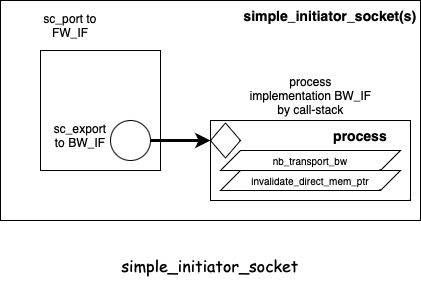

:source-highlighter: coderay

:toc: left

SystemC中的TLM 2.0 Simple Socket
[[chap::tlm_simple_socket]]

=== 引言

在<<chap::tlm_intro, SystemC中的TLM 2.0介绍>>部分，我们简单介绍了TLM 2.0中常用的
一些数据结构，包括initiator socket和target socket的定义，但这些仍然不足以支持
我们建立一个可运行的仿真环境。这些数据仍然只是框架性质的定义，还缺少具体的实现细节。
为此，TLM 2.0种设计了三种类型
的socket，来方便使用者直接使用。这三种类型的socket分别是

* simple socket
* passthrough socket
* multi socket

而在本部分，我们将从simple socket入手，socket的实现细节，并且从这些实现细节，也尝试去掌握如何理解TLM 2.0协议的内在约束。
本章首先介绍了三种socket所使用的基类，convenience_socket_base的定义。然后，我们将深入探索simple socket的具体实现。
一些simple socket实现过程中，需要用到的tlm utils的类也在这里得到详细介绍。最后，我们将尝试汇总一下TLM 2.0协议
的实现细节，将其对应到simple socket的具体实施中。

对于passthrough socket，以及multi socket，我们将在下一章讨论。

=== convenience_socket_base

convenience_socket_base是一个纯虚的基类，用来实现一些辅助函数：
[[data::convenience_socket_base]]

.src/tlm_utils/convenience_socket_bases.h
[source,cpp]
----
// implementation-defined base class helper for convenience sockets
class SC_API convenience_socket_base
{
public:
  void display_warning(const char* msg) const; <1>
  void display_error(const char* msg) const; <1>
protected:
  virtual ~convenience_socket_base(){}
private:
  virtual const char* get_report_type() const = 0; <2>
  virtual const sc_core::sc_object* get_socket() const = 0; <2>
};
----
<1> convenience_socket_base实现了display_warning和display_error两个辅助函数
<2> convenience_socket_base要求继承类实现接口函数get_report_type和get_socket

convenience_socket_base两个辅助函数display_warning和display_error的实现如下所示：

.src/tlm_utils/convenience_socket_bases.cpp
[source,cpp]
----
void
convenience_socket_base::display_warning(const char* text) const
{
  std::stringstream s;
  s << get_socket()->name() << ": " << text;
  SC_REPORT_WARNING(get_report_type(), s.str().c_str());
}

void
convenience_socket_base::display_error(const char* text) const
{
  std::stringstream s;
  s << get_socket()->name() << ": " << text;
  SC_REPORT_ERROR(get_report_type(), s.str().c_str());
}
----

注意，其中用到了接口函数get_report_type和get_socket。所以继承自convenience_socket_base
的派生类只要实现了两个接口函数，就可以方便地调用display_warning和display_error，来打印
warning和error信息了。这也是convenience_socket_base设计的初衷所在。

====  convenience_socket_cb_holder

convenience_socket_cb_holder是一个非常简单的用来持有convenience_socket_base指针
的类，这也是为何名字叫call-back holder的原因了:
[[data::convenience_socket_cb_holder]]

.src/tlm_utils/convenience_socket_bases.cpp
[source,cpp]
----
// implementation-defined base class for callback helpers
class SC_API convenience_socket_cb_holder
{
public:
  void display_warning(const char* msg) const;
  void display_error(const char* msg) const;

protected:
  explicit convenience_socket_cb_holder(convenience_socket_base* owner) <1>
    : m_owner(owner) {}

private:
  convenience_socket_base* m_owner;
};
----
<1> 构造函数只接受一个convenience_socket_base指针，然后将指针保存下来

=== simple socket

simple socket，是最简单类型的一种socket。simple socket包括initiator和target两种socket的
实现。这里的实现意思是，相关的数据结构实现了相应的接口函数。然而，在TLM 2.0中，接口函数的实现
方式与TLM 1.0完全不同。TLM 1.0的典型接口函数实现方法仍然没有脱离FIFO的概念。

在TLM 1.0中，
一个精心设计的类<<tlm::1::tlm_fifo, tlm_fifo>>实现了接口函数的定义。与此同时，tlm_fifo也是
一个primitive channel，这就保证了仿真的正确性。TLM 2.0设计时采用了截然不同的思路，没有FIFO之类
保证primitive channel的同步原语，而是采用了定义接口函数，并提供延时的方式（延时至少是SC_ZERO_time），
完成同步的目的。

而对于simple socket，则在内部实现了继承有<<api::tlm_fw_transport_if, tlm_fw_transport_if>>
和<<api::tlm_bw_transport_if, tlm_bw_transport_if>>的对象，提供了相应接口函数的实现。这些接口函数内部仍然
需要回调函数来完成实际的工作，而simple socket的设计则只是提供注册回调函数的API调用，持有
回调函数的指针（一般回调函数是成员函数，所以这里需要模板类），然后完成一些必要的转换，例如，对于实现了
non-blocking语义的回调函数，如果调用blocking语义的API，则需要使用non-blocking来实现blocking，反之亦然。
这样一来，使用simple socket的时候，无需定义继承tlm_fw_transport_if/tlm_bw_transport_if的类来绑定到
socket上，只需要注册回调函数即可。

---

simple_initiator_socket需要和相匹配的simple_target_socket配对使用。所谓的配对使用，指的是
一个simple_initiator_socket需要绑定到相对应的simple_target_socket上。这样绑定达到的
目的就是，无论是simple_initiator_socket，还是simple_target_socket，所有的port和export
都得到了绑定，并且所需要实现的接口函数也都得到了实现。

simple_initiator_socket和simple_target_socket的目的也在于此。只需要将两个socket绑定，接口函数
就可以实现了。而这些实现了的接口函数，其内部实际调用的是需要进一步进行注册的回调函数，只不过如果在
运行时某些接口函数如果从未用过，则无需注册。如果不使用simple_initiator_socket/simple_target_socket
对，而是直接使用tlm_initiator_socket和tlm_target_socket对，那么即使是从未使用过的接口函数，也需要
实现一下，否则会出现编译期错误。

---

一个例子来自https://www.cnblogs.com/cngpus/p/13175947.html：

[source,cpp]
----
#include "systemc.h"
#include "tlm.h"
#include "tlm_utils/simple_initiator_socket.h"
#include "tlm_utils/simple_target_socket.h"

class A : public sc_module {
public:
    SC_HAS_PROCESS(A);

    A(sc_module_name name) : sc_module(name) {
        SC_THREAD(hello);
    }

public:
    tlm_utils::simple_initiator_socket<A> socket;

private:
    void
    hello() {
        auto *payload = new tlm::tlm_generic_payload();
        assert(payload != nullptr);

        const char *data{"Hello"};
        payload->set_data_ptr((unsigned char *) data);

        sc_time delay = SC_ZERO_TIME;

        socket->b_transport(*payload, delay);

        delete payload;
    }
};

class B : public sc_module {
public:
    SC_HAS_PROCESS(B);

    B(sc_module_name name) : sc_module(name) {
        socket.register_b_transport(this, &B::hello);
    }

public:
    tlm_utils::simple_target_socket<B> socket;

private:
    void
    hello(tlm::tlm_generic_payload  &payload, sc_core::sc_time &delay_time) {
        const char *data = reinterpret_cast<const char *>(payload.get_data_ptr());
        std::cout << data << std::endl;
    }
};

int
sc_main(int argc, char* argv[]) {
    A a("A");
    B b("B");

    a.socket(b.socket);

    sc_start(10, SC_NS);

    return EXIT_SUCCESS;
}
----

从这里我们也可以看出，模块内部使用simple_initiator_socket和simple_target_socket直接做绑定，
然后模块 B只需要注册 `b_transport` 的回调函数，整个程序就可以运行起来。这个过程中，并不需要注册
任何nonblocking的回调函数，或者注册dmi/dbg的回调函数，因为实际运行时并没有使用这些回调函数。
simple_initiator_socket和simple_target_socket已经在内部实现了这些需要实现的接口函数，并将
在调用的时候调用注册的回调函数。相比于tlm_initiator_socket和tlm_target_socket，这无疑得到了
极大的简化，这也是名字里simple的由来了。

另一个值得注意的点则是，拥有 `simple_target_socket` 的类B才能使用 register_b_transport，注册
b_transport的回调函数。然而，b_transport是一个FW_IF的接口函数，调用方向应当从initiator socket
到target socket。这里之所以是拥有simple_target_socket的类注册回调函数，是因为拥有
simple_initiator_socket的A，其内部simple_initiator_socket，作为一个 `sc_port<FW_IF>`, 绑定
到作为 `sc_export<FW_IF>` 的simple_target_socket之后，simple_target_socket作为一个FW_IF，已经
将自己绑定到内部的 <<data::simple_target_socket_b::fw_process, fw_process>> 上，
实现了b_transport函数。只不过这个实现的b_transport函数，和其他的
FW_IF的接口函数一样，都需要调用注册的回调函数而已。当simple_target_socket注册了FW_IF的接口函数之后，从
simple_initiator_socket调用这些FW_IF的接口函数，其表现就如同直接调用这些注册了的回调函数
一样。即，A在thread `hello` 中调用 `socket->b_transport`，其效果
和直接调用 B注册的回调函数 `hello` 一样，这就是socket的含义所在了。

从这里，我们也能理解，为何注册BW_IF类型回调函数的是simple_initiator_socket，而
注册FW_IF类型回调函数的反而是simple_target_socket。

=== simple_socket_base

simple_socket_base直接继承自convenience_socket_base，且只实现了一个接口函数
get_report_type，所以simple_socket_base还是一个抽象虚基类：
[[data::simple_socket_base]]

.src/tlm_utils/convenience_socket_bases.h
[source,cpp]
----
// implementation-defined base class helper for simple sockets
class SC_API simple_socket_base : public convenience_socket_base
{
  virtual const char* get_report_type() const; <1>
protected:
  void elaboration_check(const char* action) const; <2>
};
----
<1> 只实现了接口函数get_report_type，没有实现get_socket
<2> 添加了一个额外的elaboration_check的函数

simple_socket_base所实现的接口函数get_report_type，实际上只是简单返回一个字符串，标识
这是一个TLM 2.0定义的simple socket:

.src/tlm_utils/convenience_socket_bases.h
[source,cpp]
----
const char*
simple_socket_base::get_report_type() const {
  return "/OSCI_TLM-2/simple_socket";
}

void
simple_socket_base::elaboration_check(const char* action) const
{
  if (sc_core::sc_get_curr_simcontext()->elaboration_done()) {
    std::stringstream s;
    s << " elaboration completed, " << action << " not allowed";
    display_error(s.str().c_str());
  }
}
----

[[api::simple_socket_base::elaboration_check]]
此外，simple_socket_base还实现了一个elaboration_check的函数。当elaboration_check
函数被调用的时候，就会打印一个elaboration阶段的报错信息。如果elaboration_check没有
在elaboration done之后调用，则没有其他作用。这个函数主要是为了确保一些执行过程需要在elaboration
done之前发生。

=== simple_initiator_socket

simple_initiator_socket包括一系列sockets定义，同样有着一套复杂的继承关系：

* simple_initiator_socket_b继承自tlm_initiator_socket和simple_socket_base
* 从simple_initiator_socket_b，派生出
- simple_initiator_socket
- simple_initiator_socket_optional
* simple_initiator_socket_tagged_b继承自tlm_initiator_socket和simple_socket_base
* 从simple_initiator_socket_tagged_b，派生出
- simple_initiator_socket_tagged
- simple_initiator_socket_tagged_optional

所有的simple_initiator_socket，实际上都继承自<<api::tlm_initiator_socket, tlm_initiator_socket>>，
并且内部实现了一个继承自<<api::tlm_bw_transport_if, tlm_bw_transport_if>>，且
实现了两个接口函数 `nb_transport_bw` 和 `invalidate_direct_mem_ptr`
方法的类，这两个接口函数实际调用了注册的回调函数。同时，simple initiator socket作为一个
tlm_initiator_socket，其内部的 `sc_export<BW_IF>` 直接绑定到这个process上。这样一来，
sc_export<BW_IF>就获得了实际的实现。simple_initiator_socket的实现大致如下图所示：

.simple initiator socket的实现

我们将按照继承体系的顺序，逐步探索这些类的实现细节。

==== simple_initiator_socket_b::process

simple_initiator_socket_b::process是定义在simple_initiator_socket_b模板类
内部的一个辅助的模板类。process直接继承自<<api::tlm_bw_transport_if, tlm_bw_transport_if>>
，所以process需要实现接口函数nb_transport_bw和invalidate_direct_mem_ptr。process
类同时也继承自<<data::convenience_socket_cb_holder, convenience_socket_cb_holder>>，
其唯一的作用就是用来持有simple_initiator_socket_b本身指针。定义如下：
[[data::simple_initiator_socket_b::process]]

.src/tlm_utils/simple_initiator_socket.h
[source,cpp]
----
  class process
    : public tlm::tlm_bw_transport_if<TYPES>
    , protected convenience_socket_cb_holder
  {
  public:
    typedef sync_enum_type (MODULE::*TransportPtr)(transaction_type&,
                                                   phase_type&,
                                                   sc_core::sc_time&);
    typedef void (MODULE::*InvalidateDirectMemPtr)(sc_dt::uint64,
                                                   sc_dt::uint64);

    explicit process(simple_socket_base* owner)
      : convenience_socket_cb_holder(owner), m_mod(0)
      , m_transport_ptr(0)
      , m_invalidate_direct_mem_ptr(0)
    {
    }
    //blabla
    private:
    MODULE* m_mod;
    TransportPtr m_transport_ptr;
    InvalidateDirectMemPtr m_invalidate_direct_mem_ptr;
  };
----

为方便起见，process内部定义了两个成员函数指针类型，分别是 `TransportPtr`
和 `InvalidateDirectMempTR`。注意，这两个成员函数指针的类都是MODULE，这实际上是
simple_initiator_socket_b的模板参数。 构造函数中，会将传入的simple_socket_base指针
保存到convenience_socket_cb_holder父类中。构造的时候，3个成员变量都是0，即指向
MODULE的指针，以及两个成员函数指针均为空。这三个成员变量需要使用额外的
函数来进行注册才能使用，参考下边：

.src/tlm_utils/simple_initiator_socket.h
[source,cpp]
----
    void set_transport_ptr(MODULE* mod, TransportPtr p)
    {
      if (m_transport_ptr) {
        display_warning("non-blocking callback already registered");
        return;
      }
      sc_assert(!m_mod || m_mod == mod);
      m_mod = mod;
      m_transport_ptr = p;
    }

    void set_invalidate_direct_mem_ptr(MODULE* mod, InvalidateDirectMemPtr p)
    {
      if (m_invalidate_direct_mem_ptr) {
        display_warning("invalidate DMI callback already registered");
        return;
      }
      sc_assert(!m_mod || m_mod == mod);
      m_mod = mod;
      m_invalidate_direct_mem_ptr = p;
    }
----

函数 `set_transport_ptr` 和 `set_invalidate_direct_mem_ptr` 分别用来注册两个
成员函数，并且MODULE的指针也需要保持一致。这样一来，实现tlm_bw_transport_if<>接口
函数的代码也就非常简单了，基本上就是转发给注册的成员函数而已：

.src/tlm_utils/simple_initiator_socket.h
[source,cpp]
----
    sync_enum_type nb_transport_bw(transaction_type& trans, phase_type& phase, sc_core::sc_time& t)
    {
      if (m_transport_ptr) {
        // forward call
        sc_assert(m_mod);
        return (m_mod->*m_transport_ptr)(trans, phase, t);
      }
      display_error("no transport callback registered"); <1>
      return tlm::TLM_COMPLETED; <2>
    }

    void invalidate_direct_mem_ptr(sc_dt::uint64 start_range,
                                   sc_dt::uint64 end_range)
    {
      if (m_invalidate_direct_mem_ptr) {
        // forward call
        sc_assert(m_mod);
        (m_mod->*m_invalidate_direct_mem_ptr)(start_range, end_range);
      }
    }
----
<1> 调用的display_error实际调用的是基类convenience_socket_cb_holder的display_error，在实现中转发给了
持有的simple_socket_base对象的display_error函数
<2> 这里返回TLM_COMPLETED是不会走到的，如果走到就意味着系统出现错误

总结一下，simple_initiator_socket_b::process，就是一个使用回调函数机制，实现了
<<api::tlm_bw_transport_if, tlm_bw_transport_if>>的模板类。

==== simple_initiator_socket_b
[[data::simple_initiator_socket_b]]

simple_initiator_socket_b是一个模板类，需要4个模板参数:

1. 对象的类型，这个对象是拥有兼容tlm_bw_transport_if接口函数为成员函数的类
2. 位宽
3. 类型，即拥有两个成员类型tlm_payload_type和tlm_phase_type的类，默认是<<api::tlm_base_protocol_types, tlm_base_protocol_types>>
4. 作为一个sc_port时候的绑定策略

.src/tlm_utils/simple_initiator_socket.h
[source,cpp]
----
template< typename MODULE, unsigned int BUSWIDTH, typename TYPES
        , sc_core::sc_port_policy POL = sc_core::SC_ONE_OR_MORE_BOUND >
class simple_initiator_socket_b
  : public tlm::tlm_initiator_socket<BUSWIDTH, TYPES, 1, POL> <1>
  , protected simple_socket_base <2>
{
public:
  typedef typename TYPES::tlm_payload_type                transaction_type;
  typedef typename TYPES::tlm_phase_type                  phase_type;
  typedef tlm::tlm_sync_enum                              sync_enum_type;
  typedef tlm::tlm_fw_transport_if<TYPES>                 fw_interface_type;
  typedef tlm::tlm_bw_transport_if<TYPES>                 bw_interface_type;
  typedef tlm::tlm_initiator_socket<BUSWIDTH,TYPES,1,POL> base_type;
  // blabla
private:
  const sc_core::sc_object* get_socket() const { return this; } <3>
private:
  process m_process; <4>
};
----
<1> simple_initiator_socket_b继承自<<api::tlm_initiator_socket, tlm_initiator_socket>>, 最后两个参数1和POL用来给<<api::sc_port, sc_port>>提供参数，因为tlm_initiator_socket本身也是一个sc_port，1的含义是，如果绑定策略是SC_ALL_BOUND，那么就只能精确绑定一个。对于不是SC_ALL_BOUND绑定策略的情况，1这个数字无意义
<2> simple_initiator_socket_b同时也继承自<<data::simple_socket_base, simple_socket_base>>，注意是protected继承
<3> get_socket实现了simple_socket_base所需要的接口函数定义
<4> 唯一一个成员变量就是<<data::simple_initiator_socket_b::process, process>>了

simple_initiator_socket_b之所以需要继承simple_socket_base，是为了提供display_warning和display_error
两个用来辅助显示warning和error信息的API函数。

simple_initiator_socket_b的唯一一个成员变量是<<data::simple_initiator_socket_b::process, process>>，是一个
<<api::tlm_bw_transport_if, tlm_bw_transport_if>>的实现。

simple_initiator_socket_b的构造函数比较简单：

.src/tlm_utils/simple_initiator_socket.h
[source,cpp]
----
  static const char* default_name()
    { return sc_core::sc_gen_unique_name("simple_initiator_socket"); }

  explicit simple_initiator_socket_b(const char* n = default_name())
    : base_type(n)
    , m_process(this)
  {
    this->m_export.bind(m_process); <1>
  }
----
<1> 这个绑定是这个构造函数最为重要的一个功能

构造函数除了构造基类之外，最重要的是构造m_process成员变量，以及将本类作为一个
<<api::tlm_initiator_socket, tlm_initiator_socket>>，其m_export成员变量绑定
到m_process成员变量上。回想一下，对于tlm_initiator_socket，其成员变量m_export
是一个BW_IF的sc_export:

.tlm_base_initiator_socket的数据结构
image::tlm_base_initiator_socket.png[]

所以这样的绑定结果是，本类的基类tlm_initiator_socket的成员变量 m_export
内部持有了一个指向成员变量 m_process的指针，指针类型为 `tlm_bw_transport_if*`，
可以用来调用tlm_bw_transport_if所定义的
接口函数nb_transport_bw和invalidate_direct_mem_ptr。

接下来只剩下两个API函数，用来将process注册回调函数的部分同样导出来，即
register_nb_transport_bw和register_invalidate_direct_mem_ptr两个
成员函数，注意这两个成员函数的类型和prcess的同名成员函数是一样的，所以函数本身的实现
只是一个转发而已：
[[data::simple_initiator_socket_b::register_nb_transport_bw]]
[[data::simple_initiator_socket_b::register_invalidate_direct_mem_ptr]]

.src/tlm_utils/simple_initiator_socket.h
[source,cpp]
----
  void register_nb_transport_bw(MODULE* mod,
                                sync_enum_type (MODULE::*cb)(transaction_type&,
                                                             phase_type&,
                                                             sc_core::sc_time&))
  {
    m_process.set_transport_ptr(mod, cb);
  }

  void register_invalidate_direct_mem_ptr(MODULE* mod,
                                          void (MODULE::*cb)(sc_dt::uint64, sc_dt::uint64))
  {
    m_process.set_invalidate_direct_mem_ptr(mod, cb);
  }
----

---

目前为止，我们已经simple_initiator_socket_b模板代码的学习了。总的来说，
simple_initiator_socket_b本身是一个tlm_initiator_socket，其tlm_initiator_socket
的m_export绑定到内部唯一一个成员变量m_process上，而m_process则是一个
tlm_bw_transport_if的实现，所需要实现的接口函数可以通过
simple_initiator_socket_b的register_nb_transport_bw
和register_invalidate_direct_mem_ptr两个成员函数进行注册。

这样一来，对于simple_initiator_socket_b本身，作为一个tlm_initiator_socket，
get_base_interface/get_base_export所返回的BW_IF指针或者sc_export<BW_IF>，都可以
用来调用所注册的两个函数（即nb_transport_bw和invalidate_direct_mem_ptr）。这两个
函数实际保存在simple_initiator_socket_b唯一的成员变量m_process中，实际上是保存了
一个对象（对象的类型就是simple_initiator_socket_b的第一个模板参数）的指针和两个成员函数指针。

==== simple_initiator_socket

simple_initiator_socket的实现非常简单，直接继承自<<data::simple_initiator_socket_b, simple_initiator_socket_b>>。
对于基类simple_initiator_socket_b，提供了可选的模板参数BUSWIDTH和TYPES，这样POL模板参数就使用了
simple_initiator_socket_b的默认值 `sc_core::SC_ONE_OR_MORE_BOUND` ，即sc_port至少要绑定一个interface
，这部分的内容参考<<api::sc_port::bind::policy, sc_port的绑定策略>>部分:
[[data::simple_initiator_socket]]

.src/tlm_utils/simple_initiator_socket.h
[source,cpp]
----
template< typename MODULE, unsigned int BUSWIDTH = 32
        , typename TYPES = tlm::tlm_base_protocol_types >
class simple_initiator_socket
  : public simple_initiator_socket_b<MODULE,BUSWIDTH,TYPES>
{
  typedef simple_initiator_socket_b<MODULE,BUSWIDTH,TYPES> socket_b;
public:
  simple_initiator_socket() : socket_b() {}
  explicit simple_initiator_socket(const char* name) : socket_b(name) {}
};
----

==== simple_initiator_socket_optional

simple_initiator_socket_optional的实现和simple_initiator_socket一样，也非常简单，直接继承
自simple_initiator_socket_b，提供了可选的模板参数BUSWIDTH和TYPES。而在基类继承的时候，为模板
参数POL提供了不同于默认值的值 `sc_core::SC_ZERO_OR_MORE_BOUND` ，这就允许simple_initiator_socket_optional
作为一个sc_port，可以绑定任意数目（包括0个）interface:
[[data::simple_initiator_socket_optional]]

.src/tlm_utils/simple_initiator_socket.h
[source,cpp]
----
template< typename MODULE, unsigned int BUSWIDTH = 32
        , typename TYPES = tlm::tlm_base_protocol_types >
class simple_initiator_socket_optional
  : public simple_initiator_socket_b<MODULE,BUSWIDTH,TYPES,sc_core::SC_ZERO_OR_MORE_BOUND>
{
  typedef simple_initiator_socket_b<MODULE,BUSWIDTH,TYPES,sc_core::SC_ZERO_OR_MORE_BOUND> socket_b;
public:
  simple_initiator_socket_optional() : socket_b() {}
  explicit simple_initiator_socket_optional(const char* name) : socket_b(name) {}
};
----

==== simple_initiator_socket_tagged_b::process

simple_initiator_socket_tagged_b内部有一个类process，实现了和
<<data::simple_initiator_socket_b::process, simple_initiator_socket_b中的process类>>
同样的功能：
[[data::simple_initiator_socket_tagged_b::process]]

.src/tlm_utils/simple_initiator_socket.h
[source,cpp]
----
  class process
    : public tlm::tlm_bw_transport_if<TYPES>
    , protected convenience_socket_cb_holder
  {
  public:
    typedef sync_enum_type (MODULE::*TransportPtr)(int, <1>
                                                   transaction_type&,
                                                   phase_type&,
                                                   sc_core::sc_time&);
    typedef void (MODULE::*InvalidateDirectMemPtr)(int, <1>
                                                   sc_dt::uint64,
                                                   sc_dt::uint64);
  // blabla
  private:
    MODULE* m_mod;
    TransportPtr m_transport_ptr;
    InvalidateDirectMemPtr m_invalidate_direct_mem_ptr;
    int m_transport_user_id; <2>
    int m_invalidate_direct_mem_user_id; <2>
  };
----
<1> 注意，成员函数指针的类型中，函数参数相比于<<data::simple_initiator_socket_b::process, simple_initiator_socket_b中的process类>>
多了第一个 `int` 型的参数
<2> 成员变量也增加了两个 `int` 型变量

process类同样继承自<<api::tlm_bw_transport_if, tlm_bw_transport_if>>和
<<data::convenience_socket_cb_holder, convenience_socket_cb_holder>>。继承自前者，意味着
需要实现接口函数nb_transport_bw和invalidate_direct_mem_ptr。继承自后者，主要是为了实现
在process内部调用display_warning和display_error函数的功能。

注意，这里的成员函数指针的类型TransportPtr和InvalidateDirectMmePtr，与
<<data::simple_initiator_socket_b::process, simple_initiator_socket_b中的process类>>
的成员函数指针类型不一样：这里的函数指针类型，都增加了第一个 `int` 型的参数。此外，成员变量
也多了两个 `int` 型的 m_transport_user_id和m_invalidate_direct_mem_user_id。

在实现tlm_bw_transport_if的时候，这两个id被用来作为相应成员函数调用时候的第一个参数：

.src/tlm_utils/simple_initiator_socket.h
[source,cpp]
----
    sync_enum_type nb_transport_bw(transaction_type& trans, phase_type& phase, sc_core::sc_time& t)
    {
      if (m_transport_ptr) {
        // forward call
        sc_assert(m_mod);
        return (m_mod->*m_transport_ptr)(m_transport_user_id, trans, phase, t); <1>
      }
      display_error("no transport callback registered");
      return tlm::TLM_COMPLETED;
    }

    void invalidate_direct_mem_ptr(sc_dt::uint64 start_range,
                                   sc_dt::uint64 end_range)
    {
      if (m_invalidate_direct_mem_ptr) {
        // forward call
        sc_assert(m_mod);
        (m_mod->*m_invalidate_direct_mem_ptr)(m_invalidate_direct_mem_user_id, start_range, end_range); <2>
      }
    }
----
<1> 调用注册的成员函数m_transport_ptr时候，传入第一个参数时保存的 `int` 型成员变量m_transport_user_id
<2> 调用注册的成员函数m_invalidate_direct_mem_ptr的时候，传入第一个参数是保存的 `int` 型成员变量m_invalidate_direct_mem_user_id

而process提供四个额外的函数，用来注册成员函数指针，以及为两个 `int` 型成员变量（也就是tag值）提供值：
[[data::simple_initiator_socket_tagged_b::process::set_transport_user_id]]
[[data::simple_initiator_socket_tagged_b::process::set_invalidate_dmi_user_id]]
[[data::simple_initiator_socket_tagged_b::process::set_transport_ptr]]
[[data::simple_initiator_socket_tagged_b::process::set_invalidate_direct_mem_ptr]]

.src/tlm_utils/simple_initiator_socket.h
[source,cpp]
----
    void set_transport_user_id(int id) { m_transport_user_id = id; }
    void set_invalidate_dmi_user_id(int id) { m_invalidate_direct_mem_user_id = id; }

    void set_transport_ptr(MODULE* mod, TransportPtr p)
    {
      if (m_transport_ptr) {
        display_warning("non-blocking callback already registered");
        return;
      }
      sc_assert(!m_mod || m_mod == mod);
      m_mod = mod;
      m_transport_ptr = p;
    }

    void set_invalidate_direct_mem_ptr(MODULE* mod, InvalidateDirectMemPtr p)
    {
      if (m_invalidate_direct_mem_ptr) {
        display_warning("invalidate DMI callback already registered");
        return;
      }
      sc_assert(!m_mod || m_mod == mod);
      m_mod = mod;
      m_invalidate_direct_mem_ptr = p;
    }
----

这四个成员函数会在
<<data::simple_initiator_socket_tagged_b::register_nb_transport_bw, simple_initiator_socket_tagged_b的register_nb_transport_bw>>
和
<<data::simple_initiator_socket_tagged_b::register_invalidate_direct_mem_ptr, simple_initiator_socket_tagged_b的register_invalidate_direct_mem_ptr>>

==== simple_initiator_socket_tagged_b

simple_initiator_socket_tagged_b，是实现带tagged功能的simple initiator socket的基础。
这个所谓的tag，实际上就是在
<<data::simple_initiator_socket_tagged_b::process, simple_initiator_socket_tagged_b::process>>
里，我们展示的那个额外的integer值。
[[data::simple_initiator_socket_tagged_b]]

simple_initiator_socket_tagged_b，和<<data::simple_initiator_socket_b, simple_initiator_socket_b>>
一样，也是继承自tlm_initiator_socket和simple_socket_base

.src/tlm_utils/simple_initiator_socket.h
[source,cpp]
----
template< typename MODULE, unsigned int BUSWIDTH, typename TYPES
        , sc_core::sc_port_policy POL = sc_core::SC_ONE_OR_MORE_BOUND >
class simple_initiator_socket_tagged_b
  : public tlm::tlm_initiator_socket<BUSWIDTH, TYPES, 1, POL> <1>
  , protected simple_socket_base <2>
{
public:
  typedef typename TYPES::tlm_payload_type                transaction_type;
  typedef typename TYPES::tlm_phase_type                  phase_type;
  typedef tlm::tlm_sync_enum                              sync_enum_type;
  typedef tlm::tlm_fw_transport_if<TYPES>                 fw_interface_type;
  typedef tlm::tlm_bw_transport_if<TYPES>                 bw_interface_type;
  typedef tlm::tlm_initiator_socket<BUSWIDTH,TYPES,1,POL> base_type;
  // blabla
private:
  const sc_core::sc_object* get_socket() const { return this; } <3>
private:
  process m_process; <4>
};
----
<1> 继承自tlm_initiator_socket
<2> 继承自simple_socket_base，主要是提供了display_warning和display_error函数的使用能力
<3> get_socket实现了simple_socket_base所定义的接口函数
<4> 拥有唯一一个成员变量，就是<<data::simple_initiator_socket_tagged_b::process, simple_initiator_socket_tagged_b::process>>

simple_initiator_socket_tagged_b的构造非常简单：

.src/tlm_utils/simple_initiator_socket.h
[source,cpp]
----
  static const char* default_name()
    { return sc_core::sc_gen_unique_name("simple_initiator_socket_tagged"); }

  explicit simple_initiator_socket_tagged_b(const char* n = default_name())
    : base_type(n)
    , m_process(this)
  {
    this->m_export.bind(m_process); <1>
  }
----
<1> 将tlm_initiator_socket的m_export绑定到m_process上

[[data::simple_initiator_socket_tagged_b::register_nb_transport_bw]]
这里的绑定和<<data::simple_initiator_socket_b, simple_initiator_socket_b>>基本一样。simple_initiator_socket_tagged_b
同样提供了注册函数register_nb_trasnport_bw和register_invalidate_direct_mem_ptr，用来为m_process的成员变量提供值：

[[data::simple_initiator_socket_tagged_b::register_invalidate_direct_mem_ptr]]

.src/tlm_utils/simple_initiator_socket.h
[source,cpp]
----
  void register_nb_transport_bw(MODULE* mod,
                                sync_enum_type (MODULE::*cb)(int,
                                                             transaction_type&,
                                                             phase_type&,
                                                             sc_core::sc_time&),
                                int id)
  {
    m_process.set_transport_ptr(mod, cb);
    m_process.set_transport_user_id(id);
  }

  void register_invalidate_direct_mem_ptr(MODULE* mod,
                                          void (MODULE::*cb)(int, sc_dt::uint64, sc_dt::uint64),
                                           int id)
  {
    m_process.set_invalidate_direct_mem_ptr(mod, cb);
    m_process.set_invalidate_dmi_user_id(id);
  }
----

只是需要注意，register_nb_transport_bw和register_invalidate_direct_mem_ptr在调用的时候就需要
提供一个 `int` 型的数据，来设置m_process中的相应的值。这个值就是所谓的tagged了。

==== simple_initiator_socket_tagged

simple_initiator_socket_tagged和
<<data::simple_initiator_socket_tagged_b, simple_initiator_socket_tagged_b>>的关系，就和
<<data::simple_initiator_socket, simple_initiator_socket>>
与 <<data::simple_initiator_socket_b, simple_initiator_socket_b>>的关系一样，只是
为模板参数提供默认值，以及为POL模板参数提供一个值SC_ONE_OR_MORE_BOUND而已：
[[data::simple_initiator_socket_tagged]]

.src/tlm_utils/simple_initiator_socket.h
[source,cpp]
----
template< typename MODULE, unsigned int BUSWIDTH = 32
        , typename TYPES = tlm::tlm_base_protocol_types >
class simple_initiator_socket_tagged
  : public simple_initiator_socket_tagged_b<MODULE,BUSWIDTH,TYPES> <1>
{
  typedef simple_initiator_socket_tagged_b<MODULE,BUSWIDTH,TYPES> socket_b;
public:
  simple_initiator_socket_tagged() : socket_b() {}
  explicit simple_initiator_socket_tagged(const char* name) : socket_b(name) {}
};
----
<1> 这里并没有指定POL，意味着使用<<data::simple_initiator_socket_tagged_b, simple_initiator_socket_tagged_b>>
默认的POL模板参数值 `sc_core::SC_ONE_OR_MORE_BOUND`

==== simple_initiator_socket_tagged_optional

simple_initiator_socket_tagged_optional和
<<data::simple_initiator_socket_tagged_b, simple_initiator_socket_tagged_b>>的关系，就和
<<data::simple_initiator_socket_optional, simple_initiator_socket_optional>>
与 <<data::simple_initiator_socket_b, simple_initiator_socket_b>>的关系一样，只是
为模板参数提供默认值，以及为POL模板参数提供一个值SC_ZERO_OR_MORE_BOUND而已：
[[data::simple_initiator_socket_tagged_optional]]

.src/tlm_utils/simple_initiator_socket.h
[source,cpp]
----
template< typename MODULE, unsigned int BUSWIDTH = 32
        , typename TYPES = tlm::tlm_base_protocol_types >
class simple_initiator_socket_tagged_optional
  : public simple_initiator_socket_tagged_b<MODULE,BUSWIDTH,TYPES,sc_core::SC_ZERO_OR_MORE_BOUND>
{
  typedef simple_initiator_socket_tagged_b<MODULE,BUSWIDTH,TYPES,sc_core::SC_ZERO_OR_MORE_BOUND> socket_b;
public:
  simple_initiator_socket_tagged_optional() : socket_b() {}
  explicit simple_initiator_socket_tagged_optional(const char* name) : socket_b(name) {}
};
----

==== simple initiator socket summary

simple initiator socket，指包括
<<data::simple_initiator_socket, simple_initiator_socket>>, 
<<data::simple_initiator_socket_optional, simple_initiator_socket_optional>>, 
<<data::simple_initiator_socket_tagged, simple_initiator_socket_tagged>>以及
<<data::simple_initiator_socket_tagged_optional, simple_initiator_socket_tagged_optional>>
这四种常用的模板类型。这些simple initiator socket都是一个<<api::tlm_initiator_socket, tlm_initiator_socket>>
，意味着这些socket本身就是一个 `sc_port<FW_IF>` ，同时也提供了一些注册回调函数的功能，来实现
BW_IF的接口函数注册。

对于simple initiator socket，使用FW_IF的接口函数时，只需要将socket本身作为 `sc_port`
看待，或者 `get_base_port`。而使用BW_IF的接口函数时，则只需要 `get_base_interface` 或者 `get_base_export`
就可以了。

simple initiator socket在使用的时候需要绑定到FW_IF上，但不再需要绑定到BW_IF上，这是因为
这些socket在内部实现了BW_IF的类。外部只需要将接口函数注册进来即可。这样一来，即使实现了
BW_IF接口函数的类不属于SystemC的对象体系，也可以通过注册回调函数的方式，参与到TLM中来，极大
扩展了SystemC的适用范围。

simple_initiator_socket内部的sc_export<BW_IF>已经绑定到了具体的实现（其实是内部的process），这意味着
在hierarchy binding的场景下，simple_initiator_socket不能再绑定其他的inititor socket了。这包括

* simple_initiator_socket不能绑定到一个tlm_initiator_socket上
* simple_initiator_socket不能绑定到另一个simple_initiator_socket上

但是，反方向的绑定是可行的：

* tlm_initiator_socket可以绑定一个simple_initiator_socket，这意味着这个tlm_initiator_socket和simple_initiator_socket一起，构成了
hierarchy binding的终点（对于BW_IF而言）

=== simple_target_socket

simple_target_socket，类似于simple_initiator_socket，同样由多种类型的socket组成：

* simple_target_socket_b继承自tlm_target_socket和simple_socket_base
* 从simple_target_socket_b，派生出
- simple_target_socket
- simple_target_socket_optional
* simple_target_socket_tagged_b继承自tlm_target_socket和simple_socket_base
* 从simple_target_socket_tagged_b，派生出
- simple_target_socket_tagged
- simple_target_socket_tagged_optional

但与simple_initiator_socket不同，simple_target_socket的实现更为复杂。这个原因主要在于，对于simple initiator socket
而言，其内部需要实现BW_IF的功能。BW_IF只有两个接口函数需要实现，因而simple initiator socket实现比较简单。但对于simple
target socker而言，其内部需要实现BW_IF的功能。BW_IF有4个接口函数需要实现，同时，还需要考虑到，其中两个接口函数 `nb_transport_fw`
和 `b_transport` 之间的相互实现，即如果回调函数注册了nonblocking版本，如何使用nonblocking版本实现blocking版本，以及反过来，
回调函数只注册了blocking版本，如何实现nonblocking版本。

如果无需实现nonblocking的接口函数和blocking的接口函数之间的相互实现，simple_target_socket就会变得简单很多。这样的target
socket就是我们下一部分要介绍的<<data::passthrough_target_socket, passthrough_target_socket>>。

==== simple_target_socket_b::bw_process

bw_process是定义在模板类型simple_target_socket_b中的一个辅助类，用来处理后向通路的调用：

[[data::simple_target_socket_b::bw_process]]

.src/tlm_utils/simple_target_socket.h
[source,cpp]
----
  //Helper class to handle bw path calls
  // Needed to detect transaction end when called from b_transport.
  class bw_process : public tlm::tlm_bw_transport_if<TYPES>
  {
  public:
    bw_process(simple_target_socket_b *p_own) : m_owner(p_own)
    {
    }

  // blabla
    private:
    simple_target_socket_b *m_owner;
  };
----

bw_process直接继承自 <<api::tlm_bw_transport_if, tlm_bw_transport_if>>，有唯一一个成员变量就是
指向simple_target_socket_b的指针m_owner。

bw_process实现tlm_bw_transport_if的接口函数invalidate_direct_mem_ptr的
方式很简单，那就是直接调用simple_target_socket_b提供的接口函数
<<data::simple_target_process_b::bw_invalidate_direct_mem_ptr, simple_target_process_b::bw_invalidate_direct_mem_ptr>>:
[[data::simple_target_process_b::bw_process::invalidate_direct_mem_ptr]]

.src/tlm_utils/simple_target_socket.h
[source,cpp]
----
    void invalidate_direct_mem_ptr(sc_dt::uint64 s,sc_dt::uint64 e)
    {
      return m_owner->bw_invalidate_direct_mem_ptr(s, e);
    }
----

[[data::simple_target_process_b::bw_process::nb_transport_bw]]
然而，tlm_bw_transport_if的接口函数nb_transport_bw的实现相对而言比较复杂，虽然
也主要是借用了simple_target_socket_b的成员函数
<<data::simple_target_process_b::bw_nb_transport, bw_nb_transport>>来实现的：

.src/tlm_utils/simple_target_socket.h
[source,cpp]
----
    sync_enum_type nb_transport_bw(transaction_type &trans, phase_type &phase, sc_core::sc_time &t)
    {
      typename std::map<transaction_type*, sc_core::sc_event *>::iterator it =
        m_owner->m_pending_trans.find(&trans);

      if(it == m_owner->m_pending_trans.end()) {
        // Not a blocking call, forward.
        return m_owner->bw_nb_transport(trans, phase, t);

      }

      if (phase == tlm::END_REQ) {
        m_owner->m_end_request.notify(sc_core::SC_ZERO_TIME);
        return tlm::TLM_ACCEPTED;
      }
      if (phase == tlm::BEGIN_RESP) {
        if (m_owner->m_current_transaction == &trans) {
          m_owner->m_end_request.notify(sc_core::SC_ZERO_TIME);
        }
        //TODO: add response-accept delay?
        it->second->notify(t);
        m_owner->m_pending_trans.erase(it);
        return tlm::TLM_COMPLETED;
      }
      m_owner->display_error("invalid phase received");
      return tlm::TLM_COMPLETED;
    }
----

如果trans对象并不在 `m_owner->m_pending_trans` 中，表明这并不是一个fw_process
使用nonblocking API实现blocking语义的请求，这里直接转发即可。这部分内容请参考
<<data::simple_target_socket::fw_process:b2nb_thread, b2nb_thread>>的介绍。
如果trans在 `m_owner->m_pending_trans` 中，那么就需要根据协议，来决定如何应对了。

[[bw_process::b2nb_thread::end_req]]
如果phase是END_REQ，这里就触发 `m_owner->m_end_request`，然后返回TLM_ACCEPTED，表明
接受请求了（不需要返回TLM_UPDATED，因为没有更新phase）。这就和
<<fw_process::b2nb_thread::begin_req, fw_process里处理相同的请求>>时，等待 `m_owner->m_end_request`
同步起来了。

[[bw_process::b2nb_thread::begin_resp]]
如果phase是BEGIN_RESP，这对应了
<<fw_process::b2nb_thread::begin_req, fw_process里处理相同的请求>>时的下一步，所以这里仍然需要notify
一次m_end_request，然后完成传输。完成传输的动作是先触发这个trans对应的事件，这样
<<data::fw_process::end_event, fw_process使用nonblocking实现blocking的事件等待部分>>的blocking请求就结束，然后将这个trans从
`m_owner->m_pending_trans` 中移除。之后直接返回TLM_COMPLTED即可，不再需要返回一个TLM_UPDATED/TLM_ACCEPTED，继续END_RESP阶段。

==== simple_target_socket_b::fw_process

fw_process同样是定义在simple_target_socket_b内部的辅助类。fw_process直接继承自
<<api::tlm_fw_transport_if, tlm_fw_transport_if>>，同时也继承自 <<api::tlm_mm_interface, tlm_mm_interface>>：

[[data::simple_target_socket_b::fw_process]]

.src/tlm_utils/simple_target_socket.h
[source,cpp]
----
  class fw_process : public tlm::tlm_fw_transport_if<TYPES>,
                    public tlm::tlm_mm_interface
  {
  public:
    typedef sync_enum_type (MODULE::*NBTransportPtr)(transaction_type&,
                                                     phase_type&,
                                                     sc_core::sc_time&);
    typedef void (MODULE::*BTransportPtr)(transaction_type&,
                                          sc_core::sc_time&);
    typedef unsigned int (MODULE::*TransportDbgPtr)(transaction_type&);
    typedef bool (MODULE::*GetDirectMemPtr)(transaction_type&,
                                            tlm::tlm_dmi&);
    // blabla
  private:
    simple_target_socket_b *m_owner; <1>
    MODULE* m_mod; <2>
    NBTransportPtr m_nb_transport_ptr; <2>
    BTransportPtr m_b_transport_ptr; <2>
    TransportDbgPtr m_transport_dbg_ptr; <2>
    GetDirectMemPtr m_get_direct_mem_ptr; <2>
    peq_with_get<transaction_type> m_peq; <3>
    bool m_response_in_progress;
    sc_core::sc_event m_end_response;
  };
----
<1> 内部持有一个指向simple_target_socket_b的指针
<2> 内部持有对象的指针，以及四个成员函数指针
<3> 这个<<data::peq_with_get, peq_with_get>>类型的成员变量主要用在使用nonblocking的API实现blocking语义的时候

fw_process同样将4个需要实现的函数定义为类的成员函数指针。fw_process提供了4个函数，用来注册
这4个成员函数指针：

.src/tlm_utils/simple_target_socket.h
[source,cpp]
----
    void set_nb_transport_ptr(MODULE* mod, NBTransportPtr p)
    {
      if (m_nb_transport_ptr) {
        m_owner->display_warning("non-blocking callback already registered");
        return;
      }
      sc_assert(!m_mod || m_mod == mod);
      m_mod = mod;
      m_nb_transport_ptr = p;
    }

    void set_b_transport_ptr(MODULE* mod, BTransportPtr p)
    {
      if (m_b_transport_ptr) {
        m_owner->display_warning("blocking callback already registered");
        return;
      }
      sc_assert(!m_mod || m_mod == mod);
      m_mod = mod;
      m_b_transport_ptr = p;
    }

    void set_transport_dbg_ptr(MODULE* mod, TransportDbgPtr p)
    {
      if (m_transport_dbg_ptr) {
        m_owner->display_warning("debug callback already registered");
        return;
      }
      sc_assert(!m_mod || m_mod == mod);
      m_mod = mod;
      m_transport_dbg_ptr = p;
    }

    void set_get_direct_mem_ptr(MODULE* mod, GetDirectMemPtr p)
    {
      if (m_get_direct_mem_ptr) {
        m_owner->display_warning("get DMI pointer callback already registered");
        return;
      }
      sc_assert(!m_mod || m_mod == mod);
      m_mod = mod;
      m_get_direct_mem_ptr = p;
    }
----

注意注册成员函数指针时，必须保持对象指针不变，否则会报错。

如果全部的4个成员函数指针都实现了，那么实现<<api::tlm_fw_transport_if, tlm_fw_transport_if>>
的接口函数就变得水到渠成：

.src/tlm_utils/simple_target_socket.h
[source,cpp]
----
// Interface implementation
    sync_enum_type nb_transport_fw(transaction_type& trans,
                                   phase_type& phase,
                                   sc_core::sc_time& t)
    {
      if (m_nb_transport_ptr) {
        // forward call
        sc_assert(m_mod);
        return (m_mod->*m_nb_transport_ptr)(trans, phase, t);
      }

      // blabla <1>
    }
    void b_transport(transaction_type& trans, sc_core::sc_time& t)
    {
      if (m_b_transport_ptr) {
        // forward call
        sc_assert(m_mod);
        (m_mod->*m_b_transport_ptr)(trans, t);
        return;
      }

      // blabla <1>
    }
    unsigned int transport_dbg(transaction_type& trans)
    {
      if (m_transport_dbg_ptr) {
        // forward call
        sc_assert(m_mod);
        return (m_mod->*m_transport_dbg_ptr)(trans);
      }
      // No debug support
      return 0;
    }

    bool get_direct_mem_ptr(transaction_type& trans,
                            tlm::tlm_dmi&  dmi_data)
    {
      if (m_get_direct_mem_ptr) {
        // forward call
        sc_assert(m_mod);
        return (m_mod->*m_get_direct_mem_ptr)(trans, dmi_data);
      }
      // No DMI support
      dmi_data.allow_read_write();
      dmi_data.set_start_address(0x0);
      dmi_data.set_end_address((sc_dt::uint64)-1);
      return false;
    }
----
<1> 未完待续部分，我们在后续补充这部分的实现细节

TODO: 关于mm_interface部分内容还需要在看几遍，补充实现细节

可以看出，如果全部的回调函数都注册了，那么这里对接口函数的实现基本都只是转发而言，包括nb_transport_fw, b_transport, transport_dbg
以及 get_direct_mem_ptr。 

如果transport_dbg没有实现，那么这里就可以简单返回0，表示不支持debug功能，这是trasnport_dbg接口函数允许的。同样的，对于
get_direct_mem_ptr没有实现的情况，可以将dmi数据设置后返回，来表示不支持DMI请求。

现在的问题在于，对于nb_transport_fw和b_transport，我们不能仅仅因为没有实现而选择忽略。如果其中某一个回调函数实现了，另一个没有实现，那么
simple target socket就需要使用实现了的回调函数来实现相应的API。具体分为两种情况：

* 注册了non-blocking的API，但没有注册blocking的API，那么就需要使用nb_transport_fw实现b_transport
* 注册了blocking的API，但没有注册non-blocking的API，那么就需要使用b_transport时限nb_transport_fw

===== nb_transport_fw实现b_transport
[[impl::nb_transport_fw::b_transport]]

在fw_process的实现b_transport的时候，如果发现b_transport的回调函数没有实现，但是实现了nb_transport_fw，那么就需要使用如下代码了：

.src/tlm_utils/simple_target_socket.h
[source,cpp]
----
    void b_transport(transaction_type& trans, sc_core::sc_time& t)
    {
      if (m_b_transport_ptr) {
        // forward call
        sc_assert(m_mod);
        (m_mod->*m_b_transport_ptr)(trans, t);
        return;
      }

      // b->nb conversion
      if (m_nb_transport_ptr) {
        m_peq.notify(trans, t);
        t = sc_core::SC_ZERO_TIME;

        mm_end_event_ext mm_ext;
        const bool mm_added = !trans.has_mm();

        if (mm_added) {
          trans.set_mm(this);
          trans.set_auto_extension(&mm_ext);
          trans.acquire();
        }

        // wait until transaction is finished
        sc_core::sc_event end_event;
        m_owner->m_pending_trans[&trans] = &end_event;
        sc_core::wait(end_event);

        if (mm_added) {
          // release will not delete the transaction, it will notify mm_ext.done
          trans.release();
          if (trans.get_ref_count()) {
            sc_core::wait(mm_ext.done);
          }
          trans.set_mm(0);
        }
        return;
      }

      // should not be reached
      m_owner->display_error("no blocking transport callback registered");
    }
----

使用nonblocking的API来实现blocking的API，主要使用了一个额外的数据结构，即 <<data::peq_with_get, peq_with_get>>。
简单来说，peq_with_get可以保存一系列transaction对象，同时保存设置下来的latency延迟时间。当最近设置的延迟时间到达的时候，
peq_with_get可以触发其内部的一个事件。而peq_with_get的这个事件则被fw_process的start_of_simulation中，
注册为b2nb_thread线程函数的静态敏感事件：

.src/tlm_utils/simple_target_socket.h
[source,cpp]
----
    void start_of_simulation()
    {
      if (!m_b_transport_ptr && m_nb_transport_ptr) { // only spawn b2nb_thread, if needed <1>
        sc_core::sc_spawn_options opts;
        opts.set_sensitivity(&m_peq.get_event()); <2>
        opts.dont_initialize();
        sc_core::sc_spawn(sc_bind(&fw_process::b2nb_thread, this),
                          sc_core::sc_gen_unique_name("b2nb_thread"), &opts);
      }
    }
----
<1> 只有当nb_transport指针注册，且b_transport指针没有注册的时候，需要启动b2nb_thread线程函数
<2> m_peq的<<data::peq_with_get::get_event, get_event>>返回超时事件的引用，这里直接拿来设置为将要启动的线程的静态敏感事件

这样一来，当调用blocking的API，但b_transport回调函数没有注册，只注册了nb_transport函数的时候，
首先将trans和延时时间一并放入到<<data::peq_with_get, peq_with_get>>类型的成员变量 `m_peq`
中。因为需要等待trans完成，所以在这里讲这个trans注册到 `m_owner->m_pending_trans` 中去，并将
这个trans关联到一个local的event上，之后等待这个event：

[source,cpp]
----
        // wait until transaction is finished
        sc_core::sc_event end_event;
        m_owner->m_pending_trans[&trans] = &end_event;
        sc_core::wait(end_event);
----

[[data::fw_process::end_event]]
当这里的 `end_event` 等待到的时候，即表明trans完成，就可以返回了。代码这里与mm_interface
相关的内容后续再分析。

那么，b2nb_thread线程函数又是如何实现的呢？
[[data::simple_target_socket::fw_process:b2nb_thread]]

.src/tlm_utils/simple_target_socket.h
[source,cpp]
----
    void b2nb_thread()
    {
      while (true) {
        transaction_type* trans;
        while ((trans = m_peq.get_next_transaction())!=0) { <3>
          sc_assert(m_mod);
          sc_assert(m_nb_transport_ptr);
          phase_type phase = tlm::BEGIN_REQ;
          sc_core::sc_time t = sc_core::SC_ZERO_TIME;

          switch ((m_mod->*m_nb_transport_ptr)(*trans, phase, t)) {
          case tlm::TLM_COMPLETED:
          {
            // notify transaction is finished
            typename std::map<transaction_type*, sc_core::sc_event *>::iterator it =
              m_owner->m_pending_trans.find(trans); <1>
            sc_assert(it != m_owner->m_pending_trans.end());
            it->second->notify(t); <1>
            m_owner->m_pending_trans.erase(it); <2>
            break;
          }

          case tlm::TLM_ACCEPTED:
          case tlm::TLM_UPDATED:
            switch (phase) {
            case tlm::BEGIN_REQ:
              m_owner->m_current_transaction = trans;
              sc_core::wait(m_owner->m_end_request);
              m_owner->m_current_transaction = 0;
              break;

            case tlm::END_REQ:
              sc_core::wait(t);
              break;

            case tlm::BEGIN_RESP:
            {
              phase = tlm::END_RESP;
              sc_core::wait(t);  // This line is a bug fix added in TLM-2.0.2
              t = sc_core::SC_ZERO_TIME;
              (m_mod->*m_nb_transport_ptr)(*trans, phase, t);

              // notify transaction is finished
              typename std::map<transaction_type*, sc_core::sc_event *>::iterator it =
                m_owner->m_pending_trans.find(trans); <1>
              sc_assert(it != m_owner->m_pending_trans.end());
              it->second->notify(t); <1>
              m_owner->m_pending_trans.erase(it); <2>
              break;
            }

            default:
              m_owner->display_error("invalid phase received");
            }
            break;

          default:
            m_owner->display_error("invalid sync value received");
          }
        }
        sc_core::wait();
      }
    }
----
<1> 注意，当nonblocking的transport完成之后，这里需要从 `m_owner->m_pending_trans` 里查找相应的trans对象，并notify与之关联的事件
<2> trans完成之后，就不要再保存这个对象，将之删除即可
<3> 使用<<data::peq_with_get::get_next_transaction, get_next_transaction>>获取设定时间达到的trans对象

这段代码实现，我们首先关注和b_transport中同步的部分。注意，当trans完成之后，总是有如下部分代码调用：

[source,cpp]
----
              // notify transaction is finished
              typename std::map<transaction_type*, sc_core::sc_event *>::iterator it =
                m_owner->m_pending_trans.find(trans); 
              sc_assert(it != m_owner->m_pending_trans.end());
              it->second->notify(t); 
              m_owner->m_pending_trans.erase(it); 
----

这里从 `m_owner->m_pending_trans` 找到trans对象，然后notify对应的event，这样就与b_transport中
局部变量event对应上，同步起来了。

那么，trans在合适能够完成呢？b2nb_thread实际上实现了使用nonblocking的协议，做blocking的传输的过程。
从<<data::peq_with_get, peq_with_get>>使用get_next_transaction获得需要传送的trans对象之后，首先
设置phase为BEGIN_REQ，延时时间则设置为SC_ZERO_TIME（这里并不需要b_transport设置的延时时间，因为b_transport
设置的延时时间已经到了），调用nb_transport_fw API。

等到nb_transport_fw返回之后，需要根据返回值来判断。如果nb_transport_fw返回TLM_COMPLETED，就表明当前这笔
传输已经完成，可以将这个trans从 `m_owner->m_pending_trans` 中挪去，然后notify相应的event了。

[source,cpp]
----
          case tlm::TLM_COMPLETED:
          {
            // notify transaction is finished
            typename std::map<transaction_type*, sc_core::sc_event *>::iterator it =
              m_owner->m_pending_trans.find(trans); <1>
            sc_assert(it != m_owner->m_pending_trans.end());
            it->second->notify(t); <1>
            m_owner->m_pending_trans.erase(it); <2>
            break;
          }
----

[[fw_process::b2nb_thread::begin_req]]
如果nb_transport_fw返回值并不是TLM_COMPLETED，说明传说需要更多的PHASE。这时候就需要根据返回的PHASE信息
来决定接下来的行为。如果PHASE仍然是BEGIN_REQ，说明下游返回的只是TLM_ACCEPTED。这时候就需要等待下游
通过nb_transport_bw发送END_REQ了。但由于这里只是前向通路，所以等待一个end_request的事件发生：

[source,cpp]
----
            case tlm::BEGIN_REQ:
              m_owner->m_current_transaction = trans;
              sc_core::wait(m_owner->m_end_request);
              m_owner->m_current_transaction = 0;
              break;
----

这个wait一直等到
<<bw_process::b2nb_thread::end_req, bw_process中的nb_transport_bw>>
收到END_REQ为止才会触发。这个事件结束后，BEGIN_REQ和END_REQ phase就都完成了。但注意，此时
仍然没有从 `m_owner->m_pending_trans` 中挪去这个需要传输的对象。这种情况下，接下来需要的
PHASE是BEGIN_RESP，由<<bw_process::b2nb_thread::begin_resp, bw_process里的begin_resp>>
部分进行处理。注意此时后续的处理全部在<<bw_process::b2nb_thread::begin_resp, bw_process的nb_transport_bw>>
部分进行处理，而不再需要这部分的参与了。

如果nb_transport_fw返回phase为END_REQ，这里同样需要延时设定的时间，后续的操作同样
由<<bw_process::b2nb_thread::begin_resp, bw_process的nb_transport_bw>>
部分来完成（不清楚这里为何不设定m_current_transaction）：

[source,cpp]
----
            case tlm::END_REQ:
              sc_core::wait(t);
              break;
----

如果nb_transport_fw返回的phse直接是BEGIN_RESP，表明这时候fw可以回一个END_RESP，延迟给定的时间之后，
，再次调用nb_transport_fw, 结束处理了：

[source,cpp]
----
            case tlm::BEGIN_RESP:
            {
              phase = tlm::END_RESP;
              sc_core::wait(t);  // This line is a bug fix added in TLM-2.0.2
              t = sc_core::SC_ZERO_TIME;
              (m_mod->*m_nb_transport_ptr)(*trans, phase, t);

              // notify transaction is finished
              typename std::map<transaction_type*, sc_core::sc_event *>::iterator it =
                m_owner->m_pending_trans.find(trans); <1>
              sc_assert(it != m_owner->m_pending_trans.end());
              it->second->notify(t); <1>
              m_owner->m_pending_trans.erase(it); <2>
              break;
            }
----

发起END_RESP之后，调用nb_transport_fw已经不再需要返回值和phase，因为此时一个完成的transaction已经结束了，所以
这里同样按照流程，在 `m_owner->m_pending_trans` 中查找对象，notify对应的event，然后从中移除这个已经完成的
trans对象。

===== b_transport实现nb_transport_fw
[[impl::b_transport::nb_transport_fw]]

在fw_process的实现nb_transport_f的时候，如果发现nb_transport_f的回调函数没有实现，但是实现了b_transport，那么就需要使用如下代码了：

.src/tlm_utils/simple_target_socket.h
[source,cpp]
----
      // nb->b conversion
      if (m_b_transport_ptr) {
        if (phase == tlm::BEGIN_REQ) {
          // prepare thread to do blocking call
          process_handle_class * ph = m_process_handle.get_handle(&trans); <1>

          if (!ph) { // create new dynamic process
            ph = new process_handle_class(&trans);
            m_process_handle.put_handle(ph);

            sc_core::sc_spawn_options opts;
            opts.dont_initialize();
            opts.set_sensitivity(&ph->m_e);

            sc_core::sc_spawn(sc_bind(&fw_process::nb2b_thread,this, ph),
                            sc_core::sc_gen_unique_name("nb2b_thread"), &opts);
          }

          ph->m_e.notify(t); <2>
          return tlm::TLM_ACCEPTED;
        }
        if (phase == tlm::END_RESP) {
          m_response_in_progress = false;
          m_end_response.notify(t);
          return tlm::TLM_COMPLETED;
        }
        m_owner->display_error("invalid phase received");
        return tlm::TLM_COMPLETED;
      }
      m_owner->display_error("no non-blocking transport callback registered");
      return tlm::TLM_COMPLETED;
----
<1> m_process_handle的get_handle操作会优先挑选那些已经suspend的thread复用，所以这里不用担心新建的
thread完成一次trans后就无法使用，参考<<data::process_handle_list, process_handle_list>>部分的内容
<2> 无论是新建thread，还是复用老的thread，只有这里延时事件被触发，才会得到调度，执行 `nb2b_thread` 函数

使用blocking的API实现nonblocing的语义部分，需要一些额外的工作。

如果是BEGIN_REQ phase，表明传输刚开始。
这里首先尝试获取以下是否有对应spawn
出来的线程负责这个工作，如果没有，就new一个<<data::process_handle_class, process_handle_class>>，并
将传输对象的指针设置进去。这个新建的thread对process_handle_class的 `m_e` 事件静态敏感，所以new
出来之后，设置这个 `m_e` 事件在设定的延时时间触发，返回一个TLM_ACCEPTED即可。这个新建的thread需要等待
时间的触发，所以thread本身被设置为无需初始执行（dont_initialize）。
注意，这里返回的是
TLM_ACCEPTED，这意味着后续还需要一个END_REQ的bw通路的请求。

(还没有定论，需要继续分析)
bw通路的END_REQ和BEGIN_RESP都在
<<data::simple_target_process_b::bw_process::nb_transport_bw>>中处理，直到fw返回END_RESP的时候，才再次调用这个API：

由于blocking API没有反向的Path，所以能够接受的phase参数只有前向的 BEGIN_REQ和 END_RESP。
如果再次调用的是END_RESP，这是initiator向target发送的本次transaction最后一笔数据了，此时标记m_response_in_progress
为false，并设定m_end_response事件在给定的延时时间t之后触发，此时就可以返回调用方TLM_COMPLETED了。
这里设置m_response_in_progress和m_end_response事件触发，与<<[simple_target_socket_b::nb2b_thread::end_resp, nb2b_thread中处理m_response_in_progress>>里对应的代码同步起来了。

---

nb2b_thread的实现是如下：

[[simple_target_socket_b::nb2b_thread]]
.src/tlm_utils/simple_target_socket.h
[source,cpp]
----
    void nb2b_thread(process_handle_class* h)
    {

      while(1) {
        transaction_type *trans = h->m_trans;
        sc_core::sc_time t = sc_core::SC_ZERO_TIME;

        // forward call
        sc_assert(m_mod);
        (m_mod->*m_b_transport_ptr)(*trans, t);

        sc_core::wait(t);

        // return path
        while (m_response_in_progress) {
          sc_core::wait(m_end_response);
        }
        t = sc_core::SC_ZERO_TIME;
        phase_type phase    = tlm::BEGIN_RESP;
        sync_enum_type sync = m_owner->bw_nb_transport(*trans, phase, t);
        if ( !(sync == tlm::TLM_COMPLETED ||
              (sync == tlm::TLM_UPDATED && phase == tlm::END_RESP)) ) {
          m_response_in_progress = true;
        }

        // suspend until next transaction
        h->m_suspend = true;
        sc_core::wait();
      }
    }
----

[[simple_target_socket_b::nb2b_thread::begin_req]]
函数分为几部分，首先是调用blocking API，传输数据的部分。注意这个thread被唤醒的时候，表明nb_transport_fw
所设定的延时时间已经满足，所以这里再调用blocking的b_transport的时候，只需要给一个延时时间SC_ZERO_TIME即可。
调用结束之后，再等待一段时间t（这个t是被调用方要求的延时时间）。这就是处理BEGIN_REQ部分的代码了。

[[simple_target_socket_b::nb2b_thread::end_resp]]
接下来，等待 `m_response_in_progress` 变为false，如果是true，表明有需要的response处理，则继续等待事件
`m_end_response` 的发生。当m_response_in_progress发送过来，表明response已经处理完毕，initiator已经通过
nonblocking的API发送一个end_resp了，这里就需要结束处理。

TODO: 这部分内容还需要在看几遍

这里是否有潜在的bug，因为m_response_in_progress和m_end_response都是fw_process自己的成员变量，这
意味着如果有多个process_handle_class对象的话，他们所管理的nb2b_thread共享同一份m_response_in_progress
和m_end_response对象。那么，如果一个nonblocking的API调用了END_RESP，是否会唤醒所有其他的线程呢？
后边这部分代码的功能没有看懂，是否就是为了解决这个问题的？

[source,cpp]
----
        t = sc_core::SC_ZERO_TIME;
        phase_type phase    = tlm::BEGIN_RESP;
        sync_enum_type sync = m_owner->bw_nb_transport(*trans, phase, t);
        if ( !(sync == tlm::TLM_COMPLETED ||
              (sync == tlm::TLM_UPDATED && phase == tlm::END_RESP)) ) {
          m_response_in_progress = true;
        }
----

==== simple_target_socket_b

simple_target_socket_b有两个基类，一个是<<api::tlm_target_socket, tlm_target_socket>>，
另一个则是simple_socket_base，后者主要为了实现display_warning和display_error信息。
simple_target_socket_b主要继承的是tlm_target_socket的能力，从这方面审视，simple_target_socket_b
本质上是一个 <<api::sc_export, `sc_core::sc_export` >>:
[[data::simple_target_socket_b]]

.src/tlm_utils/simple_target_socket.h
[source,cpp]
----
template< typename MODULE, unsigned int BUSWIDTH, typename TYPES
        , sc_core::sc_port_policy POL = sc_core::SC_ONE_OR_MORE_BOUND >
class simple_target_socket_b
  : public tlm::tlm_target_socket<BUSWIDTH, TYPES, 1, POL> <1>
  , protected simple_socket_base <2>
{
  friend class fw_process;
  friend class bw_process;
public:
  typedef typename TYPES::tlm_payload_type              transaction_type;
  typedef typename TYPES::tlm_phase_type                phase_type;
  typedef tlm::tlm_sync_enum                            sync_enum_type;
  typedef tlm::tlm_fw_transport_if<TYPES>               fw_interface_type;
  typedef tlm::tlm_bw_transport_if<TYPES>               bw_interface_type;
  typedef tlm::tlm_target_socket<BUSWIDTH,TYPES,1,POL>  base_type;

  // blabla

private:
  const sc_core::sc_object* get_socket() const { return this; } <3>
private:
  fw_process m_fw_process;
  bw_process m_bw_process;
  std::map<transaction_type*, sc_core::sc_event *> m_pending_trans;
  sc_core::sc_event m_end_request;
  transaction_type* m_current_transaction;
};
----
<1> simple_target_socket_b主要继承自tlm_target_socket
<2> simple_target_socket_b同样继承自simple_socket_base
<3> 实现了get_socket接口函数，为基类<<data::convenience_socket_base, convenience_socket_base>>的display_warning和display_error提供获取组件名称的能力

相比于对应的 <<data::simple_initiator_socket_b, simple_initiator_socket_b>>, simple_target_socket_b的
成员变量更为复杂，这是因为simple_target_socket_b不仅要实现fw_process，还需要实现bw_process。由于需要在fw_process
中实现可能的阻塞调用和非阻塞调用之间的切换，所以simple_initiator_socket_b不得不保存非常多的数据结构，包括当前的
transaction，排队的transactions队列，以及结束请求时候发起的事件。

---

simple_target_socket_b的构造函数非常简单，可以是空的，也可以显示给定一个字符串名字：

.src/tlm_utils/simple_target_socket.h
[source,cpp]
----
public:
  static const char* default_name()
    { return sc_core::sc_gen_unique_name("simple_target_socket"); }

  explicit simple_target_socket_b(const char* n = default_name())
    : base_type(n) <1>
    , m_fw_process(this) <2>
    , m_bw_process(this) <3>
  {
    bind(m_fw_process); <4>
  }

  using base_type::bind;

  // bw transport must come thru us.
  tlm::tlm_bw_transport_if<TYPES> * operator ->() {return &m_bw_process;} <5>
----
<1> 名字用来构造基类tlm_target_socket
<2> 将this指针用来构造成员变量m_fw_process
<3> 将this指针用来构造成员变量m_bw_process
<4> 调用bind，将m_fw_process绑定到自己身上，这里的bind调用的是tlm_target_socket的bind，所以这里是讲一个实现了tlm_fw_transport_if
的类绑定到一个作为 `sc_export<FW_IF>` 的tlm_base_socket上
<5> 重载了 `operator->()` 实现，返回的是m_bw_process指针

---

[[data::simple_target_process_b::bw_nb_transport]]
simple_target_socket_b提供了两个private的成员函数，供自己的友元类fw_process和bw_process使用(
主要是bw_process实现
<<data::simple_target_process_b::bw_process::nb_transport_bw, bw_process::nb_transport_bw>>
以及
<<data::simple_target_process_b::bw_process::invalidate_direct_mem_ptr, bw_process::invalidate_direct_mem_ptr>>
这两个tlm_bw_transport_if函数的时候使用
)：
[[data::simple_target_process_b::bw_invalidate_direct_mem_ptr]]

.src/tlm_utils/simple_target_socket.h
[source,cpp]
----
private:
  //make call on bw path.
  sync_enum_type bw_nb_transport(transaction_type &trans, phase_type &phase, sc_core::sc_time &t)
  {
    return base_type::operator ->()->nb_transport_bw(trans, phase, t);
  }

  void bw_invalidate_direct_mem_ptr(sc_dt::uint64 s,sc_dt::uint64 e)
  {
    base_type::operator ->()->invalidate_direct_mem_ptr(s, e);
  }
----

注意这里的 `base_type` 指的是基类 tlm_target_socket（因为simple_target_socket_b自己也实现了
`operator->()`，所以这里如果不显示指定base_type，调用的则是simple_target_socket_b自己所实现的
`operator->()`，返回m_bw_process的指针，这样就无法达到所需要的目的了），所以 `base_type::operator ->()`
实际上调用的是基类tlm_target_socket的 `operator->()`，根据以下的定义，调用的则是tlm_target_socket
中的类型为sc_port类型的成员变量m_port的 `operator->()`:

.src/tlm_core/tlm_2/tlm_sockets/tlm_target_socket.h
[source,cpp]
----
  //
  // Forward to 'operator->()' of port class
  //
  bw_interface_type* operator->()
  {
    return m_port.operator->();
  }
----

故而，最后的结果是，调用的是tlm_target_socket中，所绑定的BW_IF（可以是多个）的接口函数
nb_transport_bw和invalidate_direct_mem_ptr。
而tlm_target_socket所绑定的BW_IF，在定义simple_target_socket_b的时候并没有提供，这就需要
应用者自己将simple_target_socket_b作为一个tlm_target_socket，绑定BW_IF。而tlm_target_socket
的 m_port成员只有在双向绑定（绑定一个tlm_initiator_socket或者一个tlm_target_socket）时候才能
被绑定。

---

simple_target_socket_b自己作为一个tlm_target_socket，在构造函数中，调用bind，将自己绑定到
成员变量fw_process上，而
<<data::simple_target_socket_b::fw_process, fw_process>>则是一个tlm_fw_transport_if的子类。
这里的绑定调用，实现如下：

.src/tlm_core/tlm_2/tlm_sockets/tlm_target_socket.h
[source,cpp]
----
  //
  // Bind interface to socket
  // - Binds the interface to the export
  //
  virtual void bind(fw_interface_type& ifs)
  {
    export_type* exp = &get_base_export();
    if( this == exp ) {
      export_type::bind( ifs ); // non-virtual function call
    } else {
      exp->bind( ifs );
    }
  }
----

这样的效果等同于simple_target_socket_b作为一个sc_export<FW_IF>，持有了fw_process的一个指针。
这样一来，当simple_target_socket_b和其他initiator socket绑定之后，其他initiator socket
同样可以获取持有fw_process的指针，进而调用fw_process所实现的FW_IF的四个接口函数。fw_process
虽然实现了FW_IF的四个接口函数，但是这4个接口函数内部都需要调用回调函数。如果相应的接口函数在运行时
没有被调用，那么就无需定义回调函数。对于nb_transport_fw和b_transport，则只需要实现其中一个，另一个
simple_target_socket会自行实现（如果nb_transport_fw实现，那么所绑定的initiator socket侧必须同时实现nb_transport_bw）。

==== simple_target_socket

如同<<data::simple_initiator_socket, simple_initiator_socket>>的实现一样，
simple_target_socket直接继承自 <<data::simple_target_socket_b, simple_target_socket_b>>，主要
对于基类simple_target_socket_b，提供了可选的模板参数BUSWIDTH和TYPES，这样POL模板参数就使用了
simple_target_socket_b的默认值 `sc_core::SC_ONE_OR_MORE_BOUND` ，即sc_port至少要绑定一个interface
，这部分的内容参考<<api::sc_port::bind::policy, sc_port的绑定策略>>部分:

[[data::simple_target_socket]]
.src/tlm_utils/simple_target_socket.h
[source,cpp]
----
template< typename MODULE, unsigned int BUSWIDTH = 32
        , typename TYPES = tlm::tlm_base_protocol_types >
class simple_target_socket
  : public simple_target_socket_b<MODULE,BUSWIDTH,TYPES>
{
  typedef simple_target_socket_b<MODULE,BUSWIDTH,TYPES> socket_b;
public:
  simple_target_socket() : socket_b() {}
  explicit simple_target_socket(const char* name) : socket_b(name) {}
};
----

==== simple_target_socket_optional

与<<data::simple_initiator_socket_optional, simple_initiator_socket_optional>>一样，
simple_target_socket_optional继承
<<data::simple_target_socket_b, simple_target_socket_b>>，对模板参数进行了特化。这里的optinal
后缀体现在POL上: 设定POL为SC_ZERO_OR_MORE_BOUND，这样不绑定interface也可以：

[[data::simple_target_socket_optional]]
.src/tlm_utils/simple_target_socket.h
[source,cpp]
----
template< typename MODULE, unsigned int BUSWIDTH = 32
        , typename TYPES = tlm::tlm_base_protocol_types >
class simple_target_socket_optional
  : public simple_target_socket_b<MODULE,BUSWIDTH,TYPES,sc_core::SC_ZERO_OR_MORE_BOUND>
{
  typedef simple_target_socket_b<MODULE,BUSWIDTH,TYPES,sc_core::SC_ZERO_OR_MORE_BOUND> socket_b;
public:
  simple_target_socket_optional() : socket_b() {}
  explicit simple_target_socket_optional(const char* name) : socket_b(name) {}
};
----

==== simple_target_socket_tagged_b

带tagged版本的simle_target_socket_tagged_b，其实现和
<<data::simple_target_socket_b, simple_target_socket_b>>基本一样，唯一的区别在于，注册的回调函数
可以带一个额外的参数，就如同
<<data::simple_initiator_socket_tagged_b, simple_initiator_socket_tagged_b>>与
<<data::simple_initiator_socket_b, simple_initiator_socket_b>>的关系一样：

[[data::simple_target_socket_tagged_b]]
.src/tlm_utils/simple_target_socket.h
[source,cpp]
----
//ID Tagged version
template< typename MODULE, unsigned int BUSWIDTH, typename TYPES
        , sc_core::sc_port_policy POL = sc_core::SC_ONE_OR_MORE_BOUND >
class simple_target_socket_tagged_b
  : public tlm::tlm_target_socket<BUSWIDTH, TYPES, 1, POL>
  , protected simple_socket_base
{
  // blabla
};
----

注意simple_target_socket_tagged_b提供的注册FW_IF的四个回调函数指针的API时，回调函数指针的
原型:

.src/tlm_utils/simple_target_socket.h
[source,cpp]
----
  // REGISTER_XXX
  void register_nb_transport_fw(MODULE* mod,
                                sync_enum_type (MODULE::*cb)(int id, <1>
                                                             transaction_type&,
                                                             phase_type&,
                                                             sc_core::sc_time&),
                                int id)
  {
    elaboration_check("register_nb_transport_fw");
    m_fw_process.set_nb_transport_ptr(mod, cb);
    m_fw_process.set_nb_transport_user_id(id);
  }

  void register_b_transport(MODULE* mod,
                            void (MODULE::*cb)(int id, <1>
                                               transaction_type&,
                                               sc_core::sc_time&),
                            int id)
  {
    elaboration_check("register_b_transport");
    m_fw_process.set_b_transport_ptr(mod, cb);
    m_fw_process.set_b_transport_user_id(id);
  }

  void register_transport_dbg(MODULE* mod,
                              unsigned int (MODULE::*cb)(int id, <1>
                                                         transaction_type&),
                              int id)
  {
    elaboration_check("register_transport_dbg");
    m_fw_process.set_transport_dbg_ptr(mod, cb);
    m_fw_process.set_transport_dbg_user_id(id);
  }

  void register_get_direct_mem_ptr(MODULE* mod,
                                   bool (MODULE::*cb)(int id, <1>
                                                      transaction_type&,
                                                      tlm::tlm_dmi&),
                                   int id)
  {
    elaboration_check("register_get_direct_mem_ptr");
    m_fw_process.set_get_direct_mem_ptr(mod, cb);
    m_fw_process.set_get_dmi_user_id(id);
  }
----
<1> 四个回调函数指针的原型，相比于FW_if，都增加了一个额外的整型参数，这就是所谓的tagged

==== simple_target_socket_tagged

simple_target_socket_tagged与
<<data::simple_target_socket_tagged_b, simple_target_socket_tagged_b>>
的关系，就和
<<data::simple_target_socket, simple_target_socket>>
与<<data::simple_target_socket_b, simple_target_socket_b>>的关系一样，特化了
模板的参数：

[[data::simple_target_socket_tagged]]
.src/tlm_utils/simple_target_socket.h
[source,cpp]
----
template< typename MODULE, unsigned int BUSWIDTH = 32
        , typename TYPES = tlm::tlm_base_protocol_types >
class simple_target_socket_tagged
  : public simple_target_socket_tagged_b<MODULE,BUSWIDTH,TYPES>
{
  typedef simple_target_socket_tagged_b<MODULE,BUSWIDTH,TYPES> socket_b;
public:
  simple_target_socket_tagged() : socket_b() {}
  explicit simple_target_socket_tagged(const char* name) : socket_b(name) {}
};
----

===== simple_target_socket_tagged_optional

simple_target_socket_tagged_optional与
<<data::simple_target_socket_tagged_b, simple_target_socket_tagged_b>>
的关系，就和
<<data::simple_target_socket_optional, simple_target_socket_optional>>
与<<data::simple_target_socket_b, simple_target_socket_b>>的关系一样，特化了
模板的参数，指定绑定的POL是SC_ZERO_OR_MORE_BOUND:

[[data::simple_target_socket_tagged_optional]]
.src/tlm_utils/simple_target_socket.h
[source,cpp]
----
template< typename MODULE, unsigned int BUSWIDTH = 32
        , typename TYPES = tlm::tlm_base_protocol_types >
class simple_target_socket_tagged_optional
  : public simple_target_socket_tagged_b<MODULE,BUSWIDTH,TYPES,sc_core::SC_ZERO_OR_MORE_BOUND>
{
  typedef simple_target_socket_tagged_b<MODULE,BUSWIDTH,TYPES,sc_core::SC_ZERO_OR_MORE_BOUND> socket_b;
public:
  simple_target_socket_tagged_optional() : socket_b() {}
  explicit simple_target_socket_tagged_optional(const char* name) : socket_b(name) {}
};

----

==== simple target socket summary

请参考TLM LRM 9.1.2.5部分，来了解更多simple target socket实现nonblocking/blocking
API之间相互转换的细节。

=== Misc Data Struction

==== peq_with_get
[[data::peq_with_get]]

peq_with_get，是payload event queue的get版本。

> A payload event queue (PEQ) is a class that maintains a queue of SystemC event notifications, where each notification carries an associated transaction object. Each transaction is written into the PEQ annotated with a delay, and each transaction emerges from the back of the PEQ at a time calculated from the current simulation time plus the annotated delay.

peq_with_get主要用在nonblocking的API实现blocking语义的时候，用来保存trans以及设定的
发生时刻信息：

.src/tlm_utils/peq_with_get.h
[source,cpp]
----
template <class PAYLOAD>
class peq_with_get : public sc_core::sc_object
{
public:
// blabla
private:
  std::multimap<const sc_core::sc_time, transaction_type*> m_scheduled_events;
  sc_core::sc_event m_event;
};
----

peq_with_get有两个成员变量，一个是 `multimap` 类型的 `m_scheduled_events`，保存着设定了
发生时刻，以及相对应的trans对象指针。另一个则是一个简单的sc_event而已。

peq_with_get保存的是需要做blocking transport的trans对象，但这些
trans对象带有延迟信息，所以在使用nb_transport的时候，不能立马调用他们，而是先放入
一个队列中，按照所设置时间的远近，依次调用。

===== notify
[[data::peq_with_get::notify]]

将一个需要传输的对象trans以及发生时间t放入peq_with_get，只能使用函数 `notify`:

.src/tlm_utils/peq_with_get.h
[source,cpp]
----
  void notify(transaction_type& trans, const sc_core::sc_time& t)
  {
    m_scheduled_events.insert(pair_type(t + sc_core::sc_time_stamp(), &trans));
    m_event.notify(t);
  }

  void notify(transaction_type& trans)
  {
    m_scheduled_events.insert(pair_type(sc_core::sc_time_stamp(), &trans));
    m_event.notify(); // immediate notification
  }
----

notify除了将trans以及发生的时间（等于当前的时间加上延时时间）放入 `m_cheduled_events`（这是一个multimap，支持
多个key，同时可以对key排序）外，还出发了m_event。如果没有给trans的延时信息，那么默认是立即发生。

===== get_next_transaction
[[data::peq_with_get::get_next_transaction]]

peq_with_get的get_next_transaction在
<<data::simple_target_socket::fw_process:b2nb_thread, b2nb_thread>>
函数中使用。get_next_transaction如果返回0，表明没有Pending需要使用非阻塞
方式传输的数据。如果m_scheduled_events对象费控，且第一个对象的时间小于等于
当前的仿真时间，就将这个对象返回，同时从m_scheduled_events里移除这个对象。
由于可以有多个trans阻塞在同一个时间点上，所以get_next_transaction需要反复循环调用。
如果当前的仿真时间还没到第一个trans设置的时间，那么就调用m_events，设置m_events
的notification时间为第一个trans需要等待的时间：

.src/tlm_utils/peq_with_get.h
[source,cpp]
----
  // needs to be called until it returns 0
  transaction_type* get_next_transaction()
  {
    if (m_scheduled_events.empty()) {
      return 0;
    }

    sc_core::sc_time now = sc_core::sc_time_stamp();
    if (m_scheduled_events.begin()->first <= now) {
      transaction_type* trans = m_scheduled_events.begin()->second;
      m_scheduled_events.erase(m_scheduled_events.begin());
      return trans;
    }

    m_event.notify(m_scheduled_events.begin()->first - now);

    return 0;
  }
----

m_event被设置之后，当到了设定的时间，就会触发，进而调度fw_process里的
b2nb_thread线程函数，因为b2nb_thread线程函数将这个event设置为了
静态敏感事件。

注意，判断是否满足时间要求的时候，使用的是 `<=`, 而不是精确的 `==`，这是因为，虽然两个trans可以设定在同一
时刻发生，但前一个trans被get_next_transaction返回之后，get_next_transaction不一定立马就能被调度从而
返回相同时刻也需要发生的另一个trans。如果前一个trans使用过程中有延迟，那么等待下次调用get_next_transaction
的时候，排在前边的trans设置的发生时刻可能早就过去了。在这种情况下，如果不用 `<=` ，而是使用 `==` 就可能发生死循环。
例如，当前仿真时刻是100ns，trans a和b都要求在未来的10ns，也就是第110ns发生。在110ns的时候，get_next_transaction
将a返回，但是在处理a的过程中，时间前进了5ns，到了115ns。这时候再次调用get_next_transaction，虽然trans b所设定的时间
（需要在110ns发生）已经过了（现在已经是115ns）了，但仍然需要将b返回，否则下边减法会得到一个非常大的数，导致仿真不正确。
从这层意义上来讲，peq_with_get存储的trans不一定精确发生在设定的时刻。

+++<del>+++在simple_target_socket实际使用过程中，由于peq_with_get放入trans的调用只发生在使用nonblocking的
API实现blocking语义的时候，在trans完成之前不会返回，因此往往m_scheduled_events
中最多存在一个item。+++</del>+++
simple_target_socket的使用过程中，b_transport可能被多次调用，因而这里的错误是可能发生的。我们需要根据具体情况来分析。

===== Event Management
[[data::peq_with_get::get_event]]

peq_with_get提供了简单的函数，一个用来返回成员变量 `m_event` 的引用，另一个则
用来清除信息：

.src/tlm_utils/peq_with_get.h
[source,cpp]
----
  sc_core::sc_event& get_event()
  {
    return m_event;
  }

  // Cancel all events from the event queue
  void cancel_all() {
    m_scheduled_events.clear();
    m_event.cancel();
  }
----

==== process_handle_class and process_handle_list
process_handle_class和process_handle_list是在
<<impl::b_transport::nb_transport_fw, 使用blocking的b_transport实现nonblocking API>>
的时候，主要用来为处理每个nonblocking的trans的，这是因为b_transport本身就是个阻塞实现，而
要实现nonblocking的API，就需要单独起一个thread：

[[data::process_handle_class]]
.src/tlm_utils/simple_target_socket.h
[source,cpp]
----
    class process_handle_class {
    public:
      explicit process_handle_class(transaction_type * trans)
        : m_trans(trans),m_suspend(false){}

      transaction_type*  m_trans;
      sc_core::sc_event  m_e;
      bool m_suspend;
    };
----

process_handle_class只是一个用来保存必要信息的类，包括需要传输的trans指针，与之关联的
event对象，以及一个最重要的，是否suspend的标志。这是因为每个trans其实只需要thread处理一次
即可，但在实现的时候，总不能为每一个trans都建立一个新的thread，这些thread处理完阻塞后，会
极大浪费资源，因此又设计了一个 process_handle_list，类似于线程池的概念：
[[data::process_handle_list]]

.src/tlm_utils/simple_target_socket.h
[source,cpp]
----
    class process_handle_list {
    public:
      process_handle_list() {}

      ~process_handle_list() {
        for( typename std::vector<process_handle_class*>::iterator
               it=v.begin(), end = v.end(); it != end; ++it )
          delete *it;
      }

      process_handle_class* get_handle(transaction_type *trans)
      {
        typename std::vector<process_handle_class*>::iterator it;

        for(it = v.begin(); it != v.end(); it++) {
          if ((*it)->m_suspend) {  // found suspended dynamic process, re-use it
            (*it)->m_trans   = trans; // replace to new one
            (*it)->m_suspend = false;
            return *it;
          }
        }
        return NULL; // no suspended process
      }

      void put_handle(process_handle_class* ph)
      {
        v.push_back(ph);
      }

    private:
      std::vector<process_handle_class*> v;
    };
----

process_handle_list的get_handle操作，会优先寻找那些已经suspend的thread，复用
这些thread。如果没有已经suspend的thread，才返回空指针。返回空指针之后，fw_process会
新建一个<<data::process_handle_class, process_handle_class>>，设定好必要的信息
后，调用这里的 `put_handle` 函数，放入进去，这样就能在这个新建的process_handle_class完成工作，suspend
自己之后，复用起来了。

=== Nonblocking Transaction Framework

对于<<api::tlm_blocking_transport_if, tlm_blocking_transport_if>，理解起来是比较简单的：发起端
调用接口函数b_transport，将数据的引用，和一个延时时间的引用传入，等待b_transport返回之后，所需要
得到的结果就已经放在了数据引用中（传参采用非常量引用的方式，所以接收端可以直接修改参数，用来达到返回数据
的目的）。b_transport只能由发起端发出，发送到接收端。

注意，b_transport的使用方式和
<<tlm::1::tlm_transport_if, TLM 1.0中的tlm_transport_if>> 很相似，后者的API函数为：

[source,cpp]
----
  virtual RSP transport( const REQ & ) = 0;

  virtual void transport( const REQ &req , RSP &rsp ) {
    rsp = transport( req );
  }
----

但b_transport有一个额外的延时参数t，t的最小值是SC_ZERO_TIME。对于TLM 1.0，仍然需要依靠
<<tlm::1::tlm_fifo, 派生自primitive channel的tlm_fifo>>作为底层的绑定对象来实现，否则就会出现
条件竞争（即调度顺序的不同导致在同一个delta cycle内，立即就能读到数据，不符合我们的要求）。而TLM 2.0
中，b_transport的额外延时参数t保证了发起读和返回一定不再同一个delta cycle内（因为至少需要延时
SC_ZERO_TIME）。这个额外延时参数的引入，也是TLM 2.0摆脱了需要寄生于primitive channel机制的重要
因素了。

但是，<<api::tlm_fw_nonblocking_transport_if, tlm_fw_nonblocking_transport_if>>，以及
<<api::tlm_bw_nonblocking_transport_if, tlm_bw_nonblocking_transport_if>>，这一对nonblocking的
协议理解起来可不那么容易了，这里我们再次引用两个接口函数的原型：

.src/tlm_core/tlm_2/tlm_2_interfaces/tlm_fw_bw_ifs.h
[source,cpp]
----
template <typename TRANS = tlm_generic_payload,
          typename PHASE = tlm_phase>
class tlm_fw_nonblocking_transport_if : public virtual sc_core::sc_interface {
public:
  virtual tlm_sync_enum nb_transport_fw(TRANS& trans,
                                        PHASE& phase,
                                        sc_core::sc_time& t) = 0;
};

template <typename TRANS = tlm_generic_payload,
          typename PHASE = tlm_phase>
class tlm_bw_nonblocking_transport_if : public virtual sc_core::sc_interface {
public:
  virtual tlm_sync_enum nb_transport_bw(TRANS& trans,
                                        PHASE& phase,
                                        sc_core::sc_time& t) = 0;
};
----

无论是前向通路，还是后向通路，都涉及到4个数据：3个函数参数，以及一个函数返回值。函数参数的修改，以及函数
返回值的运用，这些之间存在一定的约束。而这种隐式的约束，就是本部分关心的重点所在了。

首先，我们先了解下返回值类型<<api::tlm_sync_enum, tlm_sync_enum>>。
tlm_sync_enum是四个数据类型中，和时间一样，不是模板参数，这意味着目前TLM 2.0
中是无法修改返回值类型的。实际上也没有必要，因为tlm_sync_enum的定义已经足够了。tlm_sync_enum定义了3个状态，
分别是ACCEPTED, UPDATED和COMPLETED。无论是前向通路，还是反向通路，返回的tlm_sync_enum都暗含了对函数
参数的约束。例如，当返回ACCEPTED的时候，被调用方不应该修改任何一个函数的入参。又例如，*只有当返回UPDATED的时候，
调用后的phase参数才有意义*。诸如此类。

.tlm_sync_enum的含义，参考TLM LRM, section 4.1.2.8
[cols="4*"]
|===
| tlm_sync_enum | Transaction Object | Phase on return | Timing annotation on return

| TLM_ACCEPTED
| Unmodified
| Unchanged
| Unchanged

| TLM_UPDATED
| Updated
| Changed
| May be increased

| TLM_COMPLETED
| Updated
| Ignored
| May be increased
|===

具体来说，当fw/bw的nonblocking返回的时候，如果返回值是

* TLM_ACCEPTED
  - 参数trans不应该被修改
  - 参数phase不应该被修改
  - 参数t不应该被修改
* TLM_UPDATED
  - 参数trans被修改，来返回必要的信息
  - 参数phase被修改，指示之后的phase
  - 参数t可能被增加
* TLM_COMPLETED
  - 参数trans被修改，返回必要的信息
  - 参数phase是否被修改已经没有意义，因为返回TLM_COMPLTED标志着一次transaction完全结束，不需要指示下一个phase
  - 参数t可能被增加

TLM 2.0基本的传输协议如下所示：

.TLM 2.0基本传输协议,来源TLM_2_0_LRM Page 119, Figure 14
image::tlm_2_protocol.png[]

这里允许的状态转换有：

.TLM 2.0允许的状态转换footnote:[来自TLM_2_0_LRM, section 8.2.4]
[cols="3,1,3,3,3,3,3,3,1,3"]
|===
| Prev status| | Calling Path | Phase argument on-call | Phase argument on-return | Status on return | Response valid | End-of-life || Next State

| //rsp || Forward | BEGIN_REQ | -- | Accepted | | || req
| //rsp || Forward | BEGIN_REQ | END_REQ | Updated | | || //req
| //rsp || Forward | BEGIN_REQ | BEGIN_RESP | Updated | ok | || rsp
| //rsp || Forward | BEGIN_REQ | -- | Completed | ok | ok || //rsp

10+|

| req || Backward | END_REQ | -- | Accepted | | || //req

10+| a BEGIN_RESP just after a BEGIN_REQ means an implicit preceding END_RESPfootnote:[TLM_2_0_LRM, section 8.2.3, rule l)]

| req || Backward | BEGIN_RESP | -- | Accepted | ok | || rsp
| req || Backward | BEGIN_RESP | END_RESP | Updated | ok | ok || //rsp
| req || Backward | BEGIN_RESP | -- | Completed | ok | ok || //rsp

10+|

| //req || Backward | BEGIN_RESP | -- | Accepted | ok | || rsp
| //req || Backward | BEGIN_RESP | END_RESP | Updated | ok | ok || //rsp
| //req || Backward | BEGIN_RESP | -- | Completed | ok | ok || //rsp

10+|

| rsp || Forward | END_RESP | -- | Accepted | ok | ok || //rsp
| rsp || Forward | END_RESP | -- | Completed | ok | ok || //rsp
|===

其中, `req`, `//req`, `rsp`, `//rsp` 分别表示BEGIN_REQ, END_REQ, BEGIN_RESP和END_RESP。
其中，initiator socket只能通过forward path发起BEGIN_REQ和END_RESP请求，而target socket只能
通过backward path发起END_REQ和BEGIN_RESP的请求。在没有提前结束的场景下，一个完整的
transaction流程如下：

1. initiator socket通过forward path发起BEGIN_REQ请求，target socket返回TLM_ACCEPTED
2. target socket通过backward path发起END_REQ请求，initiator socket返回TLM_ACCEPTED
3. target socket通过backward path发起BEGIN_RESP请求，initiator socket返回TLM_ACCEPTED
4. initiator socket通过forward path发起END_RESP请求，target socket返回TLM_ACCPETED，至此，一笔transaction结束

并不是所有的transaction都必须走完完整的阶段，而是可以通过返回值表明某些阶段可以跳过（或者说，合并）。
如果transaction过程中，initiator/socket任何一方需要提前完成（或者合并）某些transaction阶段，
可以通过同时：

* 返回TLM_UPDATED或TLM_COMPLETED
* 修改Phase参数

来达到目的。例如，在第一步initiator socket通过forward path发起BEGIN_REQ请求，如果此时target socket
可以完成全部的transaction，则可以直接返回TLM_COMPLETED，告诉initiator socket，本次transaction已经
全部完成，后续无需END_REQ/BEGIN_RESP/END_RESP阶段。这同时也表明，initiator socket可以准备开启下一个
transaction了。

NOTE: 对于一个socket而言，最多只能有一个outstanding的transaction。这意味着一个socket在处理完毕
一个transaction之前，不能开启下一个transaction。footnote:[systemc/docs/tlm/released/TLM_2_0_presentation.pdf, page 86]

TLM_COMPLETED约束为，只能在以下场景可能返回：

* 一个target socket从forward path接受到BEGIN_REQ phase
* 一个target socket从forward path接收到END_RESP phase，这意味着一个完整的4 phase的结束
* 一个initiator socket从backward path接收到BEGIN_RESP phase

在返回TLM_COMPLETED的场景下，无论是initiator socket还是target socket应当忽略phase参数的修改，因为TLM_COMPLETED
说明本次传输已经完成，phase参数的修改已经无意义了。此外，需要注意，TLM_COMPLETED只是表明transaction的完成，并
不表明transaction是否成功完成。此时initiator socket仍然需要检测返回的tlm_generic_payload，来判断传输
是否成功完成。

---

一笔transaction，总是以Forward Path发送BEGIN_REQ请求开始。

在这种情况下，如果Target socket
返回TLM_ACCEPTED，则表明接受了这笔请求，
同时，所有传入的参数按照规定，应当没有任何修改。

如果Target
socket返回了TLM_UPDATED，表明不仅接受了这笔请求，而且target socket还修改了函数的参数来表明
状态。如果修改后的Phase是END_REQ，则表明此时target socket同时完成了END_REQ的请求。如果
修改后的Phase是BEGIN_RESP，则表明此时target socket不仅完成了END_REQ的请求，同时还发起
了BEGIN_RESP的请求。

如果Target socket返回了TLM_COMPLETED，表明在这种情况下，target socket直接完成了所有
的传输。initiator socket在这种情况下，可以准备开始下一笔transaction了。

---

如果前一个状态是BEGIN_REQ的时候，backward path可以发起一笔END_REQ的请求。此时initiator
socket只能返回TLM_ACCEPTED，不能返回TLM_COMPLETED或者TLM_UPDATED。

---

如果一笔transaction已经发送了BEGIN_REQ，在没有收到END_REQ的前提下，收到了
一笔BEGIN_RESP，这笔BEGIN_RESP则携带一个额外的END_REQ的语义。这种约定只对
同一个transaction有效。因此，无论前一个阶段是BEGIN_REQ还是END_REQ，backword
path的BEGIN_REQ的情况都是一样的。

此时，如果initiator socket返回TLM_ACCEPTED，则表明接受了这笔请求。接下来进入
END_RESP阶段。

如果initiator socket返回TLM_UPDATED，则表明不仅接受了请求，还更新了phase信息。这种
情况下，能更新的phase只有END_RESP，这表明initiator socket同时完成了END_RESP
的阶段，这也暗示了真个transaction阶段的结束。

如果initiator socket返回TLM_COMPLETED，则显式表明整个transaction阶段的结束。此时
无需无需检查phase参数的修改了。

---

如果前一个状态是BEGIN_RESP，则此时forward path只能发起END_RESP请求。在这种情况下，
无论target socket返回TLM_ACCEPTED，还是TLM_COMPLETED，都表明transaction的结束。

=== References